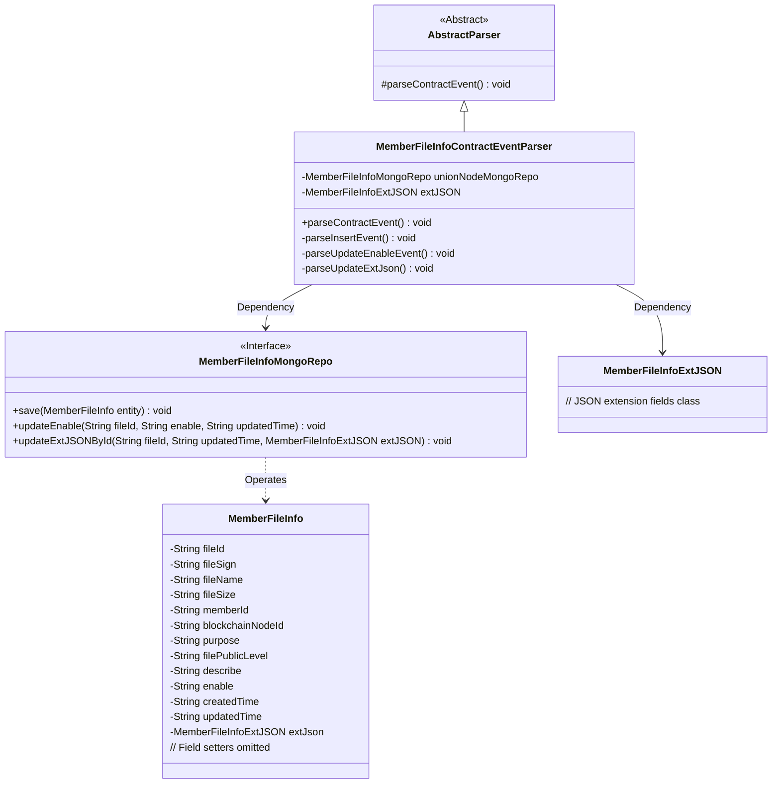
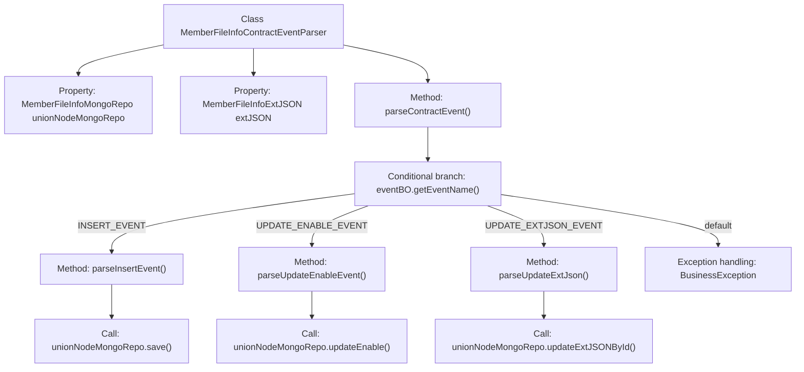

# Basic Information

|      |      |
|------|------|
| Name | MemberFileInfoContractEventParser |
| Language | .java |
| Code Path | WeFe/union/blockchain-data-sync/src/main/java/com/welab/wefe/parser/MemberFileInfoContractEventParser.java |
| Package Name | com.welab.wefe.parser |
| Dependencies | ['com.alibaba.fastjson.JSONObject', 'com.welab.wefe.BlockchainDataSyncApp', 'com.welab.wefe.common.data.mongodb.entity.union.MemberFileInfo', 'com.welab.wefe.common.data.mongodb.entity.union.ext.MemberFileInfoExtJSON', 'com.welab.wefe.common.data.mongodb.repo.MemberFileInfoMongoRepo', 'com.welab.wefe.common.util.StringUtil', 'com.welab.wefe.constant.EventConstant', 'com.welab.wefe.exception.BusinessException', 'org.apache.commons.lang3.StringUtils'] |
| Brief Description | The `MemberFileInfoContractEventParser` class parses member file information events, handling insertion, update of activation status, and extended JSON events, while operating MongoDB storage. |

# Description

The `MemberFileInfoContractEventParser` class extends `AbstractParser` and is used to parse member file information contract events. It interacts with MongoDB via `unionNodeMongoRepo` to handle three types of events: `INSERT_EVENT` creates a `MemberFileInfo` object containing attributes such as file ID, signature, and name, then saves it; `UPDATE_ENABLE_EVENT` updates the file's enable status; `UPDATE_EXTJSON_EVENT` updates extended JSON data. A `BusinessException` is thrown when the event name is invalid.

# Class Summary

| Name   | Type  | Description |
|-------|------|-------------|
| MemberFileInfoContractEventParser | class | The MemberFileInfoContractEventParser class parses contract events, handles insert, update enable status, and update extended JSON operations, and saves the data to MongoDB. |

## Class MemberFileInfoContractEventParser

|      |      |
|------|------|
| Access Modifier | public |
| Type | class |
| Name | MemberFileInfoContractEventParser |
| Description | The MemberFileInfoContractEventParser class parses contract events, handles insert, update enable status, and update extended JSON operations, and saves the data to MongoDB. |

### UML Class Diagram

Class diagram description: This diagram illustrates the class structure of a member file information contract event parser, which inherits from an abstract parser and depends on a MongoDB repository interface and an extended JSON class. The parser invokes different private methods to process data based on event types, including insert, status update, and extended field operations. The MongoDB repository interface defines data persistence methods that interact with the member file information entity class. The overall design follows a layered architecture adhering to the single responsibility principle.

### Internal Method Call Graph

This flowchart illustrates the core logic structure of the MemberFileInfoContractEventParser class. The class uses parseContractEvent() as the entry method, triggering different parsing methods based on the event name (eventName): parseInsertEvent() for adding new file information, parseUpdateEnableEvent() for updating enable status, and parseUpdateExtJson() for updating extended JSON data. Each method ultimately calls the corresponding persistence operation of the MongoDB repository (unionNodeMongoRepo), forming a complete event processing chain. A BusinessException is thrown in exceptional cases.

### Field List

| Name  | Type  | Description |
|-------|-------|------|
| extJSON | MemberFileInfoExtJSON | Protect the member variable extJSON, of type MemberFileInfoExtJSON. |
| unionNodeMongoRepo = BlockchainDataSyncApp.CONTEXT.getBean(MemberFileInfoMongoRepo.class) | MemberFileInfoMongoRepo | Obtain the MemberFileInfoMongoRepo instance, injected through the BlockchainDataSyncApp context. |

### Method List

| Name  | Type  | Description |
|-------|-------|------|
| parseInsertEvent | void | Parse the insertion event, create a MemberFileInfo object, and set various properties including file ID, signature, name, size, etc., then save it to MongoDB. |
| parseContractEvent | void | Parsing contract event methods, invoking corresponding processing logic based on event names: inserting events, updating enabled events, or updating extended JSON events, with invalid events throwing exceptions. |
| parseUpdateEnableEvent | void | Parse the update enable event to retrieve the file ID, enable status, and update time, then call the MongoDB repository to update the data. |
| parseUpdateExtJson | void | Parse the updated extended JSON data to retrieve the file ID and update time, then call the MongoDB repository to update the corresponding record. |

