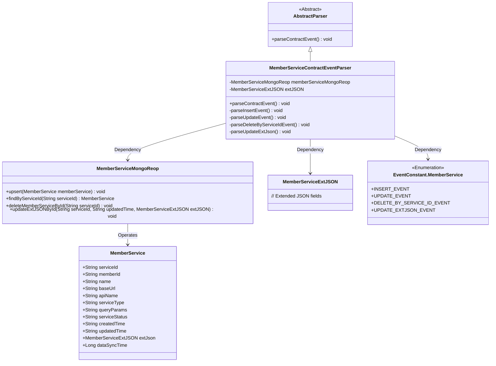
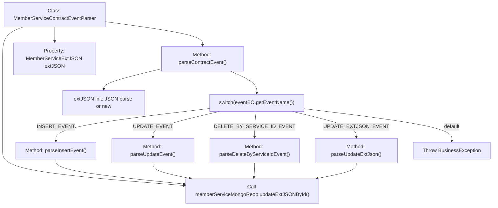

# Basic Information

|      |      |
|------|------|
| Name | MemberServiceContractEventParser |
| Language | .java |
| Code Path | WeFe/union/blockchain-data-sync/src/main/java/com/welab/wefe/parser/MemberServiceContractEventParser.java |
| Package Name | com.welab.wefe.parser |
| Dependencies | ['com.alibaba.fastjson.JSONObject', 'com.welab.wefe.BlockchainDataSyncApp', 'com.welab.wefe.common.data.mongodb.entity.union.MemberService', 'com.welab.wefe.common.data.mongodb.entity.union.ext.MemberServiceExtJSON', 'com.welab.wefe.common.data.mongodb.repo.MemberServiceMongoReop', 'com.welab.wefe.common.util.StringUtil', 'com.welab.wefe.constant.EventConstant', 'com.welab.wefe.exception.BusinessException', 'org.apache.commons.lang3.StringUtils'] |
| Brief Description | The MemberServiceContractEventParser class parses contract events, handles insert, update, delete, and extended JSON update operations, and interacts with MongoDB. |

# Description

The `MemberServiceContractEventParser` class inherits from `AbstractParser` and is used to parse member service contract events. It interacts with the MongoDB database via `memberServiceMongoReop` to handle four event types: `INSERT_EVENT` creates a new member service record and sets its attributes; `UPDATE_EVENT` modifies fields of an existing record; `DELETE_BY_SERVICE_ID_EVENT` deletes a record by its ID; and `UPDATE_EXTJSON_EVENT` updates extended JSON data. All operations include a data synchronization timestamp, and exceptional events throw a `BusinessException`.

# Class Summary

| Name   | Type  | Description |
|-------|------|-------------|
| MemberServiceContractEventParser | class | The MemberServiceContractEventParser class parses member service contract events, handling insert, update, delete, and extended JSON update operations, and interacts with MongoDB to store data. |

## Class MemberServiceContractEventParser

|      |      |
|------|------|
| Access Modifier | public |
| Type | class |
| Name | MemberServiceContractEventParser |
| Description | The MemberServiceContractEventParser class parses member service contract events, handling insert, update, delete, and extended JSON update operations, and interacts with MongoDB to store data. |

### UML Class Diagram

This class diagram illustrates the structure of a Member Service Contract Event Parser. The MemberServiceContractEventParser inherits from AbstractParser and handles four types of events (insert, update, delete, and update extended JSON). It depends on MemberServiceMongoReop for database operations, uses MemberServiceExtJSON to store extended data, and references event type constants from EventConstant.MemberService. The MemberService class contains complete attributes of member services, while MemberServiceMongoReop provides CRUD operation interfaces for member service data. The overall design adopts a layered architecture, separating parsing logic from data access.

### Internal Method Call Graph

This flowchart illustrates the core logic structure of the MemberServiceContractEventParser class. Inheriting from AbstractParser, this class primarily parses different contract events (CRUD) by dispatching them via switch-case to four specific processing methods. All methods ultimately invoke MongoDB operations through memberServiceMongoReop, including upsert, delete, and update operations. The process starts with the parseContractEvent() method, routes to corresponding sub-methods based on event type, each involving distinct operations on MemberService objects, and finally achieves data persistence through the MongoDB repository.

### Field List

| Name  | Type  | Description |
|-------|-------|------|
| memberServiceMongoReop = BlockchainDataSyncApp.CONTEXT.getBean(MemberServiceMongoReop.class) | MemberServiceMongoReop | Retrieve the Bean instance of the MemberServiceMongoReop class from the application context and assign it to the protected member variable. |
| extJSON | MemberServiceExtJSON | Protect the member variable extJSON, of type MemberServiceExtJSON. |

### Method List

| Name  | Type  | Description |
|-------|-------|------|
| parseUpdateEvent | void | Parsing update event: Retrieve the service ID and update time from the event BO, then query and update the member service's name, base URL, API name, service type, query parameters, service status, and update time, finally performing an upsert operation in MongoDB. |
| parseContractEvent | void | Parsing contract event methods, invoking corresponding processing logic based on event names, including insert, update, delete, and update extended JSON events, with invalid events throwing exceptions. |
| parseInsertEvent | void | Parse the insertion event, set the MemberService properties, and store them in the database. |
| parseDeleteByServiceIdEvent | void | Parse the deletion event and call the service to delete member data based on the service_id. |
| parseUpdateExtJson | void | Parse the updated extended JSON data to retrieve the service ID and update time, then call MongoDB to update the corresponding record. |

