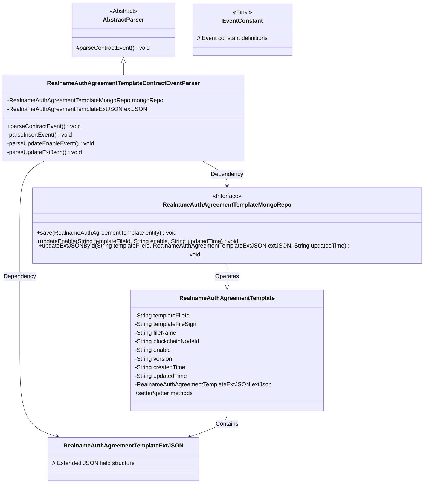
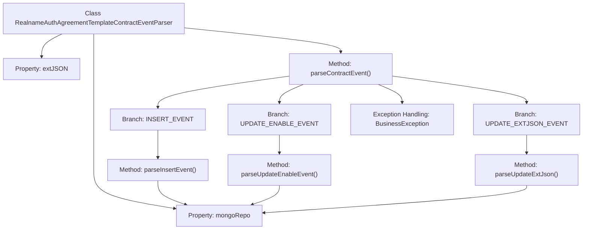
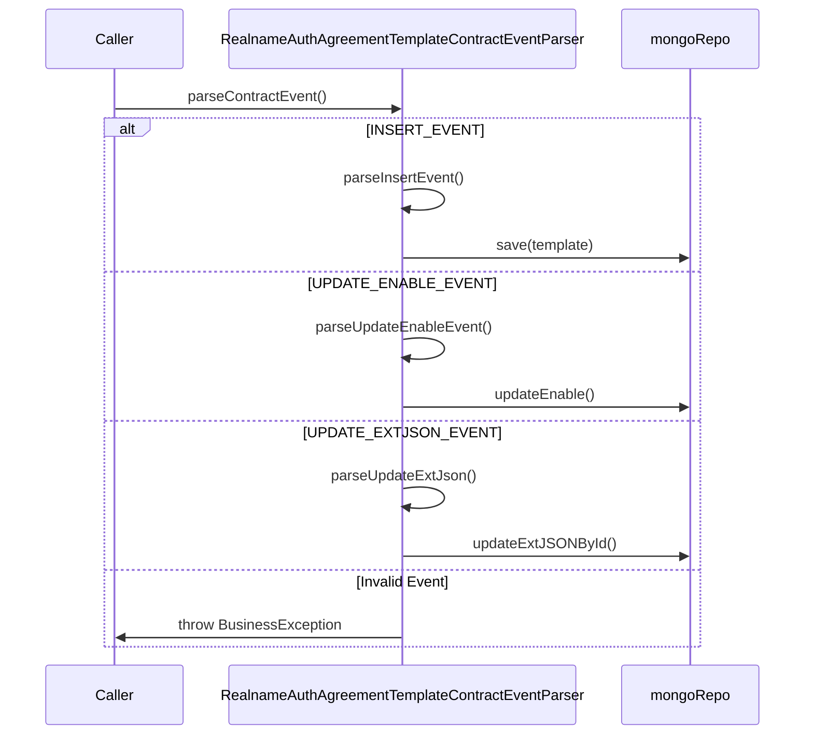

# Basic Information

|      |      |
|------|------|
| Name | RealnameAuthAgreementTemplateContractEventParser |
| Language | .java |
| Code Path | WeFe/union/blockchain-data-sync/src/main/java/com/welab/wefe/parser/RealnameAuthAgreementTemplateContractEventParser.java |
| Package Name | com.welab.wefe.parser |
| Dependencies | ['com.alibaba.fastjson.JSONObject', 'com.welab.wefe.BlockchainDataSyncApp', 'com.welab.wefe.common.data.mongodb.entity.union.RealnameAuthAgreementTemplate', 'com.welab.wefe.common.data.mongodb.entity.union.ext.RealnameAuthAgreementTemplateExtJSON', 'com.welab.wefe.common.data.mongodb.repo.RealnameAuthAgreementTemplateMongoRepo', 'com.welab.wefe.common.util.StringUtil', 'com.welab.wefe.constant.EventConstant', 'com.welab.wefe.exception.BusinessException', 'org.apache.commons.lang3.StringUtils'] |
| Brief Description | The `RealnameAuthAgreementTemplateContractEventParser` class parses real-name authentication agreement template events, handling three types of events: insertion, update of activation status, and update of extended JSON, while operating MongoDB to store data. |

# Description

The `RealnameAuthAgreementTemplateContractEventParser` class inherits from `AbstractParser` and is used to parse real-name authentication agreement template-related events. It operates on the MongoDB database via `mongoRepo` to handle three types of events: `INSERT_EVENT` creates a new template and saves all fields; `UPDATE_ENABLE_EVENT` updates the template's enabled status; `UPDATE_EXTJSON_EVENT` updates the template's extended JSON data. Unrecognized events will throw a business exception. All operations include the template file ID and timestamp fields to ensure data consistency.

# Class Summary

| Name   | Type  | Description |
|-------|------|-------------|
| RealnameAuthAgreementTemplateContractEventParser | class | A class for parsing real-name authentication protocol template contract events, handling insertion, update of activation status, and update of extended JSON events, with operations on MongoDB for data storage. |

## Class RealnameAuthAgreementTemplateContractEventParser

|      |      |
|------|------|
| Access Modifier | public |
| Type | class |
| Name | RealnameAuthAgreementTemplateContractEventParser |
| Description | A class for parsing real-name authentication protocol template contract events, handling insertion, update of activation status, and update of extended JSON events, with operations on MongoDB for data storage. |

### UML Class Diagram

This class diagram illustrates a real-name authentication agreement template event parsing system. The core class RealnameAuthAgreementTemplateContractEventParser inherits from an abstract parser and implements data persistence through a MongoDB repository, handling three types of contract events (insert, enable status update, and extended JSON update). The system adopts a layered design comprising entity classes, data access interfaces, and constant definitions. It implements business logic through an event-driven approach, demonstrating clear separation of responsibilities and modular architecture.

### Internal Method Call Graph

This code is a blockchain contract event parser specifically designed for real-name authentication agreement template-related events. The flowchart illustrates the class structure and its method invocation relationships, including three event processing branches and exception handling paths. The sequence diagram details the event parsing process: different parsing methods are triggered based on event types (INSERT/UPDATE_ENABLE/UPDATE_EXTJSON), ultimately calling mongoRepo for data persistence operations or throwing a business exception for invalid events. The core logic involves parsing different event types to update agreement template data in MongoDB.

### Field List

| Name  | Type  | Description |
|-------|-------|------|
| extJSON | RealnameAuthAgreementTemplateExtJSON | Extend JSON fields for the real-name authentication protocol template. |
| mongoRepo = BlockchainDataSyncApp.CONTEXT.getBean(RealnameAuthAgreementTemplateMongoRepo.class) | RealnameAuthAgreementTemplateMongoRepo | Retrieve the MongoDB repository instance for the real-name authentication protocol template from the application context. |

### Method List

| Name  | Type  | Description |
|-------|-------|------|
| parseInsertEvent | void | Parse the insertion event, set the real-name authentication protocol template attributes, and save them to MongoDB. |
| parseContractEvent | void | Method for parsing contract events: Invoke corresponding processing logic based on the event name, and throw an exception for invalid events. |
| parseUpdateEnableEvent | void | Parse the update activation event to retrieve the template file ID, activation status, and update time, then call the MongoDB repository to update the data. |
| parseUpdateExtJson | void | Parse the external JSON data update, retrieve the template file ID and update time, then call the MongoDB repository to update the JSON data corresponding to the ID. |

