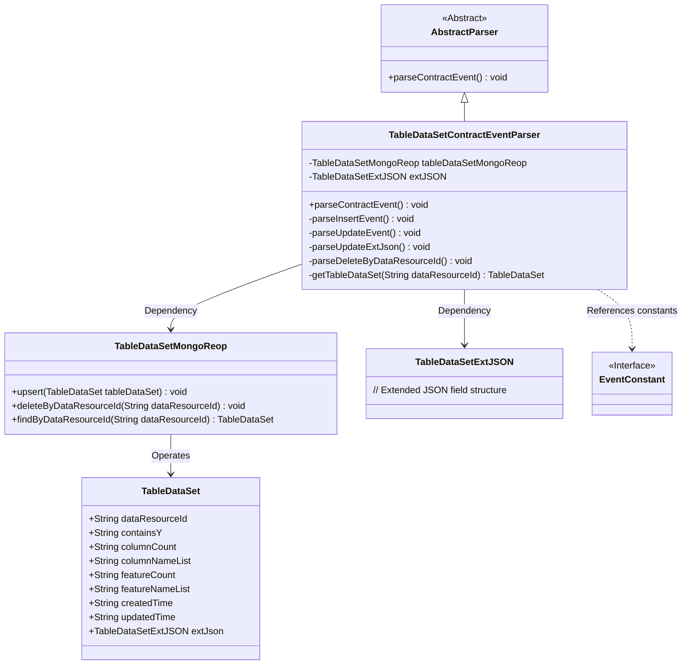
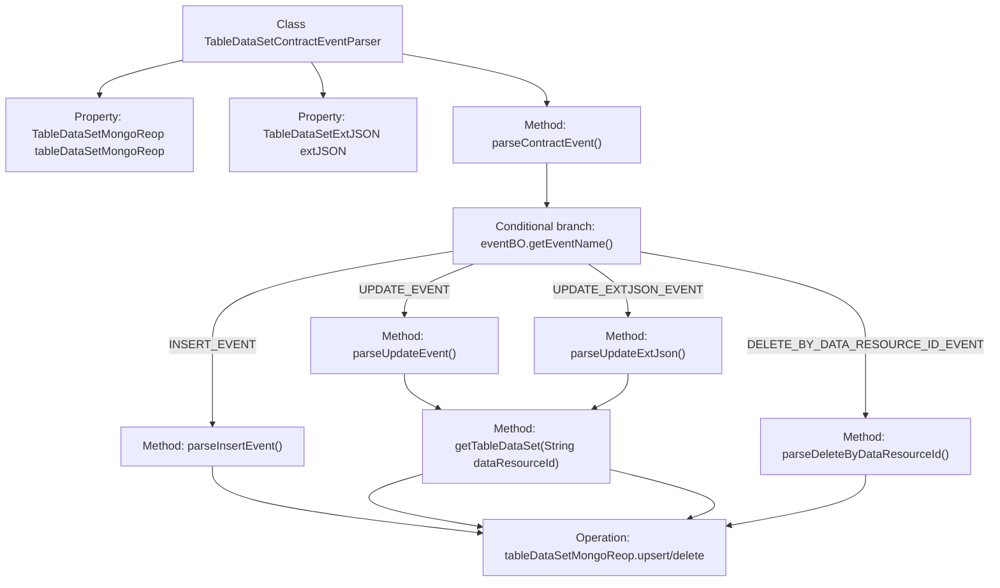
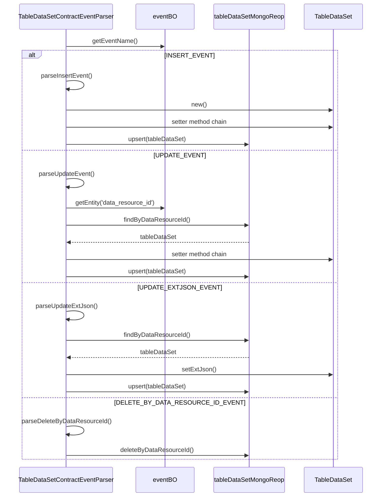

# Basic Information

|      |      |
|------|------|
| Name | TableDataSetContractEventParser |
| Language | .java |
| Code Path | WeFe/union/blockchain-data-sync/src/main/java/com/welab/wefe/parser/TableDataSetContractEventParser.java |
| Package Name | com.welab.wefe.parser |
| Dependencies | ['com.alibaba.fastjson.JSONObject', 'com.welab.wefe.BlockchainDataSyncApp', 'com.welab.wefe.common.data.mongodb.entity.union.TableDataSet', 'com.welab.wefe.common.data.mongodb.entity.union.ext.TableDataSetExtJSON', 'com.welab.wefe.common.data.mongodb.repo.TableDataSetMongoReop', 'com.welab.wefe.common.util.StringUtil', 'com.welab.wefe.constant.EventConstant', 'com.welab.wefe.exception.BusinessException', 'org.apache.commons.lang3.StringUtils'] |
| Brief Description | The TableDataSetContractEventParser class parses contract events, handles insert, update, and delete operations, and manages MongoDB storage for table data, including fields such as data resource ID, column names, and features. |

# Description

TableDataSetContractEventParser is a class that inherits from AbstractParser and is used to parse contract events related to table datasets. It contains a MongoDB repository instance and an extended JSON object. Its primary functionalities include parsing four types of events: insert events (setting dataset attributes and saving), update events (modifying existing dataset attributes), update extended JSON events (updating only the extended JSON), and delete events by data resource ID. All operations involve updating the data resource ID and timestamp, with persistence handled through the MongoDB repository. If the data does not exist or the event name is invalid, a business exception is thrown.

# Class Summary

| Name   | Type  | Description |
|-------|------|-------------|
| TableDataSetContractEventParser | class | The TableDataSetContractEventParser class parses contract events, handles operations such as insert, update, and delete, and manages MongoDB storage for table datasets. |

## Class TableDataSetContractEventParser

|      |      |
|------|------|
| Access Modifier | public |
| Type | class |
| Name | TableDataSetContractEventParser |
| Description | The TableDataSetContractEventParser class parses contract events, handles operations such as insert, update, and delete, and manages MongoDB storage for table datasets. |

### UML Class Diagram

Class Diagram Description: This diagram illustrates how TableDataSetContractEventParser inherits from AbstractParser, operates on TableDataSet data through TableDataSetMongoReop, and handles parsing logic involving the extended field TableDataSetExtJSON. The parser invokes different methods based on event types (INSERT/UPDATE/DELETE), interacts with the MongoDB repository for data persistence, and embodies the core workflow of data processing in an event-driven architecture.

### Internal Method Call Graph

This flowchart demonstrates the event handling logic of the TableDataSetContractEventParser class, which primarily operates MongoDB data by parsing different event types (INSERT/UPDATE/DELETE). The sequence diagram details the processing flows for four event types, including data validation, entity operations, and database persistence, reflecting a complete processing chain for blockchain contract events. All operations ultimately achieve data persistence or deletion through tableDataSetMongoReop.

### Field List

| Name  | Type  | Description |
|-------|-------|------|
| extJSON | TableDataSetExtJSON | Defined a protected TableDataSetExtJSON type variable extJSON. |
| tableDataSetMongoReop = BlockchainDataSyncApp.CONTEXT.getBean(TableDataSetMongoReop.class) | TableDataSetMongoReop | Obtain an instance of TableDataSetMongoReop by injecting it through the CONTEXT container of BlockchainDataSyncApp. |

### Method List

| Name  | Type  | Description |
|-------|-------|------|
| parseContractEvent | void | Method for parsing contract events: Based on the event name, invoke the corresponding processing logic—insert, update, update extended JSON, or delete by resource ID. Invalid events will throw an exception. |
| parseInsertEvent | void | Parse the insertion event, set the various attributes of the table dataset, and update them to the database. |
| parseUpdateEvent | void | Parsing update event: Retrieve the data resource ID and update time, update the dataset's inclusion of Y, column count, column name list, feature count, and feature name list, then save the updates. |
| parseUpdateExtJson | void | Parse the updated extended JSON data, retrieve the resource ID and update time, update the dataset, and save it to MongoDB. |
| parseDeleteByDataResourceId | void | This method parses and deletes the table dataset corresponding to the specified data resource ID by invoking the deleteByDataResourceId function of the Mongo repository. |
| getTableDataSet | TableDataSet | Get the table dataset based on the data resource ID, and throw a business exception if it does not exist. |

