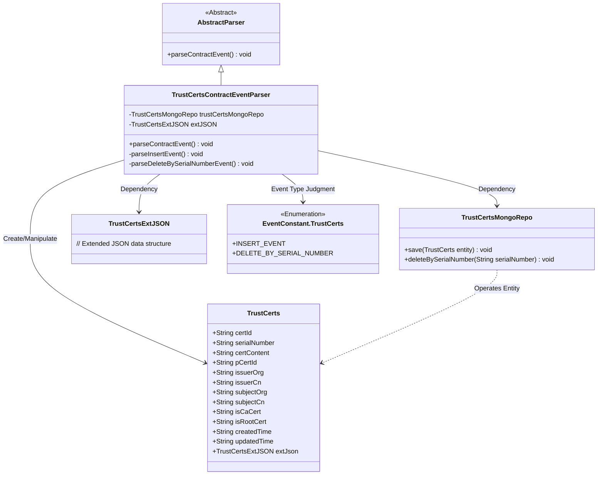
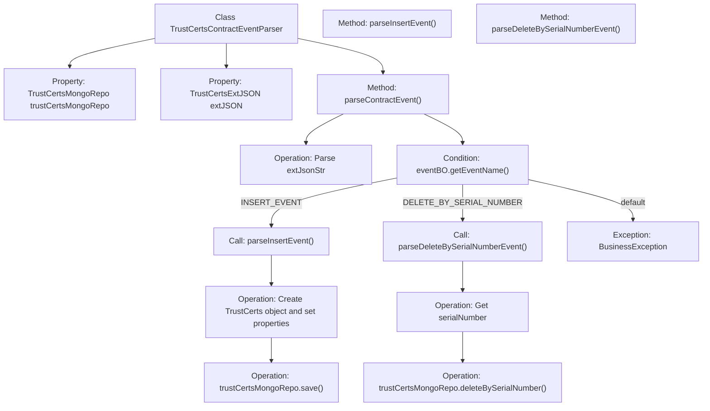

# Basic Information

|      |      |
|------|------|
| Name | TrustCertsContractEventParser |
| Language | .java |
| Code Path | WeFe/union/blockchain-data-sync/src/main/java/com/welab/wefe/parser/TrustCertsContractEventParser.java |
| Package Name | com.welab.wefe.parser |
| Dependencies | ['com.alibaba.fastjson.JSONObject', 'com.welab.wefe.BlockchainDataSyncApp', 'com.welab.wefe.common.data.mongodb.entity.union.TrustCerts', 'com.welab.wefe.common.data.mongodb.entity.union.ext.TrustCertsExtJSON', 'com.welab.wefe.common.data.mongodb.repo.TrustCertsMongoRepo', 'com.welab.wefe.common.util.StringUtil', 'com.welab.wefe.constant.EventConstant', 'com.welab.wefe.exception.BusinessException', 'org.apache.commons.lang3.StringUtils'] |
| Brief Description | Java class for parsing blockchain trust certificate events, handling insert and delete operations, using MongoDB for data storage. |

# Description

The `TrustCertsContractEventParser` class extends `AbstractParser` and is used to parse trust certificate contract events. It relies on `TrustCertsMongoRepo` for database operations and contains two main methods: `parseInsertEvent` handles certificate insertion events by setting certificate attributes and saving them to MongoDB; `parseDeleteBySerialNumberEvent` deletes certificate records based on serial numbers. The primary method `parseContractEvent` routes events to corresponding handlers by event name, throwing exceptions for invalid events.

# Class Summary

| Name   | Type  | Description |
|-------|------|-------------|
| TrustCertsContractEventParser | class | Java class for parsing blockchain certificate events, handling insert and delete operations, using MongoDB for data storage. |

## Class TrustCertsContractEventParser

|      |      |
|------|------|
| Access Modifier | public |
| Type | class |
| Name | TrustCertsContractEventParser |
| Description | Java class for parsing blockchain certificate events, handling insert and delete operations, using MongoDB for data storage. |

### UML Class Diagram

This class diagram illustrates that TrustCertsContractEventParser inherits from AbstractParser and is used to parse blockchain contract events. It relies on TrustCertsMongoRepo for database operations, utilizes TrustCertsExtJSON to handle extended data, and determines event types via the EventConstant.TrustCerts enumeration to execute insert or delete operations. The TrustCerts class contains the complete field structure of certificates, demonstrating the end-to-end workflow from event parsing to data storage.

### Internal Method Call Graph

This code demonstrates a blockchain certificate event parser that primarily handles two types of contract events: INSERT_EVENT and DELETE_BY_SERIAL_NUMBER. When the event is INSERT_EVENT, it creates a TrustCerts object, sets its properties, and saves it to MongoDB. When the event is DELETE_BY_SERIAL_NUMBER, it deletes the corresponding record from MongoDB based on the serial number. The flowchart clearly illustrates the complete call chain from event parsing to specific handling methods, including property initialization, JSON parsing, event type determination, and corresponding database operations.

### Field List

| Name  | Type  | Description |
|-------|-------|------|
| trustCertsMongoRepo = BlockchainDataSyncApp.CONTEXT.getBean(TrustCertsMongoRepo.class) | TrustCertsMongoRepo | Retrieve the TrustCertsMongoRepo instance from the application context and assign it to the protected variable. |
| extJSON | TrustCertsExtJSON | The protected TrustCertsExtJSON extended JSON object. |

### Method List

| Name  | Type  | Description |
|-------|-------|------|
| parseDeleteBySerialNumberEvent | void | The method parses the deletion event and removes the corresponding certificate from the MongoDB repository based on the serial number. |
| parseContractEvent | void | Parsing contract event methods, invoking corresponding processing logic based on event names, and throwing exceptions for invalid events. |
| parseInsertEvent | void | Parse the insertion event, set the attributes of the TrustCerts object, and save it to MongoDB. |

