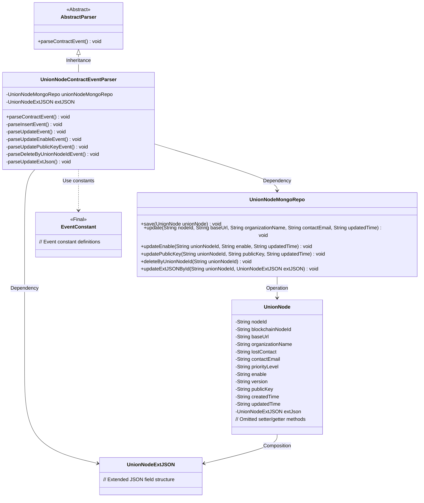
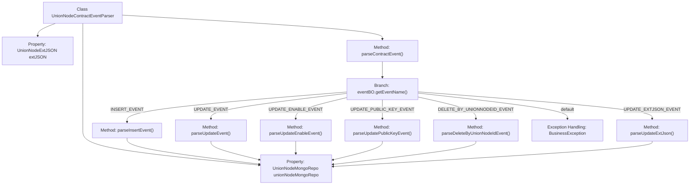

# Basic Information

|      |      |
|------|------|
| Name | UnionNodeContractEventParser |
| Language | .java |
| Code Path | WeFe/union/blockchain-data-sync/src/main/java/com/welab/wefe/parser/UnionNodeContractEventParser.java |
| Package Name | com.welab.wefe.parser |
| Dependencies | ['com.alibaba.fastjson.JSONObject', 'com.welab.wefe.BlockchainDataSyncApp', 'com.welab.wefe.common.data.mongodb.entity.union.UnionNode', 'com.welab.wefe.common.data.mongodb.entity.union.ext.UnionNodeExtJSON', 'com.welab.wefe.common.data.mongodb.repo.UnionNodeMongoRepo', 'com.welab.wefe.common.util.StringUtil', 'com.welab.wefe.constant.EventConstant', 'com.welab.wefe.exception.BusinessException', 'org.apache.commons.lang3.StringUtils'] |
| Brief Description | The `UnionNodeContractEventParser` class parses blockchain node events, handling insert, update, enable status, public key, delete, and extended JSON update operations, while interacting with MongoDB to store data. |

# Description

The `UnionNodeContractEventParser` class inherits from `AbstractParser` and is used to parse contract events related to union nodes. It interacts with the MongoDB database via `unionNodeMongoRepo` to handle different types of events. Key functionalities include parsing insertion events (setting various node attributes and saving), update events (modifying basic information), update-enabled-status events, update-public-key events, delete-by-node-ID events, and update-extended-JSON events. Each event-handling method extracts necessary information from parameters and invokes the corresponding MongoDB repository methods for data operations.

# Class Summary

| Name   | Type  | Description |
|-------|------|-------------|
| UnionNodeContractEventParser | class | The UnionNodeContractEventParser class parses blockchain node events, including insert, update, enable, public key modification, delete, and extended JSON update operations, and invokes the MongoDB repository for data persistence. |

## Class UnionNodeContractEventParser

|      |      |
|------|------|
| Access Modifier | public |
| Type | class |
| Name | UnionNodeContractEventParser |
| Description | The UnionNodeContractEventParser class parses blockchain node events, including insert, update, enable, public key modification, delete, and extended JSON update operations, and invokes the MongoDB repository for data persistence. |

### UML Class Diagram

Class Diagram Description: This diagram illustrates how UnionNodeContractEventParser inherits from AbstractParser and relies on UnionNodeMongoRepo and UnionNodeExtJSON to implement blockchain node event parsing functionality. The parser invokes corresponding MongoDB repository methods to manipulate UnionNode entities based on different event types (INSERT/UPDATE/DELETE, etc.), where UnionNode contains extended JSON fields. EventConstant provides event type constants, collectively forming a typical event-driven data processing architecture.

### Internal Method Call Graph

Flowchart Description: This flowchart illustrates the core logical structure of the UnionNodeContractEventParser class. The class inherits from AbstractParser and contains 2 properties and 7 main methods. parseContractEvent() serves as the entry method, invoking different processing methods (such as parseInsertEvent/parseUpdateEvent, etc.) based on the event type (eventName). All methods ultimately operate on the unionNodeMongoRepo for database operations. The flowchart clearly demonstrates the event dispatching logic and exception handling path, with each method pointing via arrows to its dependent MongoRepo property.

### Field List

| Name  | Type  | Description |
|-------|-------|------|
| extJSON | UnionNodeExtJSON | UnionNodeExtJSON extension JSON object for protection types. |
| unionNodeMongoRepo = BlockchainDataSyncApp.CONTEXT.getBean(UnionNodeMongoRepo.class) | UnionNodeMongoRepo | Obtain an instance of UnionNodeMongoRepo by injecting it through the CONTEXT context of BlockchainDataSyncApp. |

### Method List

| Name  | Type  | Description |
|-------|-------|------|
| parseUpdatePublicKeyEvent | void | Parse the public key update event to retrieve the node ID, public key, and update timestamp, then invoke the repository to update the data. |
| parseUpdateEvent | void | Parse the update event to retrieve the node ID, base URL, organization name, contact email, and update time, then update the node data in MongoDB. |
| parseUpdateExtJson | void | Parse and Update Extended JSON: Retrieve the node ID based on the node_id in the event BO, then call the Mongo repository method to update the extended JSON data of the corresponding node. |
| parseInsertEvent | void | Parse the insertion event, create a UnionNode object and set each attribute value, then save it to MongoDB. |
| parseUpdateEnableEvent | void | Parse the update enable event, retrieve the node ID, enable status, and update time, then call the Mongo repository to update. |
| parseContractEvent | void | Method for parsing contract events, which calls corresponding processing logic based on the event name, including CRUD operations and extended JSON updates, while throwing exceptions for invalid events. |
| parseDeleteByUnionNodeIdEvent | void | Parse the delete event and delete the corresponding record from MongoDB based on the node ID. |

