# Basic Information

|      |      |
|------|------|
| Name | parser |
| Language | .java |
| Code Path | WeFe/union/blockchain-data-sync/src/main/java/com/welab/wefe/parser |
| Package Name | docs.union.blockchain-data-sync.src.main.java.com.welab.wefe.parser |
| Brief Description | Multiple parser classes inherit from AbstractParser to handle blockchain contract events and operate MongoDB. These include various event parsers for members, datasets, nodes, certificates, etc., implementing CRUD operations and extended JSON update functionalities to ensure data synchronization and consistency. |

# Description

## Overview  
This module serves as the core parsing component of the blockchain data synchronization system, responsible for converting on-chain contract events into MongoDB storage operations. It adopts the abstract factory pattern, where the `AbstractParser` defines the foundational framework, and each subclass implements specific event parsing logic, resembling an event bus pattern. Key data structures include `EventBO` (event business object), `BlockInfoBO` (block information), and entity classes (e.g., `Member`, `DataSet`). External dependencies primarily include MongoDB (via `*MongoRepo` operations) and blockchain node SDKs (e.g., `BcosBlock`). For instance, `MemberContractEventParser` handles member data changes, while `DataSetContractEventParser` manages dataset lifecycle operations.

## Key Business Scenarios  
The module primarily handles three scenarios: entity state changes (e.g., member public key updates), extended data maintenance (e.g., `extJSON` field synchronization), and resource permission management (e.g., dataset label access control). A typical workflow involves: `BlockInfoParser` parsing block events → subclass parsers processing specific business logic → MongoDB persistence. The interaction mode is uniformly routed through `parseContractEvent`, supporting CRUD operations and extended field updates. Examples include `UnionNodeContractEventParser` handling node activation status changes and `BloomFilterContractEventParser` maintaining Bloom filter parameters. All APIs follow the "event type identification → parameter extraction → repository operation" pattern to ensure eventual data consistency.

### Package Internal Structure View

```mermaid
graph TD
    parser --> MemberContractEventParser.java
    parser --> RealnameAuthAgreementTemplateContractEventParser.java
    parser --> DataSetContractEventParser.java
    parser --> AbstractParser.java
    parser --> TableDataSetContractEventParser.java
    parser --> BlockInfoParser.java
    parser --> MemberFileInfoContractEventParser.java
    parser --> UnionNodeContractEventParser.java
    parser --> TrustCertsContractEventParser.java
    parser --> MemberAuthTypeContractEventParser.java
    parser --> DataResourceContractEventParser.java
    parser --> BloomFilterContractEventParser.java
    parser --> DataSetMemberPermissionContractEventParser.java
    parser --> MemberServiceContractEventParser.java
    parser --> DataSetDefaultTagContractEventParser.java
    parser --> DataResourceDefaultTagContractEventParser.java
    parser --> ImageDataSetContractEventParser.java
```

This flowchart displays all Java files under the parser directory in the blockchain data synchronization module. These files include various contract event parsers such as member contract, real-name authentication agreement template contract, dataset contract event parsers, as well as abstract parsers and block information parsers. All files are directly subordinate to the parser directory without deeper subdirectory structures, forming a flat file organization.

# File List

| Name   | Type  | Description |
|-------|------|-------------|
| [MemberContractEventParser.java](MemberContractEventParser.md) | file | The MemberContractEventParser class parses member contract events, handling operations such as insertions, updates, and deletions. These operations include updates to fields like member information, public keys, logos, etc., and synchronize the data to MongoDB. |
| [RealnameAuthAgreementTemplateContractEventParser.java](RealnameAuthAgreementTemplateContractEventParser.md) | file | The RealnameAuthAgreementTemplateContractEventParser class parses real-name authentication agreement template events, handling three types of events: insertion, updating activation status, and updating extended JSON, while operating MongoDB to store data. |
| [DataSetContractEventParser.java](DataSetContractEventParser.md) | file | The `DataSetContractEventParser` class parses contract events, handles insert, update, delete, and update extended JSON operations, and stores the data in MongoDB. |
| [AbstractParser.java](AbstractParser.md) | file | The abstract class AbstractParser defines the foundational logic for event parsing, including constants, logging, and the key method `process` for handling event data. Upon success, it invokes the abstract method `parseContractEvent` and logs the time consumed. |
| [TableDataSetContractEventParser.java](TableDataSetContractEventParser.md) | file | The TableDataSetContractEventParser class parses contract events, handles insert, update, and delete operations, and manages MongoDB storage for table data, including fields such as data resource IDs, column names, and features. |
| [BlockInfoParser.java](BlockInfoParser.md) | file | The BlockInfoParser class parses blockchain block information, processes transaction receipts and event logs, and generates a BlockInfoBO object containing event and transaction responses. |
| [MemberFileInfoContractEventParser.java](MemberFileInfoContractEventParser.md) | file | The MemberFileInfoContractEventParser class parses member file information events, handling insertion, update of activation status, and extended JSON events, while operating MongoDB storage. |
| [UnionNodeContractEventParser.java](UnionNodeContractEventParser.md) | file | The UnionNodeContractEventParser class parses blockchain node events, handling insert, update, enable status, public key, delete, and extended JSON update operations, interacting with MongoDB to store data. |
| [TrustCertsContractEventParser.java](TrustCertsContractEventParser.md) | file | Java class for parsing blockchain trust certificate events, handling insert and delete operations, using MongoDB for data storage. |
| [MemberAuthTypeContractEventParser.java](MemberAuthTypeContractEventParser.md) | file | The MemberAuthTypeContractEventParser class parses member authentication type events, handling insert, update, delete, and extended JSON update operations, and stores data using MongoDB. |
| [DataResourceContractEventParser.java](DataResourceContractEventParser.md) | file | The DataResourceContractEventParser class parses data resource events, handling insert, update, enable, extended JSON update, and delete operations, storing data via MongoDB. |
| [BloomFilterContractEventParser.java](BloomFilterContractEventParser.md) | file | The BloomFilterContractEventParser class parses Bloom filter-related events, including insertion, updating hash functions, updating extended JSON, and deletion by ID, using MongoDB for data storage. |
| [DataSetMemberPermissionContractEventParser.java](DataSetMemberPermissionContractEventParser.md) | file | A class for parsing contract events, handling CRUD operations on dataset member permissions, including insertion, update, deletion, and extended JSON updates, with data stored in MongoDB. |
| [MemberServiceContractEventParser.java](MemberServiceContractEventParser.md) | file | The `MemberServiceContractEventParser` class parses contract events, handling insert, update, delete, and extended JSON update operations, and interacts with MongoDB. |
| [DataSetDefaultTagContractEventParser.java](DataSetDefaultTagContractEventParser.md) | file | Parse Java classes for default label contract events in the dataset, including methods for inserting, updating, deleting, and updating extended JSON, using MongoDB for data storage. |
| [DataResourceDefaultTagContractEventParser.java](DataResourceDefaultTagContractEventParser.md) | file | A class for parsing default tag contract events of data resources, handling insert, update, delete, and extended JSON update events, using MongoDB for data storage. |
| [ImageDataSetContractEventParser.java](ImageDataSetContractEventParser.md) | file | The ImageDataSetContractEventParser class inherits from AbstractParser and parses image dataset events, including operations such as insert, update, and delete, while managing data storage in MongoDB. |

