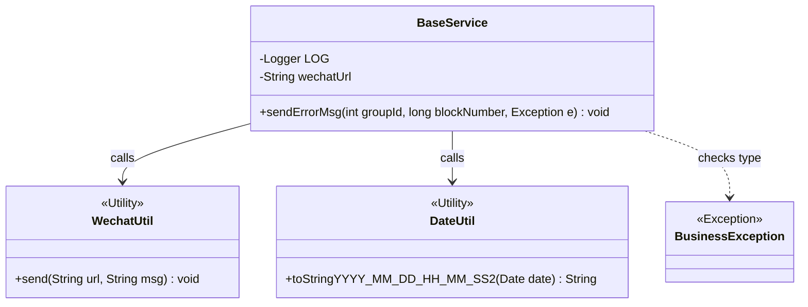
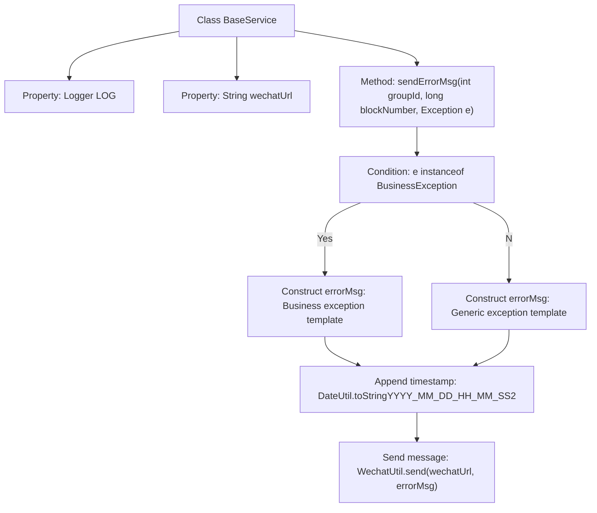

# Basic Information

|      |      |
|------|------|
| Name | BaseService |
| Language | .java |
| Code Path | WeFe/union/blockchain-data-sync/src/main/java/com/welab/wefe/service/BaseService.java |
| Package Name | com.welab.wefe.service |
| Dependencies | ['com.welab.wefe.common.util.DateUtil', 'com.welab.wefe.exception.BusinessException', 'com.welab.wefe.util.WechatUtil', 'org.slf4j.Logger', 'org.slf4j.LoggerFactory', 'org.springframework.beans.factory.annotation.Value', 'java.util.Date'] |
| Brief Description | The BaseService class includes logging and WeChat error message sending functionality, formatting error messages based on exception types and sending them to a specified URL. |

# Description

The BaseService class is a foundational service class that includes a logger and WeChat bot URL configuration. It provides the sendErrorMsg method for sending error alert messages. This method accepts a group ID, block number, and exception object, generating error messages in different formats based on the exception type. The messages include the synchronized group ID, block number, and exception details, along with a current timestamp. The error message is ultimately sent to the configured WeChat bot URL via the WechatUtil utility class. For BusinessException exceptions, the error message is emphasized by repeating it three times to highlight the importance of the business exception.

# Class Summary

| Name   | Type  | Description |
|-------|------|-------------|
| BaseService | class | The BaseService class includes logging and WeChat notification functionalities. It sends error messages via the sendErrorMsg method, distinguishing between business exceptions and regular exceptions, and appends a timestamp. |

## Class BaseService

|      |      |
|------|------|
| Access Modifier | public |
| Type | class |
| Name | BaseService |
| Description | The BaseService class includes logging and WeChat notification functionalities. It sends error messages via the sendErrorMsg method, distinguishing between business exceptions and regular exceptions, and appends a timestamp. |

### UML Class Diagram

Class Diagram Description:
The BaseService class contains a logger and WeChat bot URL configuration, providing the sendErrorMsg method to send error alert messages. This method generates differently formatted error messages based on the exception type (BusinessException or others), invokes WechatUtil to send the message, and uses DateUtil to obtain the current time. The diagram illustrates the dependency relationships between BaseService and three utility classes (WechatUtil, DateUtil) as well as one exception class (BusinessException).

### Internal Method Call Graph

This code flowchart illustrates the complete error message handling process in the BaseService class. It initializes a logger and WeChat bot URL first. When invoking the sendErrorMsg method, it selects different message templates based on the exception type (business exception or generic exception), appends the current timestamp, and sends the message via the WeChat utility class. The entire process involves key steps such as conditional branching, string concatenation, and external tool invocation, implementing differentiated exception notification functionality.

### Field List

| Name  | Type  | Description |
|-------|-------|------|
| wechatUrl | String | WeChat bot URL configuration item, injected into the private variable wechatUrl via @Value. |
| LOG = LoggerFactory.getLogger(this.getClass()) | Logger | A protected and immutable logger instance is defined in the class for logging output of the current class. |

### Method List

| Name  | Type  | Description |
|-------|-------|------|
| sendErrorMsg | void | Method for Sending Error Messages: Generate error information in different formats based on the exception type (business exception or regular exception), including the group ID, block number, and exception details. Finally, add a timestamp and send it via the WeChat tool. |

