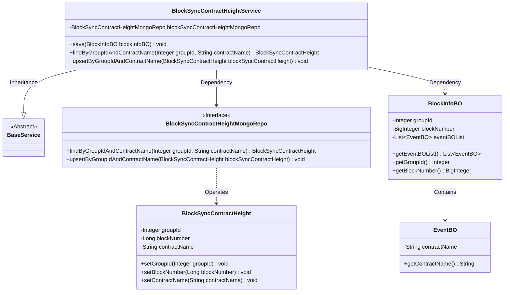
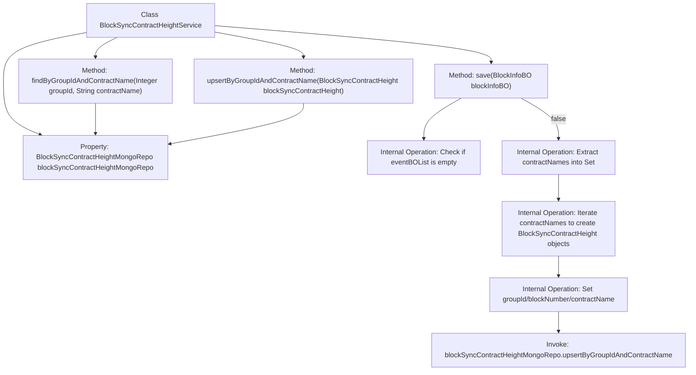

# Basic Information

|      |      |
|------|------|
| Name | BlockSyncContractHeightService |
| Language | .java |
| Code Path | WeFe/union/blockchain-data-sync/src/main/java/com/welab/wefe/service/BlockSyncContractHeightService.java |
| Package Name | com.welab.wefe.service |
| Dependencies | ['com.welab.wefe.bo.data.BlockInfoBO', 'com.welab.wefe.bo.data.EventBO', 'com.welab.wefe.common.data.mongodb.entity.union.BlockSyncContractHeight', 'com.welab.wefe.common.data.mongodb.repo.BlockSyncContractHeightMongoRepo', 'org.apache.commons.collections4.CollectionUtils', 'org.springframework.beans.factory.annotation.Autowired', 'org.springframework.stereotype.Service', 'java.util.HashSet', 'java.util.List', 'java.util.Set'] |
| Brief Description | BlockSyncContractHeightService is used to record the synchronized block height and contract information, providing functions for saving, querying, and updating, with data stored in MongoDB. |

# Description

BlockSyncContractHeightService is a service class that inherits from BaseService, designed to record successfully synchronized block height contract information. It interacts with MongoDB via blockSyncContractHeightMongoRepo. Key functionalities include: saving block information, extracting and deduplicating contract names from events, creating a BlockSyncContractHeight object for each contract, setting the group ID, block number, and contract name, and then updating or inserting records via the upsert method. It also provides methods to query records by group ID and contract name.

# Class Summary

| Name   | Type  | Description |
|-------|------|-------------|
| BlockSyncContractHeightService | class | The BlockSyncContractHeightService is used to record the synchronized block height and contract information, including functions for saving, querying, and updating, with data stored in MongoDB. |

## Class BlockSyncContractHeightService

|      |      |
|------|------|
| Access Modifier | @Service;public |
| Type | class |
| Name | BlockSyncContractHeightService |
| Description | The BlockSyncContractHeightService is used to record the synchronized block height and contract information, including functions for saving, querying, and updating, with data stored in MongoDB. |

### UML Class Diagram

This code describes a blockchain synchronization service system, primarily consisting of the BlockSyncContractHeightService class and its related components. The service inherits from BaseService and stores/retrieves block synchronization height information through a MongoDB repository (BlockSyncContractHeightMongoRepo). Core functionalities include saving block information (save method), conditional querying (findByGroupIdAndContractName), and upsert operations (upsertByGroupIdAndContractName). The main data objects processed by the system include block information (BlockInfoBO), events (EventBO), and synchronization height records (BlockSyncContractHeight).

### Internal Method Call Graph

This code represents a blockchain synchronization contract height service class, with main functionalities including: 1) Saving synchronized block height information to MongoDB by iterating through contract names in the event list and creating height records for each contract; 2) Providing methods to query and update heights by group ID and contract name. The core logic resides in the save method, which first validates the event list, then deduplicates contract names, and finally batch updates the latest block height for each contract. All database operations are delegated to blockSyncContractHeightMongoRepo for implementation.

### Field List

| Name  | Type  | Description |
|-------|-------|------|
| blockSyncContractHeightMongoRepo | BlockSyncContractHeightMongoRepo | Using @Autowired to automatically inject an instance of BlockSyncContractHeightMongoRepo. |

### Method List

| Name  | Type  | Description |
|-------|-------|------|
| save | void | The method `save` receives a `BlockInfoBO` object, checks that its event list is not empty, then extracts all contract names and stores them in a set. It iterates through each contract name, creates a `BlockSyncContractHeight` object for each, sets the group ID, block number, and contract name, and finally updates or inserts the data via the Mongo repository. |
| findByGroupIdAndContractName | BlockSyncContractHeight | This method queries BlockSyncContractHeight by groupId and contractName, implemented by calling the MongoDB repository interface. |
| upsertByGroupIdAndContractName | void | The method `upsertByGroupIdAndContractName` updates or inserts `blockSyncContractHeight` data into MongoDB based on `groupId` and `contractName`. |

