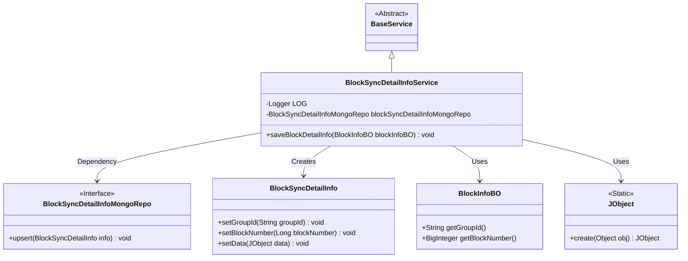
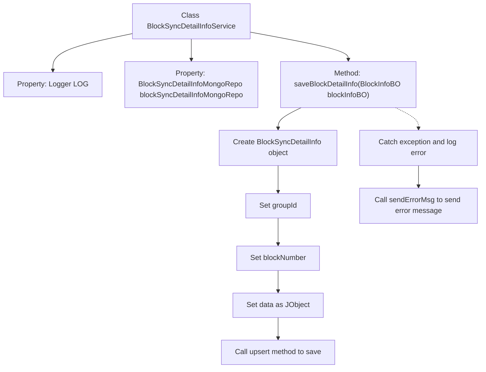

# Basic Information

|      |      |
|------|------|
| Name | BlockSyncDetailInfoService |
| Language | .java |
| Code Path | WeFe/union/blockchain-data-sync/src/main/java/com/welab/wefe/service/BlockSyncDetailInfoService.java |
| Package Name | com.welab.wefe.service |
| Dependencies | ['com.welab.wefe.bo.data.BlockInfoBO', 'com.welab.wefe.common.data.mongodb.entity.union.BlockSyncDetailInfo', 'com.welab.wefe.common.data.mongodb.repo.BlockSyncDetailInfoMongoRepo', 'com.welab.wefe.common.util.JObject', 'org.slf4j.Logger', 'org.slf4j.LoggerFactory', 'org.springframework.beans.factory.annotation.Autowired', 'org.springframework.stereotype.Service'] |
| Brief Description | The BlockSyncDetailInfoService class is used to save block information to MongoDB, including exception handling and logging. |

# Description

BlockSyncDetailInfoService is a Spring service class that extends BaseService and is used for saving block synchronization details. It injects BlockSyncDetailInfoMongoRepo via @Autowired to interact with MongoDB. The saveBlockDetailInfo method accepts a BlockInfoBO object, converts it into a BlockSyncDetailInfo entity, and saves it to MongoDB. During the conversion process, it sets the groupId, blockNumber, and serialized data. If the operation fails, it logs an error and invokes sendErrorMsg to dispatch an error message.

# Class Summary

| Name   | Type  | Description |
|-------|------|-------------|
| BlockSyncDetailInfoService | class | The BlockSyncDetailInfoService class is used to save block information to MongoDB, including exception handling and logging. |

## Class BlockSyncDetailInfoService

|      |      |
|------|------|
| Access Modifier | @Service;public |
| Type | class |
| Name | BlockSyncDetailInfoService |
| Description | The BlockSyncDetailInfoService class is used to save block information to MongoDB, including exception handling and logging. |

### UML Class Diagram

This class diagram illustrates that BlockSyncDetailInfoService inherits from BaseService and relies on the BlockSyncDetailInfoMongoRepo interface for data persistence. The service class retrieves block information via BlockInfoBO, creates BlockSyncDetailInfo entities, converts them into JObject format, and stores them. The entire process incorporates an exception handling mechanism, ensuring system reliability through logging and error message transmission.

### Internal Method Call Graph

This code represents a service method of the BlockSyncDetailInfoService class, primarily used for saving block details to a MongoDB database. The process first creates a BlockSyncDetailInfo object and sets its properties, then persists it via the MongoDB repository's upsert method. If an exception occurs, it logs the error and sends an error message. The entire workflow includes both normal data persistence and exception handling mechanisms, ensuring reliable storage of block information and error tracking.

### Field List

| Name  | Type  | Description |
|-------|-------|------|
| LOG = LoggerFactory.getLogger(BlockSyncDetailInfoService.class) | Logger | The class BlockSyncDetailInfoService defines a private immutable logger LOG for logging purposes. |
| blockSyncDetailInfoMongoRepo | BlockSyncDetailInfoMongoRepo | Use @Autowired to automatically inject the BlockSyncDetailInfoMongoRepo instance. |

### Method List

| Name  | Type  | Description |
|-------|-------|------|
| saveBlockDetailInfo | void | Save the block details, convert and store them in MongoDB, log errors and send error messages upon failure. |

