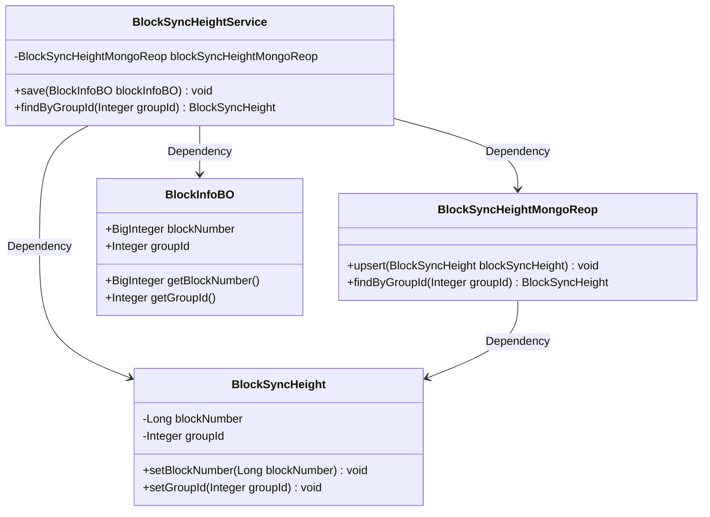
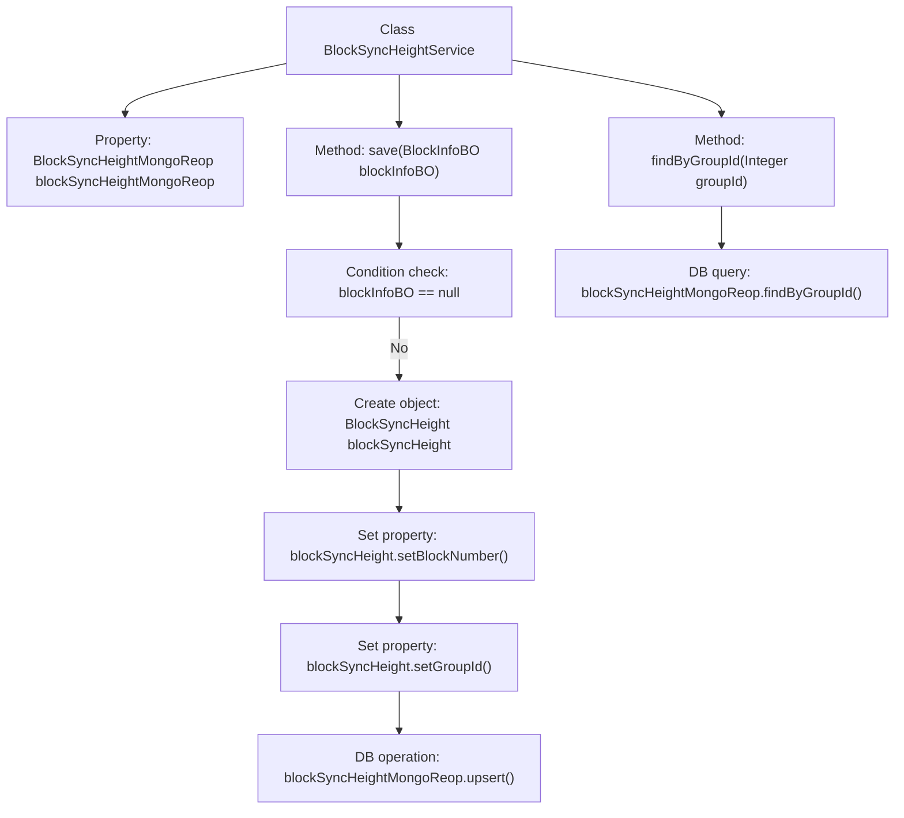

# Basic Information

|      |      |
|------|------|
| Name | BlockSyncHeightService |
| Language | .java |
| Code Path | WeFe/union/blockchain-data-sync/src/main/java/com/welab/wefe/service/BlockSyncHeightService.java |
| Package Name | com.welab.wefe.service |
| Dependencies | ['com.welab.wefe.bo.data.BlockInfoBO', 'com.welab.wefe.common.data.mongodb.entity.union.BlockSyncHeight', 'com.welab.wefe.common.data.mongodb.repo.BlockSyncHeightMongoReop', 'org.springframework.beans.factory.annotation.Autowired', 'org.springframework.stereotype.Service'] |
| Brief Description | The BlockSyncHeightService service class is used to record synchronized block height information. It includes the save method for storing block height and groupId in MongoDB, and the findByGroupId method for querying by groupId. |

# Description

BlockSyncHeightService is a service class that inherits from BaseService, designed to record successfully synchronized block height information. It interacts with MongoDB through BlockSyncHeightMongoReop. Key functionalities include saving block information to the database (skipping if the input is empty) and querying block height based on groupId. The save method converts the blockNumber and groupId from BlockInfoBO into a BlockSyncHeight object and performs an upsert operation. The query method retrieves the corresponding BlockSyncHeight record from the database using groupId.

# Class Summary

| Name   | Type  | Description |
|-------|------|-------------|
| BlockSyncHeightService | class | The BlockSyncHeightService is used to record and query synchronized block height information, including save and query-by-groupId functionalities. |

## Class BlockSyncHeightService

|      |      |
|------|------|
| Access Modifier | @Service;public |
| Type | class |
| Name | BlockSyncHeightService |
| Description | The BlockSyncHeightService is used to record and query synchronized block height information, including save and query-by-groupId functionalities. |

### UML Class Diagram

This code describes a blockchain synchronization height service system, primarily consisting of four core classes: BlockSyncHeightService as the service layer relies on BlockSyncHeightMongoReop for database operations, processes BlockInfoBO business objects, and converts them into BlockSyncHeight persistence objects. BlockSyncHeightService provides functionalities for saving block height and querying by group, with data persistence implemented through MongoDB. The overall structure clearly reflects a layered architecture philosophy, decoupling the service layer from the data access layer, aligning with Domain-Driven Design principles.

### Internal Method Call Graph

This flowchart illustrates the structure and workflow of the BlockSyncHeightService class. The class contains two main methods: save() for storing block synchronization height information (which first validates parameters, then creates and populates a BlockSyncHeight object before persisting via MongoDB), and findByGroupId() that directly invokes MongoDB's query interface to retrieve data by groupId. The process clearly demonstrates the complete workflow from parameter validation to database operations, reflecting the service layer's encapsulation logic for data access.

### Field List

| Name  | Type  | Description |
|-------|-------|------|
| blockSyncHeightMongoReop | BlockSyncHeightMongoReop | Automatically inject the BlockSyncHeightMongoReop instance. |

### Method List

| Name  | Type  | Description |
|-------|-------|------|
| save | void | The method `save` accepts a `BlockInfoBO` object. When it is not null, it creates a `BlockSyncHeight` and sets the block number and group ID, then updates it to MongoDB. |
| findByGroupId | BlockSyncHeight | The method queries BlockSyncHeight by groupId, implemented by calling blockSyncHeightMongoReop's findByGroupId. |

