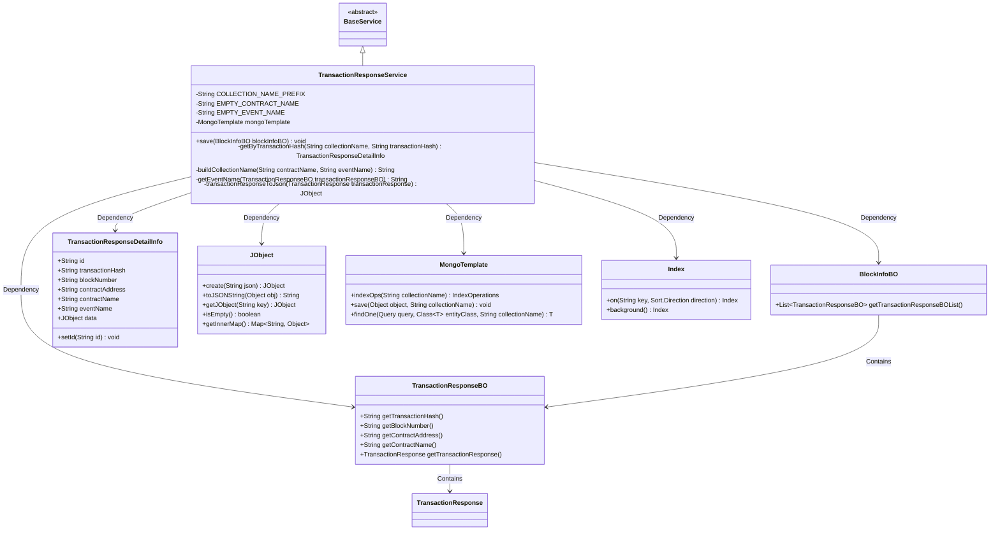
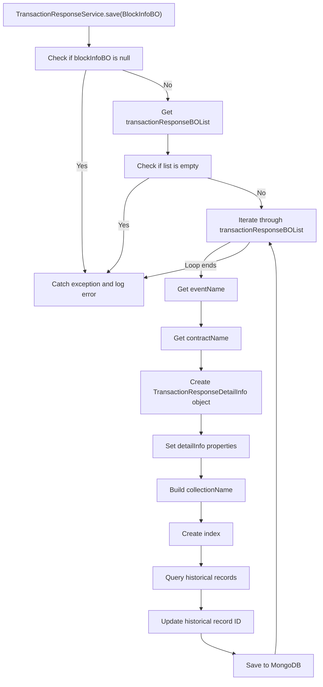
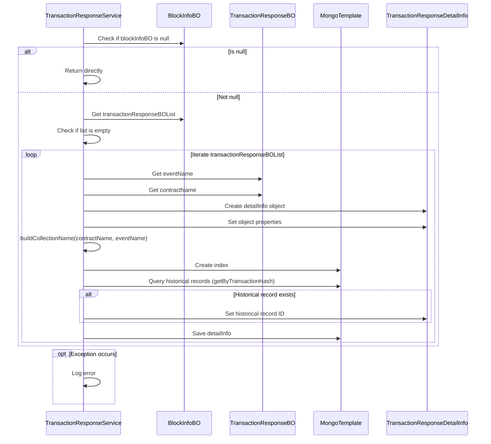

# Basic Information

|      |      |
|------|------|
| Name | TransactionResponseService |
| Language | .java |
| Code Path | WeFe/union/blockchain-data-sync/src/main/java/com/welab/wefe/service/TransactionResponseService.java |
| Package Name | com.welab.wefe.service |
| Dependencies | ['com.welab.wefe.bo.data.BlockInfoBO', 'com.welab.wefe.bo.data.TransactionResponseBO', 'com.welab.wefe.common.data.mongodb.entity.union.TransactionResponseDetailInfo', 'com.welab.wefe.common.data.mongodb.util.QueryBuilder', 'com.welab.wefe.common.util.JObject', 'com.welab.wefe.common.util.StringUtil', 'org.apache.commons.collections4.CollectionUtils', 'org.fisco.bcos.sdk.transaction.model.dto.TransactionResponse', 'org.springframework.beans.factory.annotation.Autowired', 'org.springframework.data.domain.Sort', 'org.springframework.data.mongodb.core.MongoTemplate', 'org.springframework.data.mongodb.core.index.Index', 'org.springframework.data.mongodb.core.query.Query', 'org.springframework.stereotype.Service', 'java.util.List', 'java.util.Set'] |
| Brief Description | The `TransactionResponseService` class inherits from `BaseService` and uses MongoDB to store transaction response data. Its main functionalities include: checking and saving transaction response information, constructing collection names, handling event names and contract names, creating indexes, and updating or inserting data. Logs are recorded in case of exceptions. |

# Description

TransactionResponseService is a MongoDB-based service class designed to process and store blockchain transaction response data. It inherits from BaseService and operates the database through MongoTemplate. Key functionalities include: saving transaction response information to a MongoDB collection, where the collection name is dynamically generated based on the contract name and event name; creating an index for the transaction hash field; handling cases with empty contract names or event names; and supporting updates to existing records. The service extracts transaction data from BlockInfoBO, converts it into a TransactionResponseDetailInfo object, and then stores it. Error handling logs detailed error messages, including group ID and block number.

# Class Summary

| Name   | Type  | Description |
|-------|------|-------------|
| TransactionResponseService | class | The TransactionResponseService class processes transaction response data, validates and stores it in MongoDB, organizing it into collections by contract and event name. It automatically creates indexes and supports updating existing records. Logs are recorded in case of exceptions. |

## Class TransactionResponseService

|      |      |
|------|------|
| Access Modifier | @Service;public |
| Type | class |
| Name | TransactionResponseService |
| Description | The TransactionResponseService class processes transaction response data, validates and stores it in MongoDB, organizing it into collections by contract and event name. It automatically creates indexes and supports updating existing records. Logs are recorded in case of exceptions. |

### UML Class Diagram

This class diagram illustrates that TransactionResponseService inherits from BaseService and depends on multiple business objects and utility classes. Its primary functionality involves processing blockchain transaction response data, including data validation, event name extraction, MongoDB collection naming construction, index creation, and data storage. It utilizes MongoTemplate for MongoDB operations and JObject for JSON data handling. The core method save() implements batch storage logic for transaction responses. The classes collaborate through clear dependency relationships, forming a complete data processing workflow.

### Internal Method Call Graph

This code implements the TransactionResponseService class, primarily used for storing blockchain transaction response data. The core method save() validates input parameters, iterates through the transaction list, extracts event names and contract names, constructs MongoDB collection names and creates indexes, and finally saves transaction detail data to MongoDB. The flowchart details the complete process from parameter validation to data storage, including exception handling logic. The sequence diagram more clearly illustrates the interaction sequence between objects.

### Field List

| Name  | Type  | Description |
|-------|-------|------|
| mongoTemplate | MongoTemplate | Using @Autowired to automatically inject a MongoTemplate instance for MongoDB operations. |
| EMPTY_EVENT_NAME = "empty" | String | Define a static constant EMPTY_EVENT_NAME with the value "empty". |
| EMPTY_CONTRACT_NAME = "empty" | String | Define a static constant EMPTY_CONTRACT_NAME with the value "empty", representing an empty contract name. |
| COLLECTION_NAME_PREFIX = "BlockTr_" | String | Define a static constant string COLLECTION_NAME_PREFIX with the value "BlockTr_", used to represent the collection name prefix. |

### Method List

| Name  | Type  | Description |
|-------|-------|------|
| buildCollectionName | String | Method for constructing collection names: prefix + contract name + event name, connected with underscores. |
| transactionResponseToJson | JObject | Translate the TransactionResponse object to JSON, returning an empty object if it is null. |
| getByTransactionHash | TransactionResponseDetailInfo | Query transaction details based on the transaction hash. If the hash is empty, return null; otherwise, query MongoDB and return the result. |
| save | void | The method `save` processes `BlockInfoBO` data, checks for non-null values, iterates through its transaction list, extracts information such as event names and contract names to construct a `TransactionResponseDetailInfo` object, creates MongoDB indexes, and saves the data, logging any exceptions encountered. |
| getEventName | String | This method extracts the event name from the transaction response object. First, it converts the response to JSON and checks whether the event result mapping exists or is empty. If empty, it returns the default empty name; otherwise, it takes the first key-value pair as the event name, and if still empty, returns the default value. |

