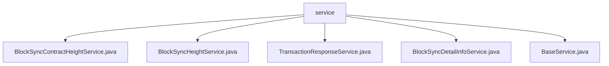

# Basic Information

|      |      |
|------|------|
| Name | service |
| Language | .java |
| Code Path | WeFe/union/blockchain-data-sync/src/main/java/com/welab/wefe/service |
| Package Name | docs.union.blockchain-data-sync.src.main.java.com.welab.wefe.service |
| Brief Description | The BlockSyncContractHeightService records synchronized block height contract information, interacts with MongoDB, saves block data, and processes contract names. The BlockSyncHeightService tracks synchronized block heights, supporting both saving and querying operations. The TransactionResponseService handles transaction response data, dynamically generates collection names, and creates indexes. The BlockSyncDetailInfoService stores block synchronization details, transforming and persisting the data. The BaseService provides foundational functionalities, including error message transmission. |

# Description

## Overview  
This module serves as the core service layer of the blockchain data synchronization system, responsible for the persistence of block height, contract information, and transaction responses. All services inherit from BaseService and utilize MongoDB for data storage, resembling a data middle platform model. Key data structures include BlockSyncContractHeight (contract height), BlockSyncHeight (block height), and TransactionResponseDetailInfo (transaction response). External dependencies are limited to MongoDB and the WeChat bot API. For instance, BlockSyncContractHeightService creates independent records for each contract, while TransactionResponseService dynamically generates collection names.  

## Core Business Scenarios  
The module primarily handles the end-to-end process of blockchain event persistence: from capturing block information (BlockSyncHeightService records height), extracting contract data (BlockSyncContractHeightService stores with deduplication), to archiving transaction responses (TransactionResponseService establishes hash indexes). UPSERT operations ensure data idempotency, akin to an ETL pipeline model. A typical scenario involves consortium chain data synchronization: BlockSyncDetailInfoService first saves raw blocks, followed by layered processing of data across different business dimensions. All exceptions are uniformly alerted via BaseService—for example, BusinessException triggers three repeated WeChat notifications.

### Package Internal Structure View

This flowchart illustrates the file structure of the blockchain data synchronization service in the WeFe project. The root node is the service folder, which contains five Java service class files: BlockSyncContractHeightService, BlockSyncHeightService, TransactionResponseService, BlockSyncDetailInfoService, and BaseService. These service classes collectively form the core implementation of the blockchain data synchronization functionality, with each file representing a distinct business processing module.

# File List

| Name   | Type  | Description |
|-------|------|-------------|
| [BlockSyncContractHeightService.java](BlockSyncContractHeightService.md) | file | BlockSyncContractHeightService is used to record the synchronized block height and contract information, providing functions for saving, querying, and updating, with data stored in MongoDB. |
| [BlockSyncHeightService.java](BlockSyncHeightService.md) | file | The `BlockSyncHeightService` service class is used to record synchronized block height information. It includes the `save` method for storing block height and `groupId` in MongoDB, and the `findByGroupId` method for querying by `groupId`. |
| [TransactionResponseService.java](TransactionResponseService.md) | file | The `TransactionResponseService` class inherits from `BaseService` and uses MongoDB to store transaction response data. Its primary functions include: checking and saving transaction response information, constructing collection names, handling event names and contract names, creating indexes, and updating or inserting data. Logs are recorded in case of exceptions. |
| [BlockSyncDetailInfoService.java](BlockSyncDetailInfoService.md) | file | The BlockSyncDetailInfoService class is used to save block information to MongoDB, including exception handling and logging. |
| [BaseService.java](BaseService.md) | file | The BaseService class includes logging and WeChat error message sending functionality, formatting error messages based on exception types and sending them to a specified URL. |

