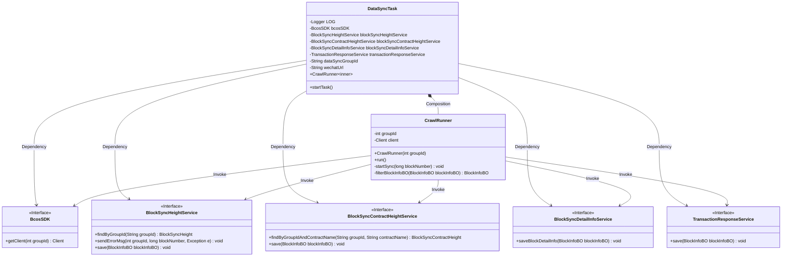
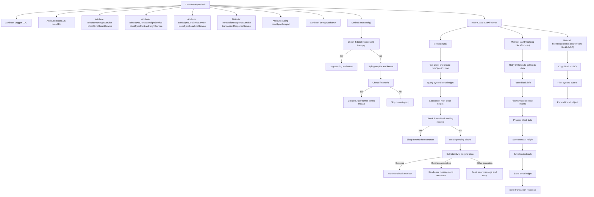

# Basic Information

|      |      |
|------|------|
| Name | DataSyncTask |
| Language | .java |
| Code Path | WeFe/union/blockchain-data-sync/src/main/java/com/welab/wefe/task/DataSyncTask.java |
| Package Name | com.welab.wefe.task |
| Dependencies | ['com.welab.wefe.bo.data.BlockInfoBO', 'com.welab.wefe.bo.data.EventBO', 'com.welab.wefe.common.data.mongodb.entity.union.BlockSyncContractHeight', 'com.welab.wefe.common.data.mongodb.entity.union.BlockSyncHeight', 'com.welab.wefe.common.util.StringUtil', 'com.welab.wefe.common.util.ThreadUtil', 'com.welab.wefe.constant.BlockConstant', 'com.welab.wefe.constant.SyncConstant', 'com.welab.wefe.exception.BusinessException', 'com.welab.wefe.parser.BlockInfoParser', 'com.welab.wefe.service.BlockSyncContractHeightService', 'com.welab.wefe.service.BlockSyncDetailInfoService', 'com.welab.wefe.service.BlockSyncHeightService', 'com.welab.wefe.service.TransactionResponseService', 'com.welab.wefe.tool.DataProcessor', 'com.welab.wefe.tool.DataSyncContext', 'com.welab.wefe.util.BlockUtil', 'org.apache.commons.collections4.CollectionUtils', 'org.apache.commons.lang.math.NumberUtils', 'org.fisco.bcos.sdk.BcosSDK', 'org.fisco.bcos.sdk.client.Client', 'org.fisco.bcos.sdk.client.protocol.response.BcosBlock', 'org.slf4j.Logger', 'org.slf4j.LoggerFactory', 'org.springframework.beans.BeanUtils', 'org.springframework.beans.factory.annotation.Autowired', 'org.springframework.beans.factory.annotation.Value', 'org.springframework.stereotype.Component', 'java.math.BigInteger', 'java.util.ArrayList', 'java.util.List'] |
| Brief Description | The DataSyncTask class is used for synchronizing blockchain data, including group ID configuration and WeChat notification URL. It synchronizes block data by group through multi-threading, handles exceptions, and records synchronization status. |

# Description

The DataSyncTask is a component class designed for data synchronization, which implements blockchain data synchronization functionality by injecting multiple services and configuration parameters. It primarily includes the startTask method to initiate synchronization tasks, checking the configured group ID and asynchronously executing the CrawlRunner. The CrawlRunner is an internal class responsible for continuously synchronizing block data for specified groups, including querying synchronized blocks, processing new blocks, and filtering synchronized contract events. During synchronization, it logs events, handles exceptions, and saves synchronization results and error information through related services. Overall, it achieves an efficient and stable blockchain data synchronization mechanism.

# Class Summary

| Name   | Type  | Description |
|-------|------|-------------|
| DataSyncTask | class | The DataSyncTask class is a data synchronization task component that synchronizes blockchain data through multi-threading, incorporating error handling and filtering of already synchronized events. |

## Class DataSyncTask

|      |      |
|------|------|
| Access Modifier | @Component;public |
| Type | class |
| Name | DataSyncTask |
| Description | The DataSyncTask class is a data synchronization task component that synchronizes blockchain data through multi-threading, incorporating error handling and filtering of already synchronized events. |

### UML Class Diagram

This code demonstrates the implementation of a blockchain data synchronization task, primarily consisting of the main DataSyncTask class and its inner class CrawlRunner. DataSyncTask obtains multiple service interface instances through dependency injection, including the BcosSDK client and various block synchronization services. CrawlRunner implements the Runnable interface and is responsible for the concrete block synchronization logic, encompassing block data retrieval, filtering, processing, and persistence. The overall design adopts a layered architecture, where the main task class handles scheduling while the inner class manages specific business logic, achieving module decoupling through service interfaces. The synchronization process incorporates error handling, retry mechanisms, and progress tracking to ensure the reliability and integrity of data synchronization.

### Internal Method Call Graph

This code implements a blockchain data synchronization task, primarily consisting of the DataSyncTask class and its inner class CrawlRunner. The flowchart illustrates the complete workflow from task initiation to block synchronization: first validating configuration parameters, then creating asynchronous threads for each group; during synchronization, it checks block height differences, retrieves block data through retry mechanisms, filters processed events, and saves various types of information. The entire process incorporates robust exception handling and logging mechanisms, achieving incremental blockchain data synchronization through multi-service collaboration.

### Field List

| Name  | Type  | Description |
|-------|-------|------|
| blockSyncContractHeightService | BlockSyncContractHeightService | Automatically inject the block synchronization contract height service instance. |
| LOG = LoggerFactory.getLogger(DataSyncTask.class) | Logger | Define a private static log object LOG for the DataSyncTask class. |
| transactionResponseService | TransactionResponseService | The code snippet uses the @Autowired annotation to automatically inject an instance of TransactionResponseService. |
| blockSyncHeightService | BlockSyncHeightService | Automatically injects the block synchronization height service instance. |
| blockSyncDetailInfoService | BlockSyncDetailInfoService | The code snippet uses the @Autowired annotation to automatically inject an instance of the BlockSyncDetailInfoService. |
| dataSyncGroupId | String | The code snippet defines a private String variable dataSyncGroupId, whose value is injected from the configuration item contract.data-sync-group-id via the @Value annotation. |
| wechatUrl | String | WeChat bot URL configuration item, injected into the private variable `wechatUrl` via @Value. |
| bcosSDK | BcosSDK | Use @Autowired to automatically inject a BcosSDK instance. |

### Method List

| Name  | Type  | Description |
|-------|-------|------|
| startTask | void | Method checks the configuration of the data synchronization group IDs. If it is empty, a warning is issued and the process returns. Otherwise, it splits the group IDs into an array, iterates over each ID, skips non-numeric items, and initiates an asynchronous crawling task for each valid ID. |

