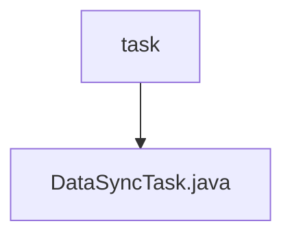

# Basic Information

|      |      |
|------|------|
| Name | task |
| Language | .java |
| Code Path | WeFe/union/blockchain-data-sync/src/main/java/com/welab/wefe/task |
| Package Name | docs.union.blockchain-data-sync.src.main.java.com.welab.wefe.task |
| Brief Description | The DataSyncTask class is used for synchronizing blockchain data, including group ID configuration and WeChat notification URL. It synchronizes block data by group through multithreading, handles exceptions, and records synchronization status. |

# Description

DataSyncTask is a component class designed for data synchronization, which implements blockchain data synchronization by injecting multiple services and configuration parameters. It primarily includes the startTask method to initiate the synchronization task, checking the configured group ID and asynchronously executing the CrawlRunner. CrawlRunner is an inner class responsible for continuously synchronizing block data for the specified group, including querying synchronized blocks, processing new blocks, and filtering already synchronized contract events. During the synchronization process, it logs events, handles exceptions, and saves synchronization results and error information through related services. Overall, it achieves an efficient and stable blockchain data synchronization mechanism.

### Package Internal Structure View

This flowchart illustrates the simple structure of the blockchain data synchronization module in the WeFe project. The root node "task" represents the task directory, which contains a specific task implementation file "DataSyncTask.java". This structure exemplifies a typical Java project's single-file task implementation pattern, where directories serve as functional module divisions and files carry specific business logic implementations.

# File List

| Name   | Type  | Description |
|-------|------|-------------|
| [DataSyncTask.java](DataSyncTask.md) | file | The DataSyncTask class is used for synchronizing blockchain data, including group ID configuration and WeChat notification URL. It synchronizes block data by group through multi-threading, handles exceptions, and records synchronization status. |

