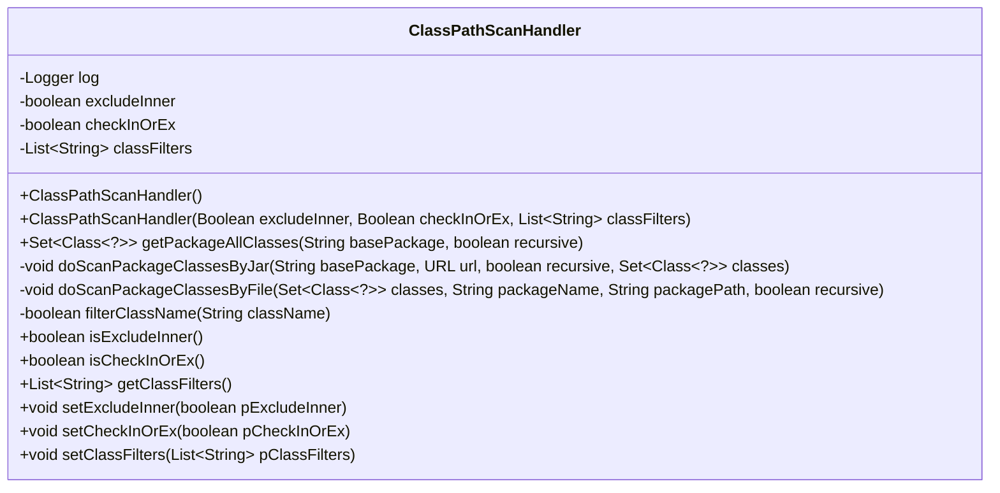
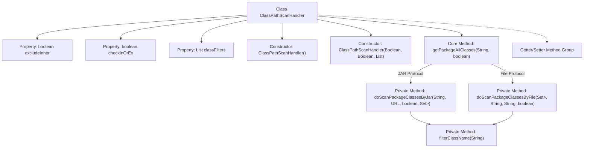

# Basic Information

|      |      |
|------|------|
| Name | ClassPathScanHandler |
| Language | .java |
| Code Path | WeFe/union/blockchain-data-sync/src/main/java/com/welab/wefe/tool/ClassPathScanHandler.java |
| Package Name | com.welab.wefe.tool |
| Dependencies | ['org.slf4j.Logger', 'org.slf4j.LoggerFactory', 'java.io.File', 'java.io.IOException', 'java.net.JarURLConnection', 'java.net.URL', 'java.net.URLDecoder', 'java.util.Enumeration', 'java.util.LinkedHashSet', 'java.util.List', 'java.util.Set', 'java.util.jar.JarEntry', 'java.util.jar.JarFile', 'java.util.regex.Pattern'] |
| Brief Description | The ClassPathScanHandler class is used to scan classes under the classpath, supporting the exclusion of inner classes and custom filtering rules, and can recursively scan classes in files or JAR packages. |

# Description

ClassPathScanHandler is a utility class designed for scanning all classes under the classpath. It supports scanning classes within specified package paths through both file systems and JAR files, offering multiple filtering options. Key functionalities include: setting whether to exclude inner classes (excludeInner), defining filtering rules (checkInOrEx), and specifying filter lists (classFilters). The core method getPackageAllClasses recursively scans the specified package path, invoking either doScanPackageClassesByFile or doScanPackageClassesByJar based on the file type. During the scanning process, filtering rules are applied, and log messages are recorded. The class also provides getter and setter methods for related properties.

# Class Summary

| Name   | Type  | Description |
|-------|------|-------------|
| ClassPathScanHandler | class | The `ClassPathScanHandler` class is used to scan classes under the classpath, supporting the exclusion of inner classes and custom filtering rules, and can handle classes in both files and JAR packages. |

## Class ClassPathScanHandler

|      |      |
|------|------|
| Access Modifier | public |
| Type | class |
| Name | ClassPathScanHandler |
| Description | The `ClassPathScanHandler` class is used to scan classes under the classpath, supporting the exclusion of inner classes and custom filtering rules, and can handle classes in both files and JAR packages. |

### UML Class Diagram

Class diagram description: The ClassPathScanHandler class is a utility tool for scanning all classes under the classpath. It contains three main private attributes: excludeInner (whether to exclude inner classes), checkInOrEx (filter rule application method), and classFilters (filter rule list). It provides constructors and the getPackageAllClasses method to scan all classes under a specified package, supporting both file and JAR scanning modes. The filterClassName method implements class name filtering functionality.

### Internal Method Call Graph

Flowchart Description: This flowchart illustrates the complete structure of the ClassPathScanHandler class, including three core properties (excludeInner, checkInOrEx, classFilters), two constructors, the core scanning method getPackageAllClasses with its branching logic. It scans class files through both file/JAR protocol paths, ultimately filtering class names via the filterClassName method, and includes a complete Getter/Setter method group. The scanning process recursively handles subdirectories and excludes inner classes based on configuration.

### Field List

| Name  | Type  | Description |
|-------|-------|------|
| checkInOrEx = true | boolean | The variable checkInOrEx is of boolean type, with an initial value of true. |
| classFilters = null | List<String> | The class filter list is initialized as empty. |
| log = LoggerFactory.getLogger(ClassPathScanHandler.class) | Logger | Define a static constant log, using LoggerFactory to obtain the logger instance for the ClassPathScanHandler class. |
| excludeInner = true | boolean | Exclude internal element flag, enabled by default. |

### Method List

| Name  | Type  | Description |
|-------|-------|------|
| doScanPackageClassesByJar | void | This method scans class files under specified package paths within JAR packages, filters them based on conditions such as recursion and exclusion of inner classes, and loads qualified classes into a collection. It handles exceptions and logs them. |
| getClassFilters | List<String> | Method to obtain the list of class filters, returns the classFilters variable. |
| isExcludeInner | boolean | The method isExcludeInner returns the state of the boolean value excludeInner. |
| doScanPackageClassesByFile | void | Scan class files under the specified package path, recursively process subdirectories, exclude inner classes, and load eligible classes into a collection. |
| setExcludeInner | void | Set the boolean method to exclude internal elements. |
| filterClassName | boolean | This method is used to filter class names: returns false if the suffix is not .class; returns true if there are no filtering rules; otherwise, checks whether the class name (with the .class suffix removed) matches the filtering rules (supports * wildcard) and returns the matching result based on the checkInOrEx flag. |
| isCheckInOrEx | boolean | The method isCheckInOrEx returns a boolean value checkInOrEx. |
| setClassFilters | void | Set the class filter list, assigning the input parameter pClassFilters to the member variable classFilters. |
| getPackageAllClasses | Set<Class<?>> | Retrieve all classes under the specified package path, supporting recursive scanning of files or classes within JAR packages, handling exceptions, and returning the collection of classes. |
| setCheckInOrEx | void | Set the boolean parameter pCheckInOrEx to the variable checkInOrEx. |

