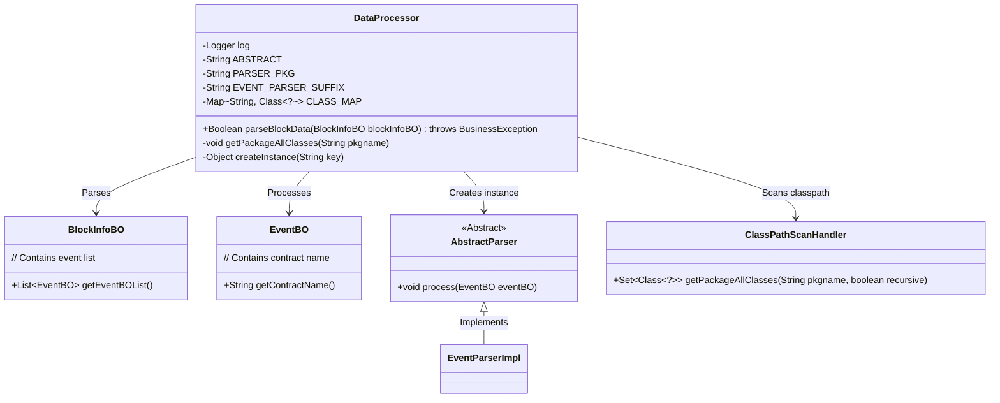
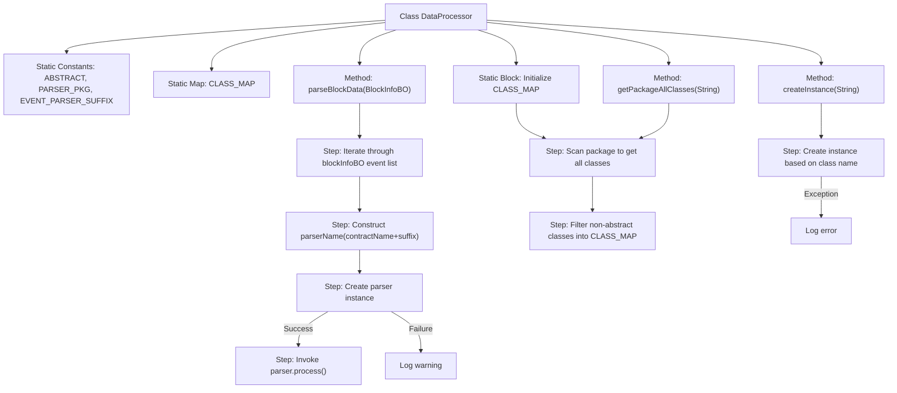

# Basic Information

|      |      |
|------|------|
| Name | DataProcessor |
| Language | .java |
| Code Path | WeFe/union/blockchain-data-sync/src/main/java/com/welab/wefe/tool/DataProcessor.java |
| Package Name | com.welab.wefe.tool |
| Dependencies | ['com.welab.wefe.bo.data.BlockInfoBO', 'com.welab.wefe.bo.data.EventBO', 'com.welab.wefe.exception.BusinessException', 'com.welab.wefe.parser.AbstractParser', 'org.slf4j.Logger', 'org.slf4j.LoggerFactory', 'java.util.HashMap', 'java.util.Map', 'java.util.Set'] |
| Brief Description | The DataProcessor class dynamically loads parser classes under specified packages through reflection to process block event data. The static block initializes class mappings, and the parseBlockData method creates parser instances to handle events. |

# Description

The `DataProcessor` class is a utility class designed for processing block data. It scans all classes under a specified package path via a static initialization block and caches non-abstract classes into `CLASS_MAP`. The primary method, `parseBlockData`, iterates through the block event list, dynamically creates corresponding parser instances (named with the contract name followed by the `EventParser` suffix) based on the contract name, and invokes their `process` method to handle event data. If parser instantiation fails, a warning log is recorded and `false` is returned. The class also includes helper methods: `getPackageAllClasses` for retrieving all classes under a package and `createInstance` for creating instances based on class names. The entire process is accompanied by comprehensive logging.

# Class Summary

| Name   | Type  | Description |
|-------|------|-------------|
| DataProcessor | class | The DataProcessor class handles block data by dynamically loading parser classes through reflection and processing events. During static initialization, it scans non-abstract classes under specified packages, and at runtime, it creates corresponding parser instances based on contract names to execute processing. |

## Class DataProcessor

|      |      |
|------|------|
| Access Modifier | public |
| Type | class |
| Name | DataProcessor |
| Description | The DataProcessor class handles block data by dynamically loading parser classes through reflection and processing events. During static initialization, it scans non-abstract classes under specified packages, and at runtime, it creates corresponding parser instances based on contract names to execute processing. |

### UML Class Diagram

This code implements a reflection-based event processor framework. The DataProcessor dynamically creates corresponding contract event parsers (XXXEventParser) by scanning non-abstract classes under specified packages, and processes blockchain event data. The core workflow includes: 1) Classpath scanning during static initialization phase; 2) Dynamic parser instantiation based on contract names during runtime; 3) Invoking parsers to process events. The class diagram illustrates the main components and their relationships, demonstrating the collaboration between data objects (BlockInfoBO/EventBO), processors (AbstractParser), and class scanners (ClassPathScanHandler).

### Internal Method Call Graph

This code implements a blockchain data processor, whose main functionality is to dynamically load and execute event parsers of specific formats through reflection mechanism. During static initialization, it scans all non-abstract classes under a specified package and caches them. The parseBlockData method dynamically creates corresponding parser instances for each event and processes them. The flowchart clearly illustrates the class structure, initialization process, and main event handling workflow, including exception handling paths. This design achieves a plugin architecture that automatically discovers and loads processors through naming conventions.

### Field List

| Name  | Type  | Description |
|-------|-------|------|
| EVENT_PARSER_SUFFIX = "EventParser" | String | The constant EVENT_PARSER_SUFFIX is defined as the string "EventParser". |
| log = LoggerFactory.getLogger(DataProcessor.class) | Logger | Define a private static log object for the DataProcessor class. |
| PARSER_PKG = "com.welab.wefe.parser" | String | Define a private static constant string PARSER_PKG with the value "com.welab.wefe.parser". |
| CLASS_MAP = new HashMap<>() | Map<String, Class<?>> | Defined a private static constant CLASS_MAP, of type Map, with String as key and Class object as value. |
| ABSTRACT = "Abstract" | String | The static constant string ABSTRACT has the value "Abstract". |

### Method List

| Name  | Type  | Description |
|-------|-------|------|
| parseBlockData | Boolean | The static method `parseBlockData` parses block information, iterates through the event list, dynamically creates a parser instance based on the contract name, and returns `false` if it fails. If successful, it processes the events and returns `true`. |
| getPackageAllClasses | void | This method scans all classes under the specified package, filters out abstract classes, stores the class names and class objects in a mapping table, and prints the fully qualified class names. |
| createInstance | Object | Static methods retrieve classes from the map by key and create instances, returning null on failure. |

