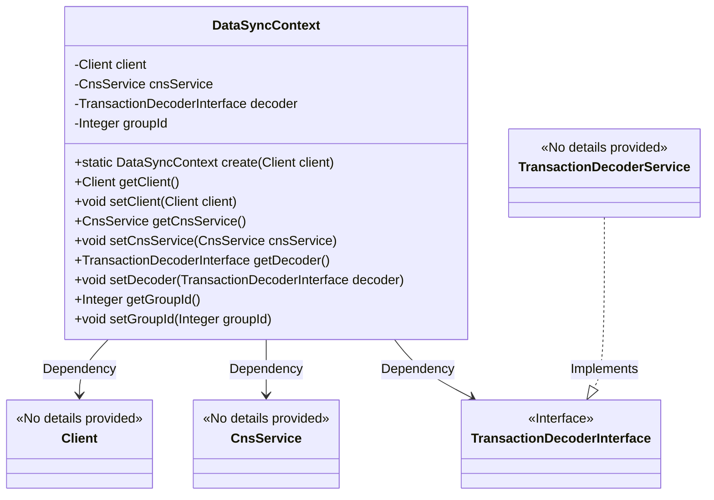
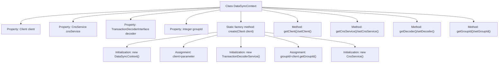

# Basic Information

|      |      |
|------|------|
| Name | DataSyncContext |
| Language | .java |
| Code Path | WeFe/union/blockchain-data-sync/src/main/java/com/welab/wefe/tool/DataSyncContext.java |
| Package Name | com.welab.wefe.tool |
| Dependencies | ['org.fisco.bcos.sdk.client.Client', 'org.fisco.bcos.sdk.contract.precompiled.cns.CnsService', 'org.fisco.bcos.sdk.transaction.codec.decode.TransactionDecoderInterface', 'org.fisco.bcos.sdk.transaction.codec.decode.TransactionDecoderService'] |
| Brief Description | The DataSyncContext class encapsulates the blockchain client, CNS service, transaction decoder, and group ID, providing creation and access methods. |

# Description

The DataSyncContext class encapsulates the core functionality of blockchain data synchronization, comprising four key components: the blockchain client, CNS service, transaction decoder, and group ID. It initializes objects via the static factory method `create`, automatically configures decoder and service instances, and provides a complete set of getter/setter methods to enable flexible access and modification. This class is primarily used to manage the foundational environment configuration for blockchain interactions.

# Class Summary

| Name   | Type  | Description |
|-------|------|-------------|
| DataSyncContext | class | The DataSyncContext class encapsulates the blockchain client, CNS service, transaction decoder, and group ID, providing methods for creation and access. |

## Class DataSyncContext

|      |      |
|------|------|
| Access Modifier | public |
| Type | class |
| Name | DataSyncContext |
| Description | The DataSyncContext class encapsulates the blockchain client, CNS service, transaction decoder, and group ID, providing methods for creation and access. |

### UML Class Diagram

Class diagram description: The DataSyncContext class encapsulates core components such as blockchain client (Client), CNS service (CnsService), transaction decoder interface (TransactionDecoderInterface), and group ID (groupId). These dependencies are initialized via the factory method create(). TransactionDecoderService implements the TransactionDecoderInterface. The class provides complete getter/setter methods for attribute access and modification, enabling blockchain data synchronization context management functionality.

### Internal Method Call Graph

This code defines a DataSyncContext class for managing blockchain data synchronization context. The core functionality is initializing objects through the static factory method create(), which sets up client instance, transaction decoder, group ID, and CNS service. The class contains four main properties with their getter/setter methods, where client and decoder are initialized during creation and cannot be null. The flowchart illustrates the class structure and detailed initialization process of the create() method, highlighting dependency relationships during object creation.

### Field List

| Name  | Type  | Description |
|-------|-------|------|
| groupId | Integer | Define a private integer variable groupId. |
| decoder | TransactionDecoderInterface | The private member variable `decoder`, of type `TransactionDecoderInterface` interface. |
| cnsService | CnsService | Private CnsService instance variable. |
| client | Client | Private client instance variables. |

### Method List

| Name  | Type  | Description |
|-------|-------|------|
| getCnsService | CnsService | Methods to obtain a CnsService instance. |
| setClient | void | Method for setting the client object, which assigns the passed client parameter to the client property of the current object. |
| create | DataSyncContext | Create a DataSyncContext instance, initialize the client, decoder, groupId, and cnsService, and return the configured object. |
| setCnsService | void | This is a Java method used to set the CnsService member variable of a class. The method accepts a CnsService parameter and assigns it to the cnsService property of the current object. |
| getClient | Client | The method to obtain the client instance directly returns the private member variable `client`. |
| getDecoder | TransactionDecoderInterface | Methods to obtain an instance of the transaction decoder interface. |
| setDecoder | void | Set up the transaction decoder interface instance. |
| getGroupId | Integer | Methods to obtain the group ID, returning an integer-type groupId. |
| setGroupId | void | This is a Java method used to set the groupId property of a class, which accepts an Integer type parameter. |

