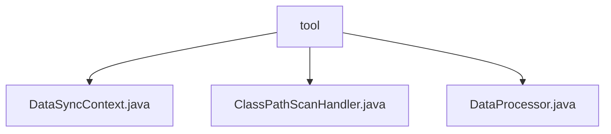

# Basic Information

|      |      |
|------|------|
| Name | tool |
| Language | .java |
| Code Path | WeFe/union/blockchain-data-sync/src/main/java/com/welab/wefe/tool |
| Package Name | docs.union.blockchain-data-sync.src.main.java.com.welab.wefe.tool |
| Brief Description | The DataSyncContext manages blockchain interaction configurations, including client, CNS, decoder, and group ID. The ClassPathScanHandler scans the classpath, supporting file and JAR scanning with filtering. The DataProcessor handles block data, dynamically creating parsers and processing events. |

# Description

## Overview  
This module implements core functionalities for blockchain data synchronization and processing, comprising three major components: environment configuration management, classpath scanning, and event parsing. The DataSyncContext manages foundational configurations such as blockchain clients and CNS services; the ClassPathScanHandler provides classpath scanning capabilities, supporting both file systems and JAR packages; and the DataProcessor dynamically loads contract parsers to process block events.  

Interface specifications include: DataSyncContext is created via the factory pattern, ClassPathScanHandler supports filter rule configuration, and DataProcessor requires parsers to adhere to the naming convention of "ContractName+EventParser". Key data structures involve the CLASS_MAP cache, classFilters exclusion list, and configuration items like group IDs.  

External dependencies include blockchain client SDKs, logging components, and JAR file operation libraries. For instance, DataSyncContext relies on CNS services, while ClassPathScanHandler needs to process JAR manifest files. Implementation examples cover scenarios such as dynamic loading of contract event parsers and exclusion filtering of inner classes.  

## Core Business Scenarios  
The module workflow consists of three phases: 1) DataSyncContext initializes the blockchain environment; 2) ClassPathScanHandler scans the classpath to retrieve parsers; 3) DataProcessor matches contract events and invokes corresponding parsers. Similar to the event bus pattern, extensibility is achieved through dynamic binding.  

Typical applications include cross-chain data synchronization and smart contract event analysis. For example, DataProcessor can parse block events from different contracts, while ClassPathScanHandler supports on-demand filtering of specific package paths. The interaction mode is primarily configuration-driven, such as using excludeInner to exclude inner classes or isolating different chain environments via group IDs.  

API types encompass factory methods (create), scanning interfaces (getPackageAllClasses), and data processing (parseBlockData). Integration examples demonstrate how the convention-over-configuration principle enables automatic discovery and loading of contract parsers.

### Package Internal Structure View

This flowchart illustrates the code structure of the blockchain data synchronization tool in the WeFe project. The root node "tool" contains three Java files: DataSyncContext.java handles data synchronization context, ClassPathScanHandler.java is responsible for classpath scanning, and DataProcessor.java performs data processing. These three files are directly located under the tool directory without deeper subdirectory hierarchies, indicating a peer-level relationship.

# File List

| Name   | Type  | Description |
|-------|------|-------------|
| [DataSyncContext.java](DataSyncContext.md) | file | The DataSyncContext class encapsulates the blockchain client, CNS service, transaction decoder, and group ID, providing creation and access methods. |
| [ClassPathScanHandler.java](ClassPathScanHandler.md) | file | The ClassPathScanHandler class is used to scan classes under the classpath, supporting the exclusion of inner classes and custom filtering rules, and can recursively scan classes in files or JAR packages. |
| [DataProcessor.java](DataProcessor.md) | file | The DataProcessor class dynamically loads parser classes under specified packages through reflection to process block event data. The static block initializes class mappings, and the parseBlockData method creates parser instances to handle events. |

