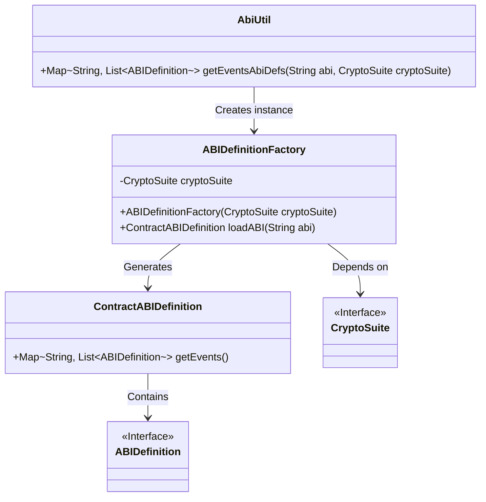
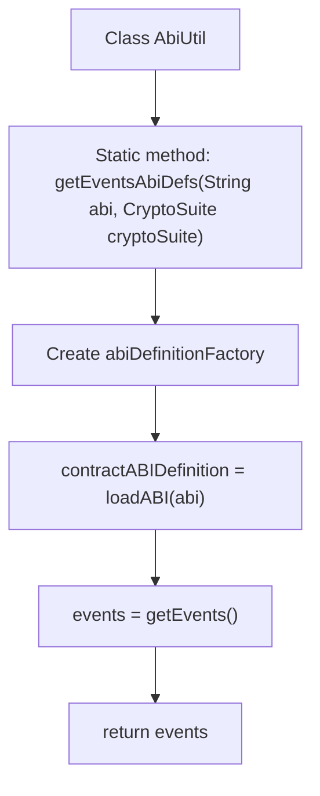

# Basic Information

|      |      |
|------|------|
| Name | AbiUtil |
| Language | .java |
| Code Path | WeFe/union/blockchain-data-sync/src/main/java/com/welab/wefe/util/AbiUtil.java |
| Package Name | com.welab.wefe.util |
| Dependencies | ['org.fisco.bcos.sdk.abi.wrapper.ABIDefinition', 'org.fisco.bcos.sdk.abi.wrapper.ABIDefinitionFactory', 'org.fisco.bcos.sdk.abi.wrapper.ContractABIDefinition', 'org.fisco.bcos.sdk.crypto.CryptoSuite', 'java.util.List', 'java.util.Map'] |
| Brief Description | The AbiUtil class contains a static method getEventsAbiDefs, which parses the ABI string through ABIDefinitionFactory and returns a list of event definitions. |

# Description

The AbiUtil class contains a static method `getEventsAbiDefs`, which takes an ABI string and a CryptoSuite object as parameters. Internally, the method creates an instance via ABIDefinitionFactory and uses the `loadABI` method to load the ABI string, generating a ContractABIDefinition object. Finally, it returns the event definition map stored in this object, where the keys are of string type and the values are lists of ABIDefinition objects.

# Class Summary

| Name   | Type  | Description |
|-------|------|-------------|
| AbiUtil | class | The AbiUtil class provides a static method `getEventsAbiDefs` that returns a map containing event definitions by inputting an ABI string and a CryptoSuite object. The method uses ABIDefinitionFactory to parse the ABI and extract the event list. |

## Class AbiUtil

|      |      |
|------|------|
| Access Modifier | public |
| Type | class |
| Name | AbiUtil |
| Description | The AbiUtil class provides a static method `getEventsAbiDefs` that returns a map containing event definitions by inputting an ABI string and a CryptoSuite object. The method uses ABIDefinitionFactory to parse the ABI and extract the event list. |

### UML Class Diagram

This code describes an ABI utility class AbiUtil, which loads contract ABI through ABIDefinitionFactory and extracts event definitions. The core workflow is: AbiUtil invokes ABIDefinitionFactory to create an instance, the factory loads the ABI string to generate a ContractABIDefinition object, and finally returns an event mapping table. Here CryptoSuite serves as a cryptographic tool interface dependency, while ABIDefinition is the interface specification for event definitions. The entire structure demonstrates the conversion process from ABI strings to event definitions, involving factory patterns and data encapsulation.

### Internal Method Call Graph

This code flowchart illustrates the complete execution process of the getEventsAbiDefs method in the AbiUtil class. The method first parses the input ABI string through ABIDefinitionFactory, generates a contract definition object to extract the event list, and finally returns the mapping between event names and their definitions. The entire process demonstrates the core logic of ABI parsing, involving three key steps: factory pattern creation, data loading, and result extraction.

### Field List

| Name  | Type  | Description |
|-------|-------|------|

### Method List

| Name  | Type  | Description |
|-------|-------|------|
| getEventsAbiDefs | Map<String, List<ABIDefinition>> | The static method `getEventsAbiDefs` takes an ABI string and an encryption suite as input, parses the ABI via a factory, and returns a mapping of event definitions. |

