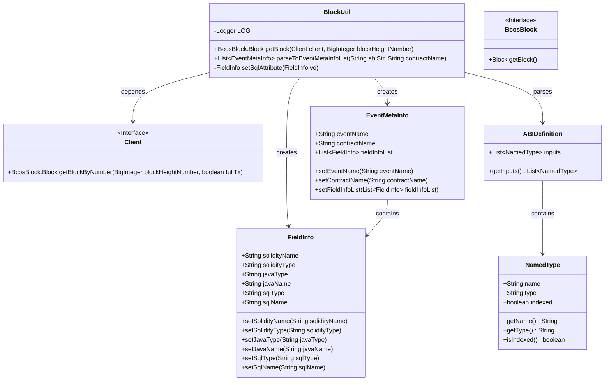
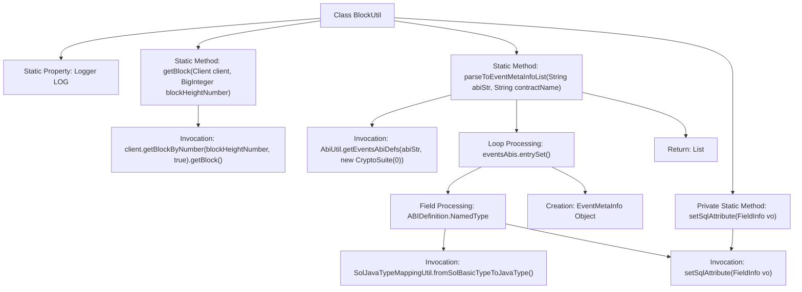

# Basic Information

|      |      |
|------|------|
| Name | BlockUtil |
| Language | .java |
| Code Path | WeFe/union/blockchain-data-sync/src/main/java/com/welab/wefe/util/BlockUtil.java |
| Package Name | com.welab.wefe.util |
| Dependencies | ['cn.hutool.core.collection.CollectionUtil', 'cn.hutool.core.util.StrUtil', 'com.welab.wefe.bo.contract.EventMetaInfo', 'com.welab.wefe.bo.contract.FieldInfo', 'com.welab.wefe.common.util.JObject', 'com.welab.wefe.enums.JavaTypeEnum', 'org.apache.commons.lang3.StringUtils', 'org.fisco.bcos.sdk.abi.wrapper.ABIDefinition', 'org.fisco.bcos.sdk.client.Client', 'org.fisco.bcos.sdk.client.protocol.response.BcosBlock', 'org.fisco.bcos.sdk.crypto.CryptoSuite', 'org.slf4j.Logger', 'org.slf4j.LoggerFactory', 'java.math.BigInteger', 'java.util.ArrayList', 'java.util.List', 'java.util.Map'] |
| Brief Description | The BlockUtil class provides two functionalities: 1. Retrieving block information by block height; 2. Parsing contract ABI to generate a list of event metadata, including event names, contract names, and field type mappings. |

# Description

The BlockUtil class contains two core methods: getBlock retrieves block data via client and block height, while parseToEventMetaInfoList parses contract ABI strings and names to generate a list of event meta-information. This method processes event ABI definitions, filters non-indexed fields, maps Solidity types to Java types, and sets SQL attributes. During the process, it validates event ABI effectiveness and logs exceptions. Ultimately, it returns a list of EventMetaInfo objects containing event names, contract names, and field information. The auxiliary method setSqlAttribute is responsible for setting SQL types and names for fields.

# Class Summary

| Name   | Type  | Description |
|-------|------|-------------|
| BlockUtil | class | The BlockUtil class provides methods for retrieving blocks and parsing event metadata. getBlock fetches block information by block height. parseToEventMetaInfoList parses event metadata based on contract ABI and name, handling event names, contract names, field mappings, and setting SQL attributes. |

## Class BlockUtil

|      |      |
|------|------|
| Access Modifier | public |
| Type | class |
| Name | BlockUtil |
| Description | The BlockUtil class provides methods for retrieving blocks and parsing event metadata. getBlock fetches block information by block height. parseToEventMetaInfoList parses event metadata based on contract ABI and name, handling event names, contract names, field mappings, and setting SQL attributes. |

### UML Class Diagram

This code primarily implements a blockchain utility class BlockUtil with two core functionalities: 1) Fetching block data at specified height via client interface; 2) Parsing smart contract ABI to generate event metadata lists. The class diagram illustrates BlockUtil's interactions with multiple helper classes, including the Client interface for block retrieval, EventMetaInfo for event metadata storage, FieldInfo for field information storage, along with ABIDefinition and NamedType for ABI structure parsing. The layered design positions BlockUtil as the entry class coordinating components to complete blockchain data parsing, demonstrating clear responsibility division and modular design principles.

### Internal Method Call Graph

This flowchart illustrates the structure and method invocation relationships of the BlockUtil class. The class includes the getBlock method for retrieving block information and the parseToEventMetaInfoList method for parsing event metadata. The latter parses ABI strings via the AbiUtil tool, iterates through event definitions, processes field type mappings, and ultimately returns a list of event metadata. The private method setSqlAttribute is used to set SQL attributes for fields. The entire process involves multiple utility classes and type conversion operations, demonstrating the complexity of blockchain event parsing.

### Field List

| Name  | Type  | Description |
|-------|-------|------|
| LOG = LoggerFactory.getLogger(BlockUtil.class) | Logger | Define the static log object LOG of the BlockUtil class for recording log information. |

### Method List

| Name  | Type  | Description |
|-------|-------|------|
| getBlock | BcosBlock.Block | Retrieve blockchain block information at the specified height, returning a block object containing complete transaction details. |
| parseToEventMetaInfoList | List<EventMetaInfo> | Parse the ABI string to generate a list of event metadata, including event names, contract names, and field information, filter indexed fields and map Java types, then return the list after handling exceptions. |
| setSqlAttribute | FieldInfo | The method `setSqlAttribute` accepts a `FieldInfo` object, sets the `sqlType` based on its `javaType`, converts the `javaName` to underscore format as the `sqlName`, and finally returns the updated object. |

