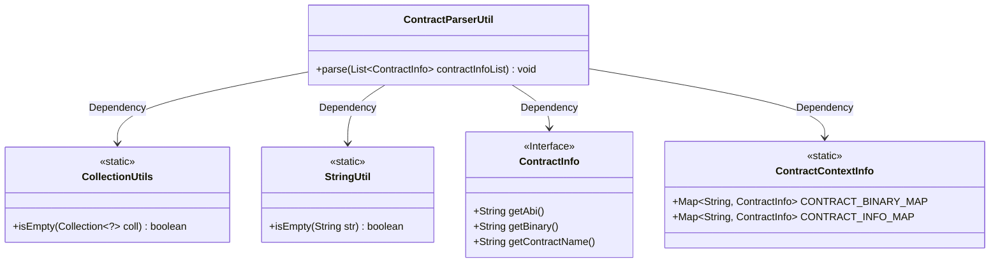
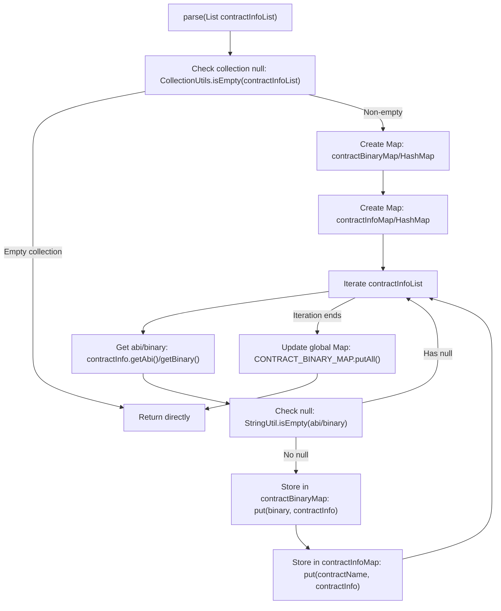

# Basic Information

|      |      |
|------|------|
| Name | ContractParserUtil |
| Language | .java |
| Code Path | WeFe/union/blockchain-data-sync/src/main/java/com/welab/wefe/util/ContractParserUtil.java |
| Package Name | com.welab.wefe.util |
| Dependencies | ['com.welab.wefe.bo.contract.ContractContextInfo', 'com.welab.wefe.bo.contract.ContractInfo', 'com.welab.wefe.common.util.StringUtil', 'org.apache.commons.collections4.CollectionUtils', 'java.util.HashMap', 'java.util.List', 'java.util.Map'] |
| Brief Description | The ContractParserUtil class parses the contract information list, filters out invalid data, maps the binary and contract name to the ContractInfo object respectively, and stores it in the global context. |

# Description

The `ContractParserUtil` class contains a static method `parse` designed to process a list of `ContractInfo` objects. The method first checks if the list is empty and returns immediately if so. It then creates two HashMaps to store `ContractInfo` objects, using binary code and contract names as keys respectively. During iteration, entries with empty ABI or binary fields are skipped, while valid data is stored in the corresponding Map. Finally, the contents of the two temporary Maps are merged into the static Maps of the `ContractContextInfo` class. This entire process achieves categorized storage of contract information.

# Class Summary

| Name   | Type  | Description |
|-------|------|-------------|
| ContractParserUtil | class | The `ContractParserUtil` class provides a static method `parse` that processes a list of contract information, filters out invalid data, maps the contract binary and name to the respective contract information, and stores it in the global context. |

## Class ContractParserUtil

|      |      |
|------|------|
| Access Modifier | public |
| Type | class |
| Name | ContractParserUtil |
| Description | The `ContractParserUtil` class provides a static method `parse` that processes a list of contract information, filters out invalid data, maps the contract binary and name to the respective contract information, and stores it in the global context. |

### UML Class Diagram

This code demonstrates a contract parsing utility class `ContractParserUtil`, which processes a list of contract information through its static method `parse`. Its primary function is to filter invalid contract data and store valid data into two static mapping tables. The class diagram clearly illustrates the dependency relationships between the utility class and utility libraries (`CollectionUtils`/`StringUtil`), the contract information interface (`ContractInfo`), and the context storage class (`ContractContextInfo`), reflecting the complete workflow of data validation, filtering, and storage.

### Internal Method Call Graph

This flowchart describes the complete logical flow of the `ContractParserUtil.parse()` method. The method first checks if the input collection is empty, returning directly if true; otherwise creates two temporary HashMaps for storing contract data. During iteration, contracts with null ABI or Binary are filtered out, while valid data is stored in corresponding Maps. Finally, the contents of temporary Maps are merged into the global static `ContractContextInfo` Map. Key steps include null checks, data filtering, and two-level Map merging.

### Field List

| Name  | Type  | Description |
|-------|-------|------|

### Method List

| Name  | Type  | Description |
|-------|-------|------|
| parse | void | Parse the contract information list, filter out invalid data, then map the binary and contract name to the contract information respectively, and store it in the global context. |

