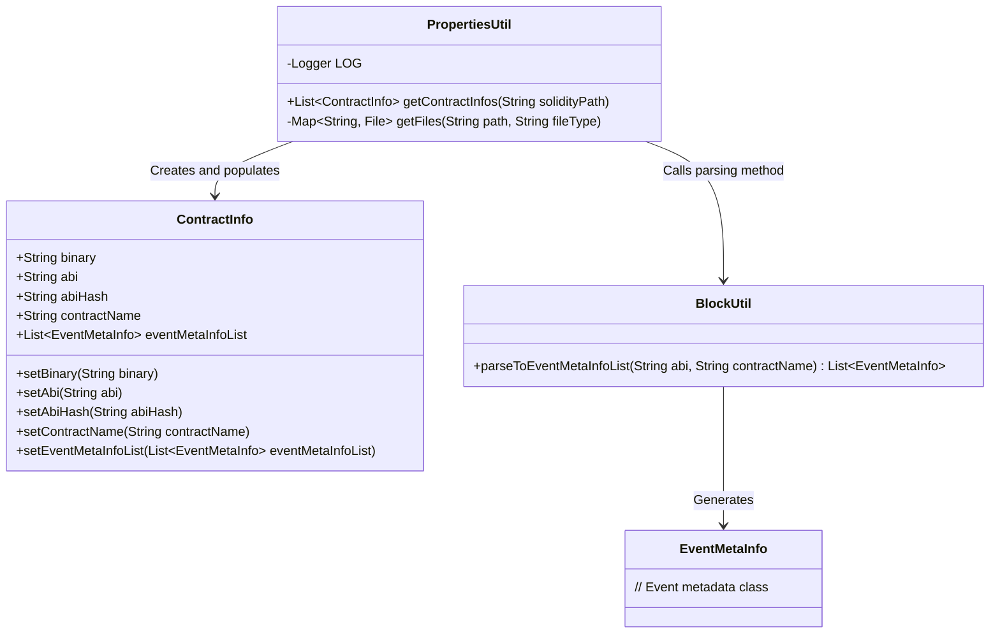
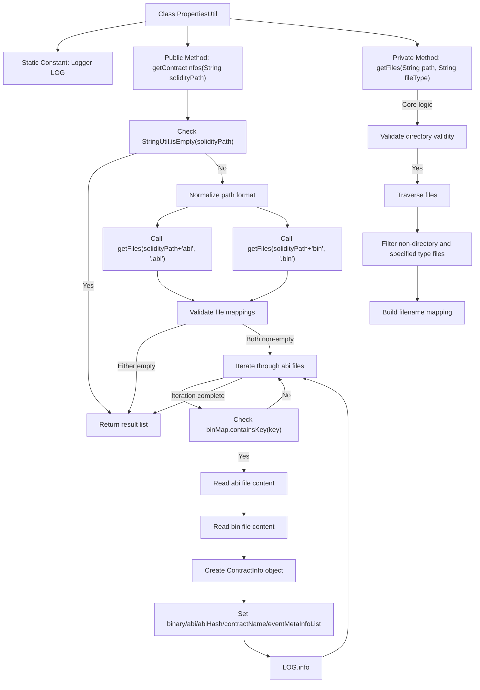

# Basic Information

|      |      |
|------|------|
| Name | PropertiesUtil |
| Language | .java |
| Code Path | WeFe/union/blockchain-data-sync/src/main/java/com/welab/wefe/util/PropertiesUtil.java |
| Package Name | com.welab.wefe.util |
| Dependencies | ['cn.hutool.core.collection.CollectionUtil', 'com.welab.wefe.bo.contract.ContractInfo', 'com.welab.wefe.common.util.StringUtil', 'org.apache.commons.codec.digest.DigestUtils', 'org.slf4j.Logger', 'org.slf4j.LoggerFactory', 'java.io.File', 'java.io.IOException', 'java.nio.charset.StandardCharsets', 'java.nio.file.Files', 'java.nio.file.Paths', 'java.util.ArrayList', 'java.util.HashMap', 'java.util.List', 'java.util.Map'] |
| Brief Description | The PropertiesUtil class provides a static method, getContractInfos, which reads abi and bin files from a specified path and parses them into a list of ContractInfo objects. Each ContractInfo contains the contract name, ABI, binary code, and event metadata. |

# Description

The PropertiesUtil class is a utility class designed to read ABI and BIN files of smart contracts from a specified path and generate a list of ContractInfo objects. Its primary functions include validating path effectiveness, processing path formats, retrieving ABI and BIN files, reading file contents, computing MD5 hashes of ABIs, parsing event metadata, and encapsulating the results as ContractInfo objects. If the path is invalid or files are missing, it returns an empty list. The process logs error messages and successfully loaded contract information.

# Class Summary

| Name   | Type  | Description |
|-------|------|-------------|
| PropertiesUtil | class | The PropertiesUtil class reads abi and bin files from a specified path, parses them into a ContractInfo list, which includes the contract name, abi, binary code, abi hash, and event metadata. |

## Class PropertiesUtil

|      |      |
|------|------|
| Access Modifier | public |
| Type | class |
| Name | PropertiesUtil |
| Description | The PropertiesUtil class reads abi and bin files from a specified path, parses them into a ContractInfo list, which includes the contract name, abi, binary code, abi hash, and event metadata. |

### UML Class Diagram

Class diagram description:  
PropertiesUtil is a utility class primarily responsible for reading ABI and BIN files of smart contracts from a specified path and converting them into a list of ContractInfo objects. It relies on the ContractInfo class to store contract information and uses the BlockUtil class to parse ABIs for generating event metadata lists. ContractInfo contains attributes such as contract binary code, ABI, hash value, contract name, and event metadata list. The entire process involves file reading, data conversion, and event parsing operations, serving the purpose of smart contract configuration management.

### Internal Method Call Graph

This flowchart illustrates the main execution logic of the PropertiesUtil class, covering the entire process from input path processing to file acquisition, content reading, object construction, and final result return. It highlights key steps such as path validity checks, file mapping retrieval, ABI/BIN file matching and reading, while demonstrating exception handling and data conversion flows. The internal processing logic of the private method getFiles is also clearly presented through sub-processes, fully showcasing the functional implementation path of this utility class.

### Field List

| Name  | Type  | Description |
|-------|-------|------|
| LOG = LoggerFactory.getLogger(PropertiesUtil.class) | Logger | Define a static constant LOG for logging in the PropertiesUtil class. |

### Method List

| Name  | Type  | Description |
|-------|-------|------|
| getContractInfos | List<ContractInfo> | This method reads the ABI and BIN files of a Solidity contract from a specified path and parses them into a list of ContractInfo objects. If the path is invalid or files are missing, it returns an empty list. During processing, it validates file matches, reads the content, calculates the ABI hash, and finally generates a list containing the contract information. |
| getFiles | Map<String, File> | Retrieve specific type files under the specified path and return a mapping of filenames (without extensions) to files. Subdirectories are ignored, and empty directories return an empty mapping. |

