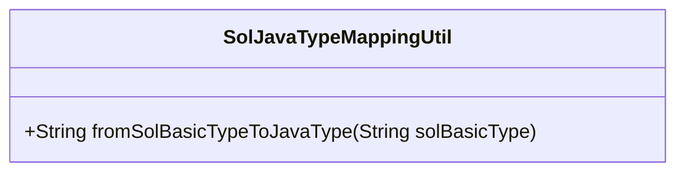
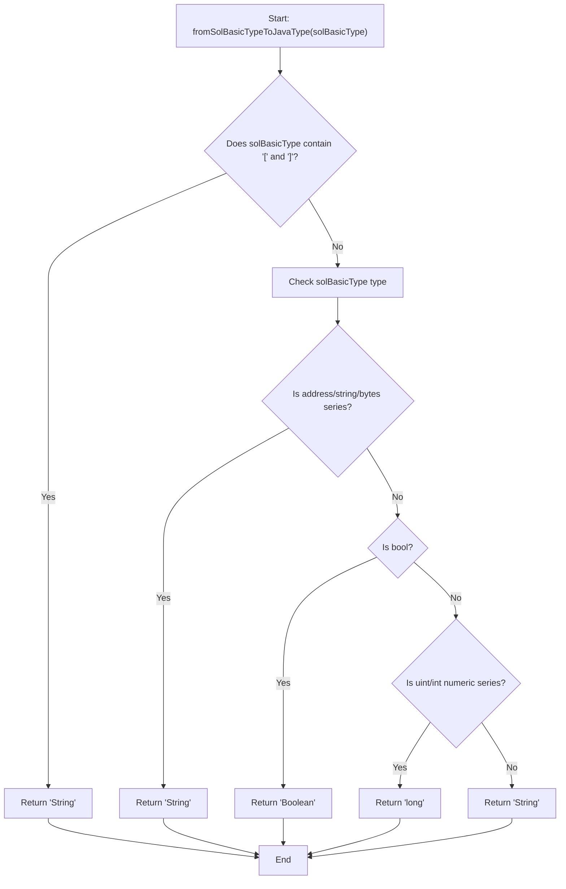
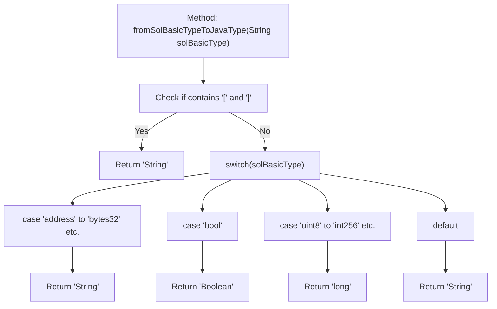

# Basic Information

|      |      |
|------|------|
| Name | SolJavaTypeMappingUtil |
| Language | .java |
| Code Path | WeFe/union/blockchain-data-sync/src/main/java/com/welab/wefe/util/SolJavaTypeMappingUtil.java |
| Package Name | com.welab.wefe.util |
| Dependencies | ['org.apache.commons.lang3.StringUtils'] |
| Brief Description | The `SolJavaTypeMappingUtil` class maps Solidity primitive types to Java types: array types return `String`; `address`, `string`, and the `bytes` series return `String`; `bool` returns `Boolean`; integer types return `long`; other types default to returning `String`. |

# Description

The SolJavaTypeMappingUtil class contains a static method `fromSolBasicTypeToJavaType` that maps Solidity basic types to Java types. If the input type contains square brackets, it returns String. The address, string, and bytes series types are mapped to String, bool is mapped to Boolean, all uint and int series numeric types are mapped to long, and other cases default to returning String. This method implements the basic type conversion logic from Solidity to Java.

# Class Summary

| Name   | Type  | Description |
|-------|------|-------------|
| SolJavaTypeMappingUtil | class | The SolJavaTypeMappingUtil class maps Solidity primitive types to Java types: array types, address, string, and byte types are mapped to String; boolean type is mapped to Boolean; integer types are mapped to long; other types default to String. |

## Class SolJavaTypeMappingUtil

|      |      |
|------|------|
| Access Modifier | public |
| Type | class |
| Name | SolJavaTypeMappingUtil |
| Description | The SolJavaTypeMappingUtil class maps Solidity primitive types to Java types: array types, address, string, and byte types are mapped to String; boolean type is mapped to Boolean; integer types are mapped to long; other types default to String. |

### UML Class Diagram

This code implements a utility class for mapping Solidity basic types to Java types. The class diagram shows it's a utility class containing only static methods, while the flowchart clearly illustrates its three-level decision logic: first checking for array types, then handling specific string types, and finally processing numeric types. The method maps Solidity's address, string, and bytes series to Java's String, bool to Boolean, all integer types to long, and defaults to returning String otherwise. This type conversion is particularly useful for interactions between blockchain smart contracts and Java applications.

### Internal Method Call Graph

This flowchart describes the execution logic of the `fromSolBasicTypeToJavaType` method in the `SolJavaTypeMappingUtil` class. The method first checks if the input string contains array symbols, and if so, directly returns "String". Otherwise, it maps Solidity basic types to Java types via a switch-case structure: address/bytes types return "String", boolean types return "Boolean", various integer types return "long", and the default case returns "String". The flowchart clearly illustrates the branching decision process of the type conversion.

### Field List

| Name  | Type  | Description |
|-------|-------|------|

### Method List

| Name  | Type  | Description |
|-------|-------|------|
| fromSolBasicTypeToJavaType | String | This method converts Solidity basic types to Java types: array types return String; address, string, and bytes series return String; bool returns Boolean; integer types return long; others default to String. |

