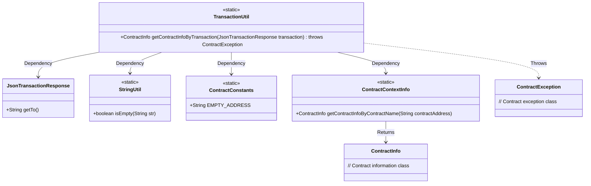
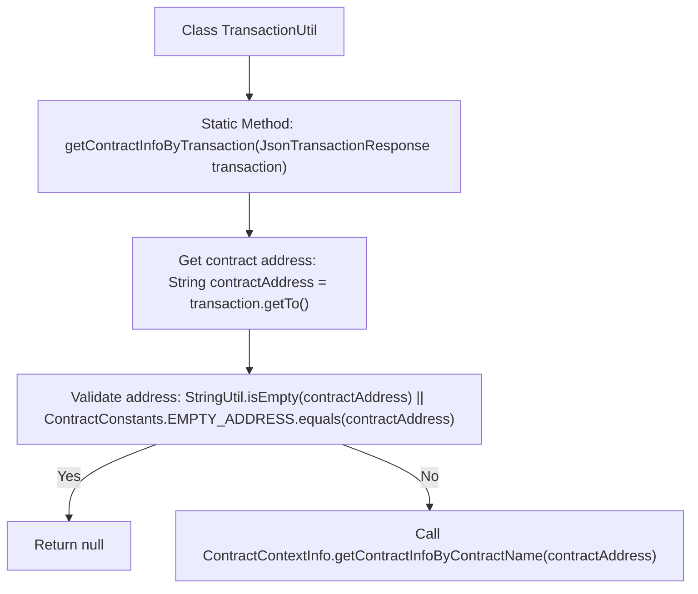

# Basic Information

|      |      |
|------|------|
| Name | TransactionUtil |
| Language | .java |
| Code Path | WeFe/union/blockchain-data-sync/src/main/java/com/welab/wefe/util/TransactionUtil.java |
| Package Name | com.welab.wefe.util |
| Dependencies | ['com.welab.wefe.bo.contract.ContractContextInfo', 'com.welab.wefe.bo.contract.ContractInfo', 'com.welab.wefe.common.util.StringUtil', 'com.welab.wefe.constant.ContractConstants', 'org.fisco.bcos.sdk.client.protocol.model.JsonTransactionResponse', 'org.fisco.bcos.sdk.transaction.model.exception.ContractException'] |
| Brief Description | The `TransactionUtil` class provides static methods to retrieve contract information from transaction data. It returns `null` if the contract address is empty or invalid; otherwise, it queries `ContractContextInfo`. |

# Description

The code describes a utility class named `TransactionUtil`, which includes a static method `getContractInfoByTransaction`. This method takes a `JsonTransactionResponse` object as a parameter and attempts to extract the contract address from it. If the address is empty or equals the predefined `EMPTY_ADDRESS` constant, it returns `null`; otherwise, it queries and returns the corresponding `ContractInfo` object via the `ContractContextInfo` class based on the contract address. The process may throw a `ContractException`.

# Class Summary

| Name   | Type  | Description |
|-------|------|-------------|
| TransactionUtil | class | The `TransactionUtil` class provides static methods to retrieve contract information from transaction data. If the contract address is empty or invalid, it returns null; otherwise, it queries the contract information based on the address. |

## Class TransactionUtil

|      |      |
|------|------|
| Access Modifier | public |
| Type | class |
| Name | TransactionUtil |
| Description | The `TransactionUtil` class provides static methods to retrieve contract information from transaction data. If the contract address is empty or invalid, it returns null; otherwise, it queries the contract information based on the address. |

### UML Class Diagram

This code demonstrates a transaction utility class TransactionUtil, which extracts contract addresses from transaction responses and retrieves contract information through the static method getContractInfoByTransaction. The process includes: validating the transaction recipient address, returning null if empty or default address, otherwise querying contract information via ContractContextInfo. It involves 6 auxiliary classes including data processing tools, constant definitions, and exception handling components, collectively implementing the contract information query functionality.

### Internal Method Call Graph

This code flowchart illustrates the logic of the contract information retrieval method in the TransactionUtil class. The process begins by checking the contract address in the transaction object, first verifying whether the address is empty or matches a predefined empty address. If invalid, it returns null; if valid, it queries and returns the corresponding contract information via ContractContextInfo. The entire process demonstrates rigorous input parameter validation and clear exception handling paths.

### Field List

| Name  | Type  | Description |
|-------|-------|------|

### Method List

| Name  | Type  | Description |
|-------|-------|------|
| getContractInfoByTransaction | ContractInfo | The method retrieves contract information through transactions, checks the address validity, and returns the corresponding contract data if valid; otherwise, it returns null. |

