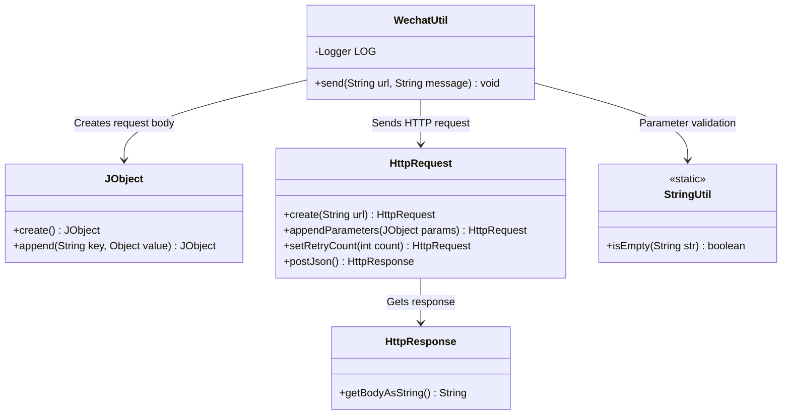
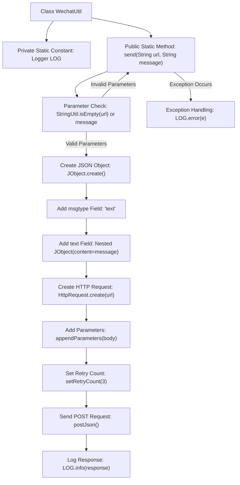

# Basic Information

|      |      |
|------|------|
| Name | WechatUtil |
| Language | .java |
| Code Path | WeFe/union/blockchain-data-sync/src/main/java/com/welab/wefe/util/WechatUtil.java |
| Package Name | com.welab.wefe.util |
| Dependencies | ['com.welab.wefe.common.http.HttpRequest', 'com.welab.wefe.common.http.HttpResponse', 'com.welab.wefe.common.util.JObject', 'com.welab.wefe.common.util.StringUtil', 'org.slf4j.Logger', 'org.slf4j.LoggerFactory'] |
| Brief Description | The WechatUtil class provides a static method `send` that sends text messages to the WeChat Enterprise account via HTTP POST, supporting retries and exception handling. |

# Description

The WechatUtil class contains a static method `send` for sending messages to WeChat. The method accepts `url` and `message` parameters and returns immediately if either is empty. It constructs a JSON request body using JObject, including `msgtype` and `text` fields. A POST request is initiated via HttpRequest with a retry count of 3, and the response or exception information is logged.

# Class Summary

| Name   | Type  | Description |
|-------|------|-------------|
| WechatUtil | class | The WechatUtil class provides a static method `send` that sends messages to WeChat via HTTP requests, supporting retries and exception handling. |

## Class WechatUtil

|      |      |
|------|------|
| Access Modifier | public |
| Type | class |
| Name | WechatUtil |
| Description | The WechatUtil class provides a static method `send` that sends messages to WeChat via HTTP requests, supporting retries and exception handling. |

### UML Class Diagram

This code demonstrates a WeChat utility class `WechatUtil`, whose primary function is to send messages to Enterprise WeChat via HTTP requests. The class diagram includes five key classes: `WechatUtil` as the main class relies on `JObject` to construct the request body, uses `HttpRequest` to send POST requests, performs null checks via `StringUtil`, and finally obtains the response result from `HttpResponse`. The entire process includes parameter validation, request body construction, HTTP request transmission, and exception handling, reflecting the complete processing chain for Enterprise WeChat message sending.

### Internal Method Call Graph

This flowchart illustrates the message sending process of the WechatUtil class: It first performs empty parameter checks, constructs a JSON request body when valid, configures the HTTP request including setting a retry mechanism and sending a POST request, and finally logs the response or exception. The entire process consists of four main stages: parameter validation, request construction, network communication, and error handling, demonstrating robust message sending logic.

### Field List

| Name  | Type  | Description |
|-------|-------|------|
| LOG = LoggerFactory.getLogger(WechatUtil.class) | Logger | Define a private static log object LOG for the WechatUtil class, using LoggerFactory to obtain the log instance. |

### Method List

| Name  | Type  | Description |
|-------|-------|------|
| send | void | The static method `send` accepts URL and message parameters, constructs a JSON request body after non-null checks, and sends it to the WeCom API via HTTP POST. It supports retrying up to 3 times and logs the response or exceptions. |

