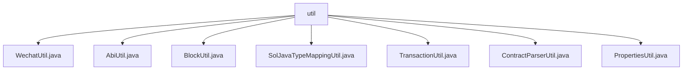

# Basic Information

|      |      |
|------|------|
| Name | util |
| Language | .java |
| Code Path | WeFe/union/blockchain-data-sync/src/main/java/com/welab/wefe/util |
| Package Name | docs.union.blockchain-data-sync.src.main.java.com.welab.wefe.util |
| Brief Description | WechatUtil sends WeChat messages; AbiUtil retrieves ABI event definitions; BlockUtil processes block data and event metadata; SolJavaTypeMappingUtil converts types; TransactionUtil obtains contract information; ContractParserUtil parses contracts; PropertiesUtil reads contract files. |

# Description

## Overview  
The core responsibility of this module is to provide a toolkit for blockchain data synchronization, including auxiliary functions such as WeChat notifications, ABI parsing, block data processing, and type conversion. The interface specification involves static method calls, with input parameters mostly being strings or objects, and outputs including object lists, mappings, or null values. Key data structures include ContractABIDefinition (storing ABI definitions), EventMetaInfo (event metadata), ContractInfo (contract information), etc. External dependencies include HttpRequest (network requests), JObject (JSON processing), CryptoSuite (encryption suite), etc. For example, WechatUtil handles WeChat notifications, and AbiUtil parses ABI definitions.  

## Main Business Scenarios  
The module primarily supports blockchain event parsing and synchronization processes, similar to an ETL pipeline model. Typical scenarios include: using BlockUtil to fetch block data and parse event metadata; loading ABI definitions with AbiUtil; leveraging SolJavaTypeMappingUtil for type conversion; and finally processing contract information through TransactionUtil and ContractParserUtil. For example, PropertiesUtil reads contract files to generate a ContractInfo list for subsequent workflows. All utility classes provide stateless services via static methods, supporting retry mechanisms and exception handling.

### Package Internal Structure View

This flowchart illustrates the utility class structure of the blockchain data synchronization module in the WeFe project. The root node "util" contains 7 utility class files, including WeChat utility, ABI utility, block utility, etc. These utility classes are directly under the util directory without deeper subdirectory structures. All utility classes are used for implementing blockchain data synchronization related functionalities.

# File List

| Name   | Type  | Description |
|-------|------|-------------|
| [WechatUtil.java](WechatUtil.md) | file | The WechatUtil class provides a static method `send` that sends text messages to the WeChat Enterprise account via HTTP POST, supporting retries and exception handling. |
| [AbiUtil.java](AbiUtil.md) | file | The AbiUtil class contains a static method getEventsAbiDefs, which parses ABI strings via ABIDefinitionFactory and returns a list of event definitions. |
| [BlockUtil.java](BlockUtil.md) | file | The BlockUtil class provides two functionalities: 1. Retrieving block information by block height; 2. Parsing contract ABI to generate a list of event metadata, including event names, contract names, and field type mappings. |
| [SolJavaTypeMappingUtil.java](SolJavaTypeMappingUtil.md) | file | The `SolJavaTypeMappingUtil` class maps Solidity primitive types to Java types: array types return `String`; `address`, `string`, and the `bytes` series return `String`; `bool` returns `Boolean`; integer types return `long`; others default to returning `String`. |
| [TransactionUtil.java](TransactionUtil.md) | file | The TransactionUtil class provides static methods to retrieve contract information from transaction data. If the contract address is empty or invalid, it returns null; otherwise, it queries ContractContextInfo. |
| [ContractParserUtil.java](ContractParserUtil.md) | file | The ContractParserUtil class parses the contract information list, filters out invalid data, maps the binary data and contract names to ContractInfo objects respectively, and stores them in the global context. |
| [PropertiesUtil.java](PropertiesUtil.md) | file | The PropertiesUtil class provides a static method `getContractInfos` that reads abi and bin files from a specified path, parses them into a list of ContractInfo, which includes the contract name, ABI, binary code, and event metadata. |

