# Basic Information

|      |      |
|------|------|
| Name | wefe |
| Language | .java |
| Code Path | WeFe/union/union-service/src/main/java/com/welab/wefe |
| Package Name | docs.union.union-service.src.main.java.com.welab.wefe |
| Brief Description | The Alliance Service Module Cluster provides multi-dimensional management capabilities, including member lifecycle, data resource operations, public services, and monitoring. It adopts RESTful interfaces, uniformly inherits the AbstractApi base class, and features key structures such as MemberOutput. It supports four major scenarios: member management, data CRUD, public services, and health checks. Relying on components like MemberService, it integrates smart contracts and blockchain technology to enable federated learning data collaboration and permission control. |

# Description

## Overview  
The core responsibility of this module group is to provide multi-dimensional management capabilities in a consortium blockchain environment, covering member lifecycle management, data resource operations, smart contract encapsulation, and system monitoring, akin to a combination of enterprise-level RBAC and a data mid-platform. The interface specification adopts a layered design, including AbstractApi base class inheritance, @Api annotation definitions, and standardized DTO encapsulation (e.g., BaseInput/MemberOutput), supporting RESTful interactions and Getter/Setter patterns. Key data structures include member information (MemberQueryOutput), data resources (DataResourcePutInput), smart contract return values (Tuple), and enumerated states (CertStatusEnums). External dependencies involve the FISCO BCOS SDK, national cryptographic algorithm libraries, MongoDB drivers, and the Spring framework. For example, MemberContract manages the full lifecycle of members, FileUploadApi handles file credentials, and UnionNodeConfigCache maintains SM2 keys.  

## Key Business Scenarios  
The module supports four typical workflows: 1) Full lifecycle management of members (registration → certification → status updates), achieved through the collaboration of MemberService and smart contracts, resembling a fusion of CRM and blockchain; 2) CRUD operations and permission control for data resources, employing a dual-phase model of "local validation + on-chain operations," such as DataSetService controlling tiered disclosure; 3) Smart contract encapsulation scenarios (e.g., MemberContract), supporting dual algorithms (ECDSA/SM2) and event subscriptions; 4) System monitoring and logging, akin to a probe mechanism detecting service status via UnionAvailableApi. Interaction modes encompass RESTful APIs (member/realname/auth), static utility classes (FileCheckerUtil), and event-driven approaches (contract event bus). Typical applications include feature set queries during joint modeling (QueryApi), file synchronization (UploadFileSyncToUnionTask), and certificate status transitions (CertStatusEnums). Functional completeness is reflected in fine-grained permissions, health check chains, and heterogeneous data conversion (e.g., MapperUtil handling time formats).

### Package Internal Structure View

```mermaid
graph TD
    wefe --> union
    union --> service
    union --> dto
    union --> operation
    union --> task
    union --> contract
    union --> constant
    union --> util
    union --> common
    union --> entity
    union --> scheduler
    union --> cache
    union --> listener
    union --> config
    union --> UnionService.java
    service --> api
    service --> contract
    service --> available
    service --> ImageDataSetService.java
    service --> DefaultTagService.java
    service --> MemberServiceService.java
    service --> AbstractDataResourceService.java
    service --> BloomFilterService.java
    service --> MemberService.java
    service --> DataSetService.java
    service --> DataResourceService.java
    service --> TableDataSetService.java
    service --> CommonService.java
    api --> cert
    api --> member
    api --> dataresource
    api --> common
    api --> service
    api --> defaulttag
    api --> server
    cert --> QueryTrustCertApi.java
    member --> authtype
    member --> QueryApi.java
    member --> UpdateServingBaseUrlApi.java
    member --> UpdateLastActivityTimeApi.java
    member --> FileUploadApi.java
    member --> UpdateApi.java
    member --> RealnameAuthApi.java
    member --> AddApi.java
    member --> RealnameAuthInfoQueryApi.java
    member --> UpdateExcludeLogoApi.java
    member --> UpdatePublicKeyApi.java
    member --> QueryMemberNameApi.java
    member --> UpdateLogoByIdApi.java
    member --> QueryAllApi.java
    authtype --> QueryAllApi.java
    dataresource --> bloomfilter
    dataresource --> dataset
    dataresource --> LazyUpdateApi.java
    dataresource --> QueryApi.java
    dataresource --> DeleteApi.java
    dataresource --> DefaultTagQueryApi.java
    dataresource --> DetailApi.java
    dataresource --> DataSetTagsApi.java
    dataresource --> HiddenApi.java
    bloomfilter --> PutApi.java
    dataset --> image
    dataset --> table
    dataset --> nomal
    image --> PutApi.java
    table --> PutApi.java
    nomal --> PutApi.java
    nomal --> QueryApi.java
    nomal --> DeleteApi.java
    nomal --> DetailApi.java
    common --> DownloadFileApi.java
    common --> QueryRealnameAuthAgreementTemplateApi.java
    common --> RealnameAuthAgreementTemplateSyncApi.java
    common --> MemberFileUploadSyncApi.java
    service --> PutApi.java
    service --> QueryApi.java
    defaulttag --> QueryAllApi.java
    server --> UnionAliveApi.java
    server --> UnionAvailableApi.java
    dto --> cert
    dto --> dataresource
    dto --> common
    dto --> member
    dto --> base
    cert --> TrustCertsQueryOutput.java
    dataresource --> bloomfilter
    dataresource --> dataset
    dataresource --> ApiDataResourceQueryOutput.java
    dataresource --> ApiTagsQueryOutput.java
    dataresource --> TagsDTO.java
    dataresource --> ApiDataResourceDetailInput.java
    dataresource --> DataResourcePutInput.java
    dataresource --> ApiDataResourceQueryInput.java
    bloomfilter --> ApiBloomFilterQueryOutput.java
    dataset --> image
    dataset --> table
    image --> ApiImageDataSetQueryOutput.java
    table --> ApiTableDataSetQueryOutput.java
    table --> ApiDataSetQueryOutput.java
    table --> DataSetDetailOutput.java
    table --> DataSetOutput.java
    table --> ApiDataSetDefaultTagOutput.java
    common --> RealnameAuthAgreementTemplateOutput.java
    common --> SM2SignedApiInput.java
    member --> MemberOutput.java
    member --> RealNameAuthFileUploadOutput.java
    member --> ApiMemberServiceQueryOutput.java
    member --> MemberQueryOutput.java
    base --> BaseInput.java
    base --> PageInput.java
    operation --> UnionApiLogger.java
    task --> UploadFileSyncToUnionTask.java
    contract --> MemberAuthTypeContract.java
    contract --> DataSetContract.java
    contract --> BloomFilterContract.java
    contract --> MemberContract.java
    contract --> TableDataSetContract.java
    contract --> DataResourceContract.java
    contract --> UnionNodeContract.java
    contract --> DataSetMemberPermissionContract.java
    contract --> ImageDataSetContract.java
    contract --> MemberServiceContract.java
    contract --> MemberFileInfoContract.java
    constant --> UnionNodeConfigType.java
    constant --> CertStatusEnums.java
    util --> FileCheckerUtil.java
    util --> ModelMapper.java
    util --> MapperUtil.java
    common --> BlockChainContext.java
    contract --> MemberFileInfoContractService.java
    contract --> BloomFilterContractService.java
    contract --> DataResourceContractService.java
    contract --> DataSetContractService.java
    contract --> AbstractContractService.java
    contract --> ImageDataSetContractService.java
    contract --> MemberServiceContractService.java
    contract --> DataSetMemberPermissionContractService.java
    contract --> TableDataSetContractService.java
    contract --> UnionNodeContractService.java
    contract --> MemberContractService.java
    available --> checkpoint
    checkpoint --> MongoCheckpoint.java
    checkpoint --> BlockChainCheckpoint.java
    entity --> DataSet.java
    entity --> DataSetMemberPermission.java
    entity --> QueryDataSet.java
    entity --> Member.java
    entity --> DataSetDefaultTag.java
    scheduler --> DataResourceLazyUpdateTask.java
    cache --> UnionNodeConfigCache.java
    cache --> MemberActivityCache.java
    listener --> RegisterNodeInfoListener.java
    config --> BlockChainConfig.java
    config --> ConfigProperties.java
```

This flowchart illustrates the complete directory structure of the union-service module in the WeFe project, starting from the top-level wefe directory and expanding hierarchically to specific Java files. It primarily includes core modules such as service, api, dto, and contract, with the api module further subdivided into submodules like cert, member, and dataresource, each containing specific API implementation classes. The overall structure clearly demonstrates the hierarchical relationships and dependencies between modules, facilitating an understanding of the project architecture.

# File List

| Name   | Type  | Description |
|-------|------|-------------|
| [union](union/_module.md) | package | The Alliance Service Module Cluster provides multi-dimensional management capabilities, including member lifecycle, data resource operations, public services, and monitoring. It adopts RESTful interfaces, uniformly inheriting the AbstractApi base class, with key structures such as MemberOutput. It supports four major scenarios: member management, data CRUD, public services, and health checks. Relying on components like MemberService, it integrates smart contracts and blockchain technology to achieve federated learning data collaboration and permission control. |

