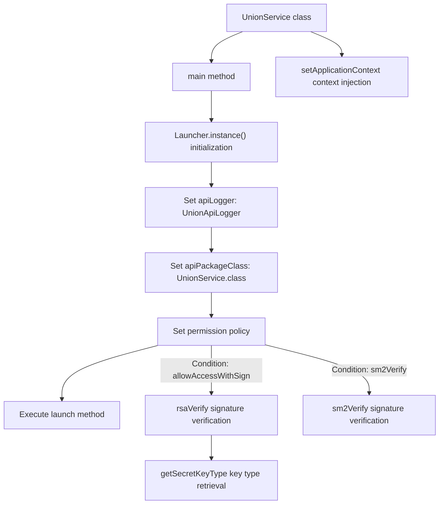
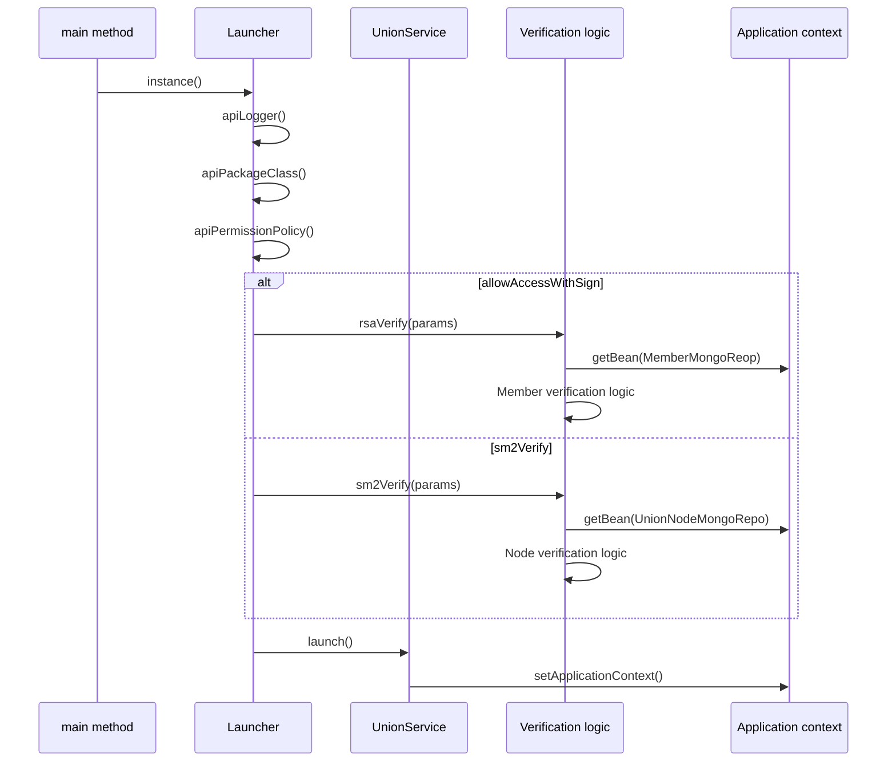

# Basic Information

|      |      |
|------|------|
| Name | UnionService |
| Language | .java |
| Code Path | WeFe/union/union-service/src/main/java/com/welab/wefe/union/service/UnionService.java |
| Package Name | com.welab.wefe.union.service |
| Dependencies | ['com.alibaba.druid.spring.boot.autoconfigure.DruidDataSourceAutoConfigure', 'com.alibaba.fastjson.JSONObject', 'com.welab.wefe.common.StatusCode', 'com.welab.wefe.common.constant.SecretKeyType', 'com.welab.wefe.common.data.mongodb.entity.union.Member', 'com.welab.wefe.common.data.mongodb.entity.union.UnionNode', 'com.welab.wefe.common.data.mongodb.entity.union.ext.MemberExtJSON', 'com.welab.wefe.common.data.mongodb.repo.MemberMongoReop', 'com.welab.wefe.common.data.mongodb.repo.UnionNodeMongoRepo', 'com.welab.wefe.common.exception.StatusCodeWithException', 'com.welab.wefe.common.util.DateUtil', 'com.welab.wefe.common.util.SM2Util', 'com.welab.wefe.common.util.SignUtil', 'com.welab.wefe.common.web.Launcher', 'com.welab.wefe.common.web.config.ApiBeanNameGenerator', 'com.welab.wefe.common.web.dto.SignedApiInput', 'com.welab.wefe.common.wefe.checkpoint.CheckpointManager', 'com.welab.wefe.union.service.cache.MemberActivityCache', 'com.welab.wefe.union.service.dto.common.SM2SignedApiInput', 'com.welab.wefe.union.service.operation.UnionApiLogger', 'com.welab.wefe.union.service.service.contract.MemberContractService', 'org.springframework.beans.BeansException', 'org.springframework.boot.autoconfigure.SpringBootApplication', 'org.springframework.boot.autoconfigure.data.mongo.MongoDataAutoConfiguration', 'org.springframework.boot.autoconfigure.jdbc.DataSourceAutoConfiguration', 'org.springframework.boot.autoconfigure.mongo.MongoAutoConfiguration', 'org.springframework.boot.autoconfigure.transaction.TransactionAutoConfiguration', 'org.springframework.context.ApplicationContext', 'org.springframework.context.ApplicationContextAware', 'org.springframework.context.annotation.ComponentScan', 'org.springframework.scheduling.annotation.EnableScheduling', 'java.nio.charset.StandardCharsets'] |
| Brief Description | The UnionService class is a Spring Boot application that excludes multiple auto-configuration classes while enabling scheduled tasks and component scanning. The main method launches the application and configures API permission validation, including RSA and SM2 signature verification. The class implements ApplicationContextAware to store the application context. It provides RSA and SM2 signature verification methods, checks member status and node validity, and updates member activity timestamps. |

# Description

The code defines a main Spring Boot application class named `UnionService`, which excludes auto-configurations such as data sources and MongoDB through annotations, while enabling scheduled tasks and component scanning. The class implements the `ApplicationContextAware` interface to obtain the application context. The `main` method launches the application using `Launcher`, configuring API logging and permission validation logic (including RSA and SM2 signature verification). It provides `rsaVerify` and `sm2Verify` methods to handle different signature verification processes, involving member status checks, public key validation, and data update operations. The class also includes helper methods to retrieve key types. Overall, it implements the core verification mechanism and context management functionality for the alliance service.

# Class Summary

| Name   | Type  | Description |
|-------|------|-------------|
| UnionService | class | A SpringBoot application excludes data source configuration, enables scheduled tasks, and scans specified packages. The main class implements application context setup, provides RSA and SM2 signature verification functionality, validates member and node status, and updates active timestamps. |


## Class UnionService

|      |      |
|------|------|
| Access Modifier | @SpringBootApplication(exclude = {;        DataSourceAutoConfiguration.class,;        DruidDataSourceAutoConfigure.class,;        MongoAutoConfiguration.class,;        MongoDataAutoConfiguration.class,;        TransactionAutoConfiguration.class;});@EnableScheduling;@ComponentScan(;        basePackages = {"com.welab.wefe.common.data.mongodb"},;        nameGenerator = ApiBeanNameGenerator.class,;        basePackageClasses = {;                Launcher.class,;                UnionService.class,;                CheckpointManager.class;        };);public |
| Type | class |
| Name | UnionService |
| Description | A SpringBoot application excludes data source configuration, enables scheduled tasks, and scans specified packages. The main class implements application context setup, provides RSA and SM2 signature verification functionality, validates member and node status, and updates active timestamps. |


### UML Class Diagram

```mermaid
classDiagram
    class UnionService {
        +ApplicationContext CONTEXT
        +main(String[] args) void
        +setApplicationContext(ApplicationContext applicationContext) void
        -rsaVerify(JSONObject params) void
        -sm2Verify(JSONObject params) void
        -getSecretKeyType(Member member) SecretKeyType
    }

    class SignedApiInput {
        +String memberId
        +String sign
        +String data
        +setSign(String sign) void
        +getMemberId() String
        +getSign() String
        +getData() String
    }

    class SM2SignedApiInput {
        +String currentBlockchainNodeId
        +String sign
        +String data
        +getCurrentBlockchainNodeId() String
        +getSign() String
        +getData() String
    }

    class Member {
        +String memberId
        +String freezed
        +String lastActivityTime
        +String publicKey
        +MemberExtJSON extJson
        +getMemberId() String
        +getFreezed() String
        +getLastActivityTime() String
        +setLastActivityTime(String time) void
        +getPublicKey() String
        +getExtJson() MemberExtJSON
    }

    class MemberExtJSON {
        +SecretKeyType secretKeyType
        +getSecretKeyType() SecretKeyType
    }

    class UnionNode {
        +String nodeId
        +String enable
        +String publicKey
        +String blockchainNodeId
        +getNodeId() String
        +getEnable() String
        +getPublicKey() String
        +getBlockchainNodeId() String
    }

    class MemberMongoReop {
        +findMemberId(String memberId) Member
    }

    class UnionNodeMongoRepo {
        +findByBlockchainNodeId(String id) UnionNode
    }

    class MemberActivityCache {
        +getInstance() MemberActivityCache
        +isActivePeriod(Member member) boolean
        +add(Member member) void
    }

    class MemberContractService {
        +updateLastActivityTimeById(String memberId, String time) void
    }

    class SignUtil {
        +verify(byte[] data, String publicKey, String sign, SecretKeyType type) boolean
    }

    class SM2Util {
        +verify(byte[] data, PublicKey publicKey, String sign) boolean
        +getPublicKey(String key) PublicKey
    }

    enum SecretKeyType {
        rsa
        sm2
    }

    UnionService --> SignedApiInput : Dependency
    UnionService --> SM2SignedApiInput : Dependency
    UnionService --> MemberMongoReop : Dependency
    UnionService --> UnionNodeMongoRepo : Dependency
    UnionService --> MemberActivityCache : Dependency
    UnionService --> MemberContractService : Dependency
    UnionService --> SignUtil : Dependency
    UnionService --> SM2Util : Dependency
    Member --> MemberExtJSON : Contains
    MemberExtJSON --> SecretKeyType : Uses
```

This code implements a Spring Boot-based union service (UnionService) with core functionalities including application startup configuration, API signature verification (RSA/SM2), and member status management. The class diagram illustrates key classes and their relationships: UnionService acts as the main class, managing application context via CONTEXT, and relies on multiple utility classes (e.g., SignUtil) and data access classes (e.g., MemberMongoReop) to complete signature verification workflows. The system adopts a layered design comprising entity classes (Member/UnionNode), data access layer, utility classes, and service layer, with the SecretKeyType enum unifying key type management. The signature verification process involves multi-step checks including member status validation, key type determination, and signature algorithm verification.


### Internal Method Call Graph





This flowchart illustrates the core execution process of UnionService, including Launcher configuration during application startup, two signature verification paths (RSA and SM2), and the context injection process. The sequence diagram details how the main method initializes the service through Launcher's builder pattern, selects different verification paths based on annotation conditions, and ultimately completes the service startup. The verification logic involves database queries and cryptographic operations, demonstrating the service's security and integrity validation mechanisms.

### Field List

| Name  | Type  | Description |
|-------|-------|------|
| CONTEXT = null | ApplicationContext | Static public application context variable with an initial value of empty. |

### Method List

| Name  | Type  | Description |
|-------|-------|------|
| main | void | The Java main method launches UnionService, configuring logging, API packages, and permission policies, supporting RSA and SM2 signature verification. |
| rsaVerify | void | Method rsaVerify verifies member signatures: checks member existence and frozen status, updates active time, verifies signature validity, and processes parameters. Throws exceptions upon failure. |
| sm2Verify | void | Verify SM2 signature, check if the node is registered and enabled, and update parameters after signature verification. |
| setApplicationContext | void | This method overrides setApplicationContext, assigning the passed-in ApplicationContext to the static variable CONTEXT. |
| getSecretKeyType | SecretKeyType | This method retrieves the key type based on the extended JSON data of the member object, returning the rsa type by default if not set. |


