# Basic Information

|      |      |
|------|------|
| Name | service |
| Language | .java |
| Code Path | WeFe/union/union-service/src/main/java/com/welab/wefe/union/service |
| Package Name | docs.union.union-service.src.main.java.com.welab.wefe.union.service |
| Brief Description | The Alliance Service Module Cluster provides multi-dimensional management capabilities, including member lifecycle, data resource operations, public services, and monitoring. It adopts RESTful interfaces, uniformly inheriting the AbstractApi base class, with key structures such as MemberOutput. It supports four major scenarios: member management, data CRUD, public services, and health monitoring. Relying on components like MemberService, it integrates smart contracts and blockchain technology to achieve federated learning data collaboration and permission control. |

# Description

## Overview  
The core responsibility of this module group is to provide multi-dimensional management capabilities in a consortium blockchain environment, covering member lifecycle management, data resource operations, smart contract encapsulation, and system monitoring, akin to a combination of enterprise-level RBAC and a data mid-platform. The interface specification adopts a layered design, including AbstractApi base class inheritance, @Api annotation definitions, and standardized DTO encapsulation (e.g., BaseInput/MemberOutput), supporting RESTful interactions and Getter/Setter patterns. Key data structures include member information (MemberQueryOutput), data resources (DataResourcePutInput), smart contract return values (Tuple), and enumerated states (CertStatusEnums). External dependencies involve the FISCO BCOS SDK, national cryptographic algorithm libraries, MongoDB drivers, and the Spring framework. For example, MemberContract manages the full lifecycle of members, FileUploadApi handles file credentials, and UnionNodeConfigCache maintains SM2 keys.  

## Key Business Scenarios  
The module supports four major workflows: 1) Full lifecycle management of members (registration → certification → status updates), achieved through the collaboration of MemberService and smart contracts, resembling a fusion of CRM and blockchain; 2) CRUD operations and permission control for data resources, employing a "local validation + on-chain operation" dual-phase model, such as DataSetService controlling tiered disclosure; 3) Smart contract encapsulation scenarios (e.g., MemberContract), supporting dual algorithms (ECDSA/SM2) and event subscriptions; 4) System monitoring and logging, akin to a probe mechanism detecting service status via UnionAvailableApi. Interaction modes encompass RESTful APIs (member/realname/auth), static utility classes (FileCheckerUtil), and event-driven approaches (contract event bus). Typical applications include feature set queries during joint modeling (QueryApi), file synchronization (UploadFileSyncToUnionTask), and certificate status transitions (CertStatusEnums). Functional completeness is reflected in fine-grained permissions, health check chains, and heterogeneous data conversion (e.g., MapperUtil handling time formats).

### Package Internal Structure View

```mermaid
graph TD
    service --> api
    service --> dto
    service --> operation
    service --> task
    service --> contract
    service --> constant
    service --> util
    service --> common
    service --> entity
    service --> scheduler
    service --> cache
    service --> listener
    service --> config
    service --> UnionService.java
    
    api --> cert
    api --> member
    api --> dataresource
    api --> common
    api --> service
    api --> defaulttag
    api --> server
    
    cert --> QueryTrustCertApi.java
    
    member --> authtype
    member --> QueryApi.java
    member --> UpdateServingBaseUrlApi.java
    member --> UpdateLastActivityTimeApi.java
    member --> FileUploadApi.java
    member --> UpdateApi.java
    member --> RealnameAuthApi.java
    member --> AddApi.java
    member --> RealnameAuthInfoQueryApi.java
    member --> UpdateExcludeLogoApi.java
    member --> UpdatePublicKeyApi.java
    member --> QueryMemberNameApi.java
    member --> QueryAllApi.java
    member --> UpdateLogoByIdApi.java
    
    authtype --> QueryAllApi.java
    
    dataresource --> bloomfilter
    dataresource --> dataset
    dataresource --> LazyUpdateApi.java
    dataresource --> QueryApi.java
    dataresource --> DeleteApi.java
    dataresource --> DefaultTagQueryApi.java
    dataresource --> DetailApi.java
    dataresource --> DataSetTagsApi.java
    dataresource --> HiddenApi.java
    
    bloomfilter --> PutApi.java
    
    dataset --> image
    dataset --> table
    dataset --> nomal
    
    image --> PutApi.java
    
    table --> PutApi.java
    
    nomal --> PutApi.java
    nomal --> QueryApi.java
    nomal --> DeleteApi.java
    nomal --> DetailApi.java
    
    common --> DownloadFileApi.java
    common --> QueryRealnameAuthAgreementTemplateApi.java
    common --> RealnameAuthAgreementTemplateSyncApi.java
    common --> MemberFileUploadSyncApi.java
    
    service --> PutApi.java
    service --> QueryApi.java
    
    defaulttag --> QueryAllApi.java
    
    server --> UnionAliveApi.java
    server --> UnionAvailableApi.java
    
    dto --> cert
    dto --> dataresource
    dto --> common
    dto --> member
    dto --> base
    
    cert --> TrustCertsQueryOutput.java
    
    dataresource --> bloomfilter
    dataresource --> dataset
    dataresource --> ApiDataResourceQueryOutput.java
    dataresource --> ApiTagsQueryOutput.java
    dataresource --> TagsDTO.java
    dataresource --> ApiDataResourceDetailInput.java
    dataresource --> DataResourcePutInput.java
    dataresource --> ApiDataResourceQueryInput.java
    
    bloomfilter --> ApiBloomFilterQueryOutput.java
    
    dataset --> image
    dataset --> table
    dataset --> ApiDataSetQueryOutput.java
    
    image --> ApiImageDataSetQueryOutput.java
    
    table --> ApiTableDataSetQueryOutput.java
    table --> ApiDataSetQueryOutput.java
    table --> DataSetDetailOutput.java
    table --> DataSetOutput.java
    table --> ApiDataSetDefaultTagOutput.java
    
    common --> RealnameAuthAgreementTemplateOutput.java
    common --> SM2SignedApiInput.java
    
    member --> MemberOutput.java
    member --> RealNameAuthFileUploadOutput.java
    member --> ApiMemberServiceQueryOutput.java
    member --> MemberQueryOutput.java
    
    base --> BaseInput.java
    base --> PageInput.java
    
    operation --> UnionApiLogger.java
    
    task --> UploadFileSyncToUnionTask.java
    
    contract --> MemberAuthTypeContract.java
    contract --> DataSetContract.java
    contract --> BloomFilterContract.java
    contract --> MemberContract.java
    contract --> TableDataSetContract.java
    contract --> DataResourceContract.java
    contract --> UnionNodeContract.java
    contract --> DataSetMemberPermissionContract.java
    contract --> ImageDataSetContract.java
    contract --> MemberServiceContract.java
    contract --> MemberFileInfoContract.java
    
    constant --> UnionNodeConfigType.java
    constant --> CertStatusEnums.java
    
    util --> FileCheckerUtil.java
    util --> ModelMapper.java
    util --> MapperUtil.java
    
    common --> BlockChainContext.java
    
    entity --> DataSet.java
    entity --> DataSetMemberPermission.java
    entity --> QueryDataSet.java
    entity --> Member.java
    entity --> DataSetDefaultTag.java
    
    scheduler --> DataResourceLazyUpdateTask.java
    
    cache --> UnionNodeConfigCache.java
    cache --> MemberActivityCache.java
    
    listener --> RegisterNodeInfoListener.java
    
    config --> BlockChainConfig.java
    config --> ConfigProperties.java
```

This flowchart illustrates the complete directory structure of the WeFe/union/union-service project, starting from the service root directory and detailing the hierarchical relationships of major modules such as api, dto, and contract along with their submodules. The diagram contains over 100 nodes, fully reflecting the project's module division and file organization, particularly showcasing the complex interface classifications under the api module and the multi-level nested structure of the dataresource module. All nodes use the last-level path names, maintaining the chart's conciseness.

# File List

| Name   | Type  | Description |
|-------|------|-------------|
| [operation](operation/_module.md) | package | The `UnionApiLogger` class inherits from `AbstractApiLogger` and implements logging functionality. It excludes logs for specific APIs, processes request parameters such as compressed public keys and logos, adds caller IDs, and saves logs to MongoDB. |
| [common](common/_module.md) | package | The input content is empty, unable to generate a summary description. |
| [UnionService.java](UnionService.md) | file | The `UnionService` class is a Spring Boot application that excludes multiple auto-configuration classes while enabling scheduled tasks and component scanning. The main method starts the application and configures API permission validation, including RSA and SM2 signature verification. The class implements `ApplicationContextAware` to store the application context. It provides RSA and SM2 signature verification methods, checks member status and node validity, and updates member activity timestamps. |
| [cache](cache/_module.md) | package | The UnionNodeConfigCache class caches node configurations and provides methods for retrieving and setting SM2 keys. The MemberActivityCache class, implemented as a singleton, manages member activity information and supports functionalities for adding and checking validity periods. |
| [config](config/_module.md) | package | The BlockChainConfig class initializes the FISCO BCOS blockchain SDK, configures properties such as certificates and group IDs, and creates SDK instances and smart contract services. ConfigProperties is an empty Spring component class used for subsequent configuration management. |
| [listener](listener/_module.md) | package | The component class RegisterNodeInfoListener monitors application startup events and automatically registers node information to the blockchain. After checking the configuration, it generates or updates an SM2 key pair, saves it to MongoDB, and synchronizes the public key through the contract service. If this process fails, the system will exit. |
| [scheduler](scheduler/_module.md) | package | This is a scheduled task class designed for delayed updates of data resources and image dataset information. It reads pending update records from MongoDB, updates the usage statistics of data resources and annotation information of image datasets, and finally deletes the processed records. The task executes every 30 seconds. |
| [service](service/_module.md) | package | The blockchain data management service module enables data CRUD operations and permission management through smart contracts, supporting multi-party collaboration in federated learning. It incorporates key structures such as data resources and Bloom filters, relying on encryption components and MongoDB. The module provides functionalities like health checks, member management, and dataset operations, covering the entire lifecycle and fine-grained control. |
| [entity](entity/_module.md) | package | The DataSet class contains dataset attributes and access methods. The DataSetMemberPermission class manages dataset member permissions. The QueryDataSet class extends dataset query functionality. The Member class stores member information and status. The DataSetDefaultTag class handles dataset tags. |
| [util](util/_module.md) | package | FileCheckerUtil checks file types and security, deleting files upon failure. ModelMapper provides thread-safe object mapping, supporting both single-object and batch conversion. MapperUtil handles data transformation, including API output, time formatting, and object mapping. |
| [constant](constant/_module.md) | package | The UnionNodeConfigType enumeration includes the SM2 value, indicating the configuration type. The CertStatusEnums enumeration defines three authentication states: Invalid (0), Authenticating (1), and Valid (2), along with a status code lookup method. |
| [contract](contract/_module.md) | package | MemberAuthTypeContract: Manages member authentication types, supporting CRUD operations, extended JSON updates, and event listening, with ECDSA/SM encryption.  DataSetContract: Dataset management contract, providing CRUD functionality, supporting ECDSA/SM2 encryption and event notifications.  BloomFilterContract: Bloom filter contract, supporting data CRUD operations and hash function updates, with event subscription.  MemberContract: Member management contract, supporting CRUD operations, paginated queries, and event listening, with ECDSA/SM encryption.  TableDataSetContract: Data table management contract, providing CRUD operations and event subscription, supporting national/non-national cryptographic algorithms.  DataResourceContract: Data resource management contract, supporting status updates, queries, and event listening, using generic type handling.  UnionNodeContract: Alliance node management contract, supporting node CRUD operations and status updates, with 6 types of event listening.  DataSetMemberPermissionContract: Data permission management contract, supporting permission queries and operations, with ECDSA/SM2 encryption.  ImageDataSetContract: Image dataset management contract, providing CRUD operations and extended JSON updates, with event subscription.  MemberServiceContract: Member service management contract, supporting service CRUD operations and event notifications, including ABI and binary code.  MemberFileInfoContract: Member file management contract, supporting file information updates and queries, with 4 types of event listening. |
| [task](task/_module.md) | package | UploadFileSyncToUnionTask is a thread class designed for uploading files to federation nodes. It incorporates a retry mechanism with incrementally increasing intervals between requests. Utilizing SM2 signatures, it supports multipart form data uploads and verifies response status codes along with JSON results. Errors are logged and retried upon failure. |
| [dto](dto/_module.md) | package | The TrustCertsQueryOutput class represents the certificate query result, containing fields such as certificate ID and content. The module manages metadata resources of data and supports CRUD operations. The real-name authentication module processes protocol templates and SM2 signature data. The member management module encapsulates member information responses. The basic input module handles pagination and member ID parameters. |
| [api](api/_module.md) | package | The `QueryTrustCertApi` class queries trust certificate information via the path `trust/certs/query`, returning results in JSON format. The member management module provides CRUD operations, real-name authentication, and other functionalities, adhering to RESTful design principles. The data resource module supports CRUD operations and tag management, relying on services like `BloomFilterService`. The public service module handles file downloads, real-name authentication agreements, and more. The member service module implements service registration and querying. The `QueryAllApi` class retrieves the default tag list. The basic service detection module offers APIs for liveness and availability checks. |

