# Basic Information

|      |      |
|------|------|
| Name | api |
| Language | .java |
| Code Path | WeFe/union/union-service/src/main/java/com/welab/wefe/union/service/api |
| Package Name | docs.union.union-service.src.main.java.com.welab.wefe.union.service.api |
| Brief Description | The `QueryTrustCertApi` class queries trust certificate information via the path `trust/certs/query`, returning results in JSON format. The member management module provides CRUD operations, real-name authentication, and other functionalities, adhering to RESTful design principles. The data resource module supports CRUD operations and tag management, relying on services like `BloomFilterService`. The public service module handles file downloads, real-name authentication agreements, and more. The member service module implements service registration and querying. The `QueryAllApi` class retrieves the default tag list. The basic service detection module offers APIs for liveness and availability checks. |

# Description

## Overview  
The core responsibility of this module group is to provide multi-dimensional management capabilities within alliance services, covering member lifecycle, data resource operations, public services, and system status monitoring. Interface specifications uniformly inherit from the AbstractApi base class, use the @Api annotation to define paths and access permissions, and employ standardized DTO encapsulation (e.g., BaseInput/JObject) for input and output. Key data structures include MemberOutput (member information), DataResourcePutInput (data resources), ServiceAvailableCheckOutput (service status), etc. External dependencies involve components such as MemberService, DataResourceService, and CommonService, which are injected via Autowired to implement business logic. Examples include UpdatePublicKeyApi for updating public keys and LazyUpdateApi for handling tag statistics.  

## Key Business Scenarios  
The module supports four major scenarios: 1) End-to-end member management (registration-authentication-status updates), similar to CRM systems; 2) CRUD operations and tag management for data resources, akin to a metadata repository; 3) Public services such as file downloads and protocol template queries; 4) Service health checks (similar to K8s probes). Interaction patterns adhere to RESTful conventions, e.g., member/realname/auth for submitting authentication and data_resource/delete for resource deletion. Typical applications include querying feature datasets during joint modeling (via QueryApi) or validating service availability through UnionAvailableApi. API types encompass CRUD, status changes, and file operations, such as FileUploadApi for file I/O and HiddenApi for controlling resource visibility.

### Package Internal Structure View

```mermaid
graph TD
    service --> cert
    service --> member
    service --> dataresource
    service --> common
    service --> defaulttag
    service --> server
    cert --> QueryTrustCertApi.java
    member --> authtype
    member --> QueryApi.java
    member --> UpdateServingBaseUrlApi.java
    member --> UpdateLastActivityTimeApi.java
    member --> FileUploadApi.java
    member --> UpdateApi.java
    member --> RealnameAuthApi.java
    member --> AddApi.java
    member --> RealnameAuthInfoQueryApi.java
    member --> UpdateExcludeLogoApi.java
    member --> UpdatePublicKeyApi.java
    member --> QueryMemberNameApi.java
    member --> UpdateLogoByIdApi.java
    member --> QueryAllApi.java
    authtype --> QueryAllApi.java
    dataresource --> bloomfilter
    dataresource --> dataset
    dataresource --> LazyUpdateApi.java
    dataresource --> QueryApi.java
    dataresource --> DeleteApi.java
    dataresource --> DefaultTagQueryApi.java
    dataresource --> DetailApi.java
    dataresource --> DataSetTagsApi.java
    dataresource --> HiddenApi.java
    bloomfilter --> PutApi.java
    dataset --> image
    dataset --> table
    dataset --> nomal
    image --> PutApi.java
    table --> PutApi.java
    nomal --> PutApi.java
    nomal --> QueryApi.java
    nomal --> DeleteApi.java
    nomal --> DetailApi.java
    common --> DownloadFileApi.java
    common --> QueryRealnameAuthAgreementTemplateApi.java
    common --> RealnameAuthAgreementTemplateSyncApi.java
    common --> MemberFileUploadSyncApi.java
    defaulttag --> QueryAllApi.java
    server --> UnionAliveApi.java
    server --> UnionAvailableApi.java
```

This flowchart illustrates the API hierarchy of the union-service module, comprising 7 main categories (cert, member, dataresource, etc.), each further subdivided into multiple submodules and specific API interface files. The member category is the most complex, containing 15 API files, while the dataresource category is divided into submodules such as bloomfilter and dataset. The overall structure clearly demonstrates the organization of service interfaces.

# File List

| Name   | Type  | Description |
|-------|------|-------------|
| [server](server/_module.md) | package | The `UnionAliveApi` class handles liveliness detection at the path `"service/alive"`, returning success directly without requiring input. The `UnionAvailableApi` class checks service availability at the path `"service/available"`, returning results after performing the check. Both classes inherit from `AbstractApi`. |
| [defaulttag](defaulttag/_module.md) | package | The Java class QueryAllApi defines an API interface with the path default_tag/query, allowing signed access. It invokes the queryAll method of DefaultTagService to retrieve data and returns the result in JSON format. |
| [service](service/_module.md) | package | The PutApi is an API for handling member service additions, with the path member/service/put, inheriting from AbstractApi. It requires fields such as serviceId and calls MemberServiceService.add. The QueryApi is an API for querying member services, with the path member/service/query, inheriting from AbstractApi. Its inputs include serviceId, and it defaults to paginated queries of 10 records, calling memberServiceService.query. |
| [common](common/_module.md) | package | DownloadFileApi handles file downloads with the path download/file. QueryRealnameAuthAgreementTemplateApi queries the real-name authentication agreement template with the path realname/auth/agreement/template/query. RealnameAuthAgreementTemplateSyncApi synchronizes the real-name authentication template using SM2 encryption. MemberFileUploadSyncApi processes member file uploads with the path member/file/upload/sync, requiring SM2 encryption. All inherit from AbstractApi and handle business logic through CommonService. |
| [dataresource](dataresource/_module.md) | package | The PutApi is used to add data to the Bloom filter. The LazyUpdateApi lazily updates tag statistics. The QueryApi retrieves data resources. The DeleteApi removes data resources. The DefaultTagQueryApi queries default tags. The DetailApi fetches data details. The DataSetTagsApi queries tags. The HiddenApi hides data resources. |
| [member](member/_module.md) | package | QueryAllApi queries member authentication types, path member/authtype/query. QueryApi queries member information, path member/query. UpdateServingBaseUrlApi updates the service URL, path member/update_serving_base_url. UpdateLastActivityTimeApi updates the last activity time, path member/update_last_activity_time. FileUploadApi handles file uploads, path member/file/upload. UpdateApi updates member information, path member/update. RealnameAuthApi handles real-name authentication, path member/realname/auth. AddApi adds a member, path member/add. RealnameAuthInfoQueryApi queries real-name information, path member/realname/authInfo/query. UpdateExcludeLogoApi updates member information, path member/update_exclude_logo. UpdatePublicKeyApi updates the public key, path member/update_public_key. QueryMemberNameApi queries member names, path member/map. UpdateLogoByIdApi updates the avatar, path member/update_logo. QueryAllApi queries all members, path member/query_all. |
| [cert](cert/_module.md) | package | This is an API class for querying trust certificates, with the path `trust/certs/query`. It retrieves all certificate data from MongoDB and converts it into the output format, returning a JSON result containing a list of certificates. |

