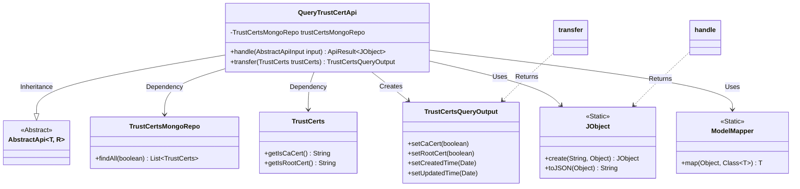

# Basic Information

|      |      |
|------|------|
| Name | QueryTrustCertApi |
| Language | .java |
| Code Path | WeFe/union/union-service/src/main/java/com/welab/wefe/union/service/api/cert/QueryTrustCertApi.java |
| Package Name | com.welab.wefe.union.service.api.cert |
| Dependencies | ['com.welab.wefe.common.data.mongodb.entity.union.TrustCerts', 'com.welab.wefe.common.data.mongodb.repo.TrustCertsMongoRepo', 'com.welab.wefe.common.util.JObject', 'com.welab.wefe.common.web.api.base.AbstractApi', 'com.welab.wefe.common.web.api.base.Api', 'com.welab.wefe.common.web.dto.AbstractApiInput', 'com.welab.wefe.common.web.dto.ApiResult', 'com.welab.wefe.union.service.dto.cert.TrustCertsQueryOutput', 'com.welab.wefe.union.service.util.ModelMapper', 'org.springframework.beans.factory.annotation.Autowired', 'java.util.Date', 'java.util.List', 'java.util.stream.Collectors'] |
| Brief Description | This is an API class for querying trust certificates, with the path `trust/certs/query`. It retrieves all certificate data from MongoDB and converts it into the output format, returning a JSON result containing a list of certificates. |

# Description

The code defines an API class named QueryTrustCertApi, which is used to query trust certificate information. The API path is `trust/certs/query`, allowing access with a signature. The class inherits from AbstractApi and uses TrustCertsMongoRepo to fetch all certificate data from MongoDB. The handle method processes the request, converts the query results into a list of TrustCertsQueryOutput objects, and encapsulates them as JSON for response. The transfer method handles data conversion, setting certificate type identifiers (CA certificates and root certificates) as well as creation and update timestamps. The entire process involves no sensitive operations and only provides query functionality.

# Class Summary

| Name   | Type  | Description |
|-------|------|-------------|
| QueryTrustCertApi | class | This is an API class for querying trust certificates, with the path `trust/certs/query`. It retrieves all certificate data from MongoDB and converts it into the output format, including CA and root certificate identifiers along with timestamps. |

## Class QueryTrustCertApi

|      |      |
|------|------|
| Access Modifier | @Api(path = "trust/certs/query", name = "trust_cert_query", allowAccessWithSign = true);public |
| Type | class |
| Name | QueryTrustCertApi |
| Description | This is an API class for querying trust certificates, with the path `trust/certs/query`. It retrieves all certificate data from MongoDB and converts it into the output format, including CA and root certificate identifiers along with timestamps. |

### UML Class Diagram

This code demonstrates a trust certificate query API class QueryTrustCertApi, which inherits from the generic abstract class AbstractApi. The class retrieves certificate data from the database via TrustCertsMongoRepo, performs object conversion using ModelMapper, and constructs JSON responses through JObject. Core functionalities include querying all non-CA/root certificates and transforming them into output objects with enhanced attributes such as creation/update timestamps. The class diagram clearly illustrates key design elements including inheritance relationships, dependency injection, and static method invocations of utility classes.

### Internal Method Call Graph

This code illustrates a trust certificate query API class that retrieves data via MongoDB repository, transforms data format using stream processing and model mapping, and ultimately returns results in JSON format. The flowchart clearly presents the complete processing chain from data query to result return, including key steps such as dependency injection, stream operations, and object conversion, reflecting a typical API handling pattern in Spring Boot applications.

### Field List

| Name  | Type  | Description |
|-------|-------|------|
| trustCertsMongoRepo | TrustCertsMongoRepo | Use @Autowired to automatically inject an instance of TrustCertsMongoRepo. |

### Method List

| Name  | Type  | Description |
|-------|-------|------|
| transfer | TrustCertsQueryOutput | Convert the TrustCerts object to a TrustCertsQueryOutput object, set the flags indicating whether it is a CA certificate and a root certificate, and update the creation and modification times to the current time. |
| handle | ApiResult<JObject> | Java method override, query MongoDB to retrieve TrustCerts data and convert it to JSON format for return. |

