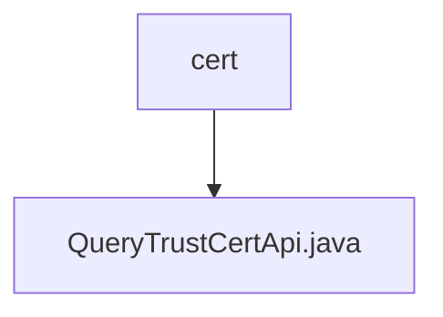

# Basic Information

|      |      |
|------|------|
| Name | cert |
| Language | .java |
| Code Path | WeFe/union/union-service/src/main/java/com/welab/wefe/union/service/api/cert |
| Package Name | docs.union.union-service.src.main.java.com.welab.wefe.union.service.api.cert |
| Brief Description | This is an API class for querying trust certificates, with the path `trust/certs/query`. It retrieves all certificate data from MongoDB and converts it into the output format, returning a JSON result containing a list of certificates. |

# Description

The code defines an API class named `QueryTrustCertApi`, which is used to query trusted certificate information. The API path is `trust/certs/query` and allows signed access. The class inherits from `AbstractApi` and uses `TrustCertsMongoRepo` to fetch all certificate data from MongoDB. The `handle` method processes the request, converts the query results into a list of `TrustCertsQueryOutput` objects, and encapsulates them as JSON for response. The `transfer` method handles data transformation, setting certificate type identifiers (CA certificates and root certificates) as well as creation and update timestamps. The entire process involves no sensitive operations and only provides query functionality.

### Package Internal Structure View

This flowchart illustrates the certificate query interface structure within the union-service module of the WeFe project. The cert directory serves as the parent node, containing a specific API implementation file, QueryTrustCertApi.java. This concise hierarchical relationship exemplifies the typical organization of interface files in a microservices architecture, where business functional modules are isolated and managed through a clear directory structure.

# File List

| Name   | Type  | Description |
|-------|------|-------------|
| [QueryTrustCertApi.java](QueryTrustCertApi.md) | file | This is an API class for querying trust certificates, with the path `trust/certs/query`. It retrieves all certificate data from MongoDB and converts it into the output format, returning a JSON result containing a list of certificates. |

