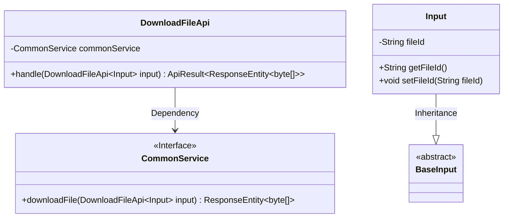
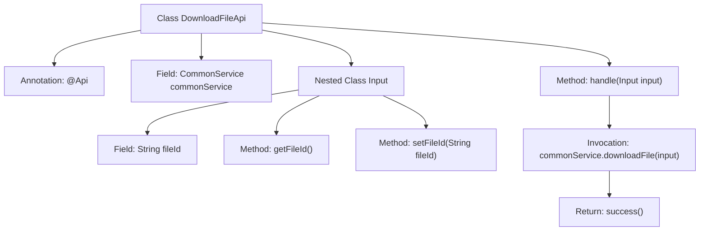

# Basic Information

|      |      |
|------|------|
| Name | DownloadFileApi |
| Language | .java |
| Code Path | WeFe/union/union-service/src/main/java/com/welab/wefe/union/service/api/common/DownloadFileApi.java |
| Package Name | com.welab.wefe.union.service.api.common |
| Dependencies | ['com.welab.wefe.common.exception.StatusCodeWithException', 'com.welab.wefe.common.fieldvalidate.annotation.Check', 'com.welab.wefe.common.web.api.base.AbstractApi', 'com.welab.wefe.common.web.api.base.Api', 'com.welab.wefe.common.web.dto.ApiResult', 'com.welab.wefe.union.service.dto.base.BaseInput', 'com.welab.wefe.union.service.service.CommonService', 'org.springframework.beans.factory.annotation.Autowired', 'org.springframework.http.ResponseEntity', 'java.io.IOException'] |
| Brief Description | The DownloadFileApi is a signature-supported file download interface that accepts the fileId parameter and returns a file byte stream. |

# Description

The code defines an API class named `DownloadFileApi` for handling file download requests. The API path is `"download/file"` and allows access with a signature. The class inherits from `AbstractApi`, with the input type being the inner class `Input` and the output being `ResponseEntity<byte[]>`. The `Input` class contains a mandatory `fileId` field, accessible via getter and setter methods. The processing logic invokes the `downloadFile` method of `commonService` to complete the file download and returns the encapsulated result. The entire API implements standard input-output handling and business logic invocation through annotations and inheritance structure.

# Class Summary

| Name   | Type  | Description |
|-------|------|-------------|
| DownloadFileApi | class | Download File API class, requires signature authentication, accepts file ID parameter, invokes CommonService to download the file and returns a byte array response. |

## Class DownloadFileApi

|      |      |
|------|------|
| Access Modifier | @Api(path = "download/file", name = "download_file", allowAccessWithSign = true);public |
| Type | class |
| Name | DownloadFileApi |
| Description | Download File API class, requires signature authentication, accepts file ID parameter, invokes CommonService to download the file and returns a byte array response. |

### UML Class Diagram

Class Diagram Description: This diagram illustrates the structure of the DownloadFileApi class and its associated relationships. DownloadFileApi inherits from AbstractApi, utilizes generic parameters Input and ResponseEntity<byte[]>, and contains a dependency on CommonService. The Input class, as an inner class, inherits from BaseInput with a fileId attribute and corresponding getter/setter methods. CommonService is an interface providing the downloadFile method. The overall structure reflects the core components of the file download API and their interaction relationships.

### Internal Method Call Graph

This code demonstrates the implementation of a file download API using the Spring framework and custom annotations. The `DownloadFileApi` class inherits from `AbstractApi`, processes input parameters through the `handle` method, and invokes the `downloadFile` method of `CommonService` to retrieve file data. The nested `Input` class defines the required `fileId` field along with its getter/setter methods. The flowchart clearly presents the class structure, method invocation relationships, and data processing flow.

### Field List

| Name  | Type  | Description |
|-------|-------|------|
| commonService | CommonService | Using @Autowired to automatically inject an instance of CommonService. |

### Method List

| Name  | Type  | Description |
|-------|-------|------|
| handle | ApiResult<ResponseEntity<byte[]>> | Java method override, handling file download requests, returning byte array response, may throw IO exceptions or status code exceptions. |

