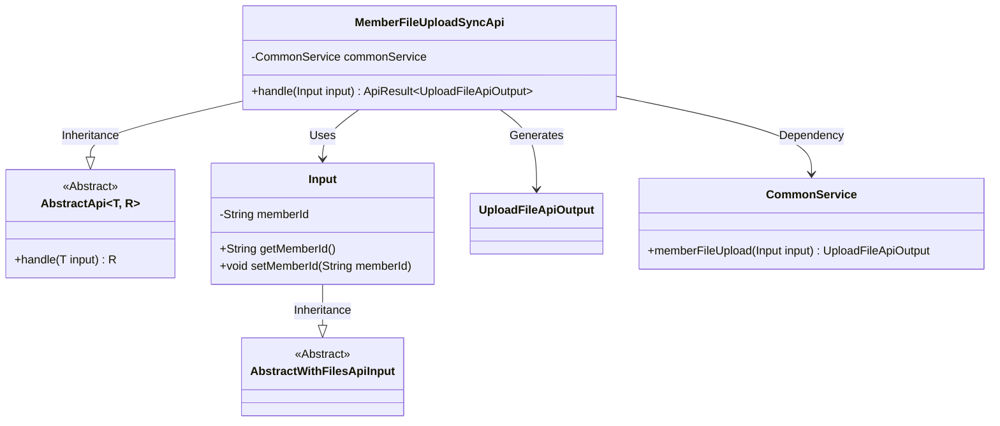

# Basic Information

|      |      |
|------|------|
| Name | MemberFileUploadSyncApi |
| Language | .java |
| Code Path | WeFe/union/union-service/src/main/java/com/welab/wefe/union/service/api/common/MemberFileUploadSyncApi.java |
| Package Name | com.welab.wefe.union.service.api.common |
| Dependencies | ['com.welab.wefe.common.exception.StatusCodeWithException', 'com.welab.wefe.common.fieldvalidate.annotation.Check', 'com.welab.wefe.common.web.api.base.AbstractApi', 'com.welab.wefe.common.web.api.base.Api', 'com.welab.wefe.common.web.dto.AbstractWithFilesApiInput', 'com.welab.wefe.common.web.dto.ApiResult', 'com.welab.wefe.common.web.dto.UploadFileApiOutput', 'com.welab.wefe.union.service.service.CommonService', 'org.springframework.beans.factory.annotation.Autowired', 'java.io.IOException'] |
| Brief Description | Member file synchronization upload API, requires SM2 verification, processes member ID and file upload, and invokes common services to complete the operation. |

# Description

The code defines an API class named `MemberFileUploadSyncApi`, designed to handle synchronous member file uploads. The API path is `member/file/upload/sync` and requires SM2 encryption verification. It inherits from the `AbstractApi` class, with the input type being the inner class `Input` and the output type being `UploadFileApiOutput`. The file upload business logic is processed via `CommonService`, with the input parameter `memberId` being mandatory. The core functionality involves forwarding the file upload request to the `commonService.memberFileUpload` method for processing.

# Class Summary

| Name   | Type  | Description |
|-------|------|-------------|
| MemberFileUploadSyncApi | class | Member file synchronization upload API, requires SM2 verification, receives member ID and file, calls the general service to handle the upload, and returns the result. |

## Class MemberFileUploadSyncApi

|      |      |
|------|------|
| Access Modifier | @Api(path = "member/file/upload/sync", name = "member file upload sync", sm2Verify = true);public |
| Type | class |
| Name | MemberFileUploadSyncApi |
| Description | Member file synchronization upload API, requires SM2 verification, receives member ID and file, calls the general service to handle the upload, and returns the result. |

### UML Class Diagram

This code demonstrates the implementation structure of a member file upload synchronization API. MemberFileUploadSyncApi inherits from the generic abstract class AbstractApi, processes Input-type parameters, and returns UploadFileApiOutput results. The Input class inherits from AbstractWithFilesApiInput, containing a memberId field with getter/setter methods. MemberFileUploadSyncApi completes core business logic through dependency-injected CommonService, reflecting clear hierarchical relationships and responsibility division.

### Internal Method Call Graph

```mermaid
graph TD
    A["Class MemberFileUploadSyncApi"]
    B["Annotation: @Api"]
    C["Inheritance: AbstractApi<Input, UploadFileApiOutput>"]
    D["Dependency Injection: @Autowired CommonService"]
    E["Overridden Method: handle(Input input)"]
    F["Inner Class: Input"]
    G["Field: String memberId"]
    H["Method: getMemberId()"]
    I["Method: setMemberId(String)"]
    J["Invocation: commonService.memberFileUpload(input)"]
    K["Return: success()"]

    A --> B
    A --> C
    A --> D
    A --> E
    E --> J
    J --> K
    A --> F
    F --> G
    F --> H
    F --> I
```

This code illustrates an API class named MemberFileUploadSyncApi, which inherits from AbstractApi and handles file upload synchronization requests. The class contains an inner class Input to encapsulate request parameters, with CommonService injected via @Autowired for business logic processing. The main flow involves the handle method invoking commonService.memberFileUpload to process the upload request and returning the encapsulated result. The code structure is clear, incorporating necessary parameter validation and logging functionality.

### Field List

| Name  | Type  | Description |
|-------|-------|------|
| commonService | CommonService | Using @Autowired to automatically inject an instance of CommonService. |

### Method List

| Name  | Type  | Description |
|-------|-------|------|
| handle | ApiResult<UploadFileApiOutput> | Process the member file upload synchronization request, call the general service to upload the file and return the result. |

