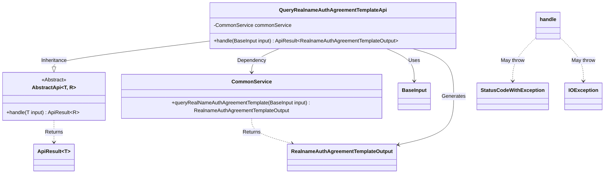

# Basic Information

|      |      |
|------|------|
| Name | QueryRealnameAuthAgreementTemplateApi |
| Language | .java |
| Code Path | WeFe/union/union-service/src/main/java/com/welab/wefe/union/service/api/common/QueryRealnameAuthAgreementTemplateApi.java |
| Package Name | com.welab.wefe.union.service.api.common |
| Dependencies | ['com.welab.wefe.common.exception.StatusCodeWithException', 'com.welab.wefe.common.web.api.base.AbstractApi', 'com.welab.wefe.common.web.api.base.Api', 'com.welab.wefe.common.web.dto.ApiResult', 'com.welab.wefe.union.service.dto.base.BaseInput', 'com.welab.wefe.union.service.dto.common.RealnameAuthAgreementTemplateOutput', 'com.welab.wefe.union.service.service.CommonService', 'org.springframework.beans.factory.annotation.Autowired', 'java.io.IOException'] |
| Brief Description | This is an API class for querying real-name authentication agreement templates, with the path "realname/auth/agreement/template/query". It allows signature-based access, retrieves agreement template data through CommonService, and returns the results. |

# Description

This is a Java class named QueryRealnameAuthAgreementTemplateApi, used to query the real-name authentication agreement template. The class inherits from AbstractApi, accepts BaseInput as input, and returns RealnameAuthAgreementTemplateOutput as output. The @Api annotation defines the API path as realname/auth/agreement/template/query, with the name "available," and allows signed access. The class injects a CommonService dependency, and its handle method calls the queryRealNameAuthAgreementTemplate method of commonService to process the request, returning an encapsulated result upon success.

# Class Summary

| Name   | Type  | Description |
|-------|------|-------------|
| QueryRealnameAuthAgreementTemplateApi | class | This is an API class for querying real-name authentication agreement templates, with the path "realname/auth/agreement/template/query". It allows signed access, retrieves agreement template data through CommonService, and returns the results. |

## Class QueryRealnameAuthAgreementTemplateApi

|      |      |
|------|------|
| Access Modifier | @Api(path = "realname/auth/agreement/template/query", name = "available", allowAccessWithSign = true);public |
| Type | class |
| Name | QueryRealnameAuthAgreementTemplateApi |
| Description | This is an API class for querying real-name authentication agreement templates, with the path "realname/auth/agreement/template/query". It allows signed access, retrieves agreement template data through CommonService, and returns the results. |

### UML Class Diagram

This code demonstrates the implementation of a real-name authentication agreement template query API class `QueryRealnameAuthAgreementTemplateApi`, which inherits from the generic abstract class `AbstractApi` and relies on `CommonService` to execute business logic. The class accepts `BaseInput` as input and returns an `ApiResult` containing `RealnameAuthAgreementTemplateOutput`. During processing, it may throw `StatusCodeWithException` and `IOException` exceptions. The `@Api` annotation defines the interface path and access permissions, while `@Autowired` enables dependency injection.

### Internal Method Call Graph

This code demonstrates a class QueryRealnameAuthAgreementTemplateApi that inherits from AbstractApi, primarily used for querying real-name authentication agreement templates. The class defines API paths and permission configurations through the @Api annotation, and injects CommonService to execute business logic. The core method is handle(), which calls the query method of commonService and returns encapsulated results. The flowchart clearly presents the complete chain from class structure to method invocation, highlighting key nodes of dependency injection and business processing.

### Field List

| Name  | Type  | Description |
|-------|-------|------|
| commonService | CommonService | The code snippet uses the @Autowired annotation to automatically inject an instance of CommonService. |

### Method List

| Name  | Type  | Description |
|-------|-------|------|
| handle | ApiResult<RealnameAuthAgreementTemplateOutput> | This method overrides the parent class logic, invokes a public service to query the real-name authentication agreement template, and returns the encapsulated result or an exception. |

