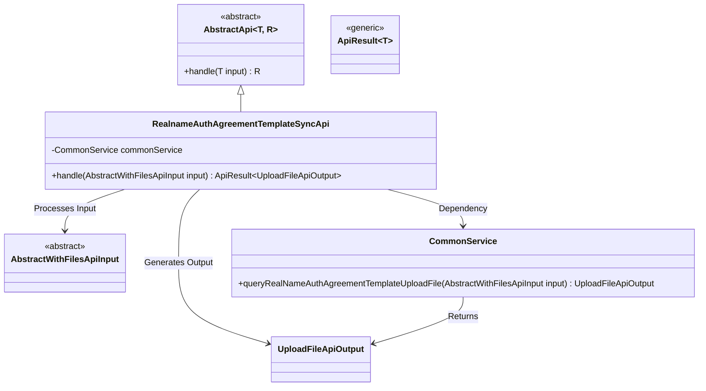
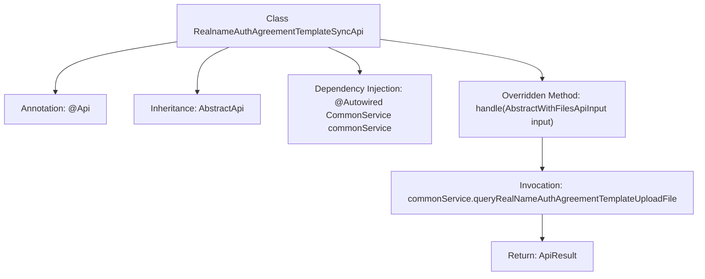

# Basic Information

|      |      |
|------|------|
| Name | RealnameAuthAgreementTemplateSyncApi |
| Language | .java |
| Code Path | WeFe/union/union-service/src/main/java/com/welab/wefe/union/service/api/common/RealnameAuthAgreementTemplateSyncApi.java |
| Package Name | com.welab.wefe.union.service.api.common |
| Dependencies | ['com.welab.wefe.common.exception.StatusCodeWithException', 'com.welab.wefe.common.web.api.base.AbstractApi', 'com.welab.wefe.common.web.api.base.Api', 'com.welab.wefe.common.web.dto.AbstractWithFilesApiInput', 'com.welab.wefe.common.web.dto.ApiResult', 'com.welab.wefe.common.web.dto.UploadFileApiOutput', 'com.welab.wefe.union.service.service.CommonService', 'org.springframework.beans.factory.annotation.Autowired', 'java.io.IOException'] |
| Brief Description | This is a real-name authentication agreement template synchronization API class with the path "realname/auth/agreement/template/sync". It uses SM2 verification, inherits from AbstractApi, processes file upload input and returns file output, and calls commonService to query the real-name authentication agreement template upload file. |

# Description

The code defines an API class named `RealnameAuthAgreementTemplateSyncApi`, which handles real-name authentication agreement template synchronization requests. This class inherits from `AbstractApi`, employs SM2 encryption for verification, accepts input of type `AbstractWithFilesApiInput`, and returns output of type `UploadFileApiOutput`. By injecting `CommonService`, it invokes the `queryRealNameAuthAgreementTemplateUploadFile` method to process the request, ultimately returning a successful result encapsulated as `ApiResult`.

# Class Summary

| Name   | Type  | Description |
|-------|------|-------------|
| RealnameAuthAgreementTemplateSyncApi | class | Real-name authentication protocol template synchronization API, using SM2 verification, processes file upload requests and returns results. |

## Class RealnameAuthAgreementTemplateSyncApi

|      |      |
|------|------|
| Access Modifier | @Api(path = "realname/auth/agreement/template/sync", name = "realname auth agreement template sync", sm2Verify = true);public |
| Type | class |
| Name | RealnameAuthAgreementTemplateSyncApi |
| Description | Real-name authentication protocol template synchronization API, using SM2 verification, processes file upload requests and returns results. |

### UML Class Diagram

This code demonstrates the class structure of a real-name authentication agreement template synchronization API. The RealnameAuthAgreementTemplateSyncApi inherits from the generic abstract class AbstractApi, processes AbstractWithFilesApiInput type inputs, and returns ApiResult<UploadFileApiOutput> results. It delegates the core business logic to CommonService, which handles file upload operations. The class diagram clearly illustrates inheritance relationships, dependencies, and input/output types, reflecting the application of the Template Method design pattern.

### Internal Method Call Graph

This flowchart illustrates the class structure and workflow of the Real-name Authentication Agreement Template Sync API. The class defines an interface path through the @Api annotation and inherits an abstract template class to handle file upload input/output. The core handle method invokes a common service to query the agreement template file, ultimately returning encapsulated results. The process clearly demonstrates the application of Spring dependency injection and the template method pattern, along with exception handling mechanisms.

### Field List

| Name  | Type  | Description |
|-------|-------|------|
| commonService | CommonService | Using @Autowired to automatically inject an instance of CommonService. |

### Method List

| Name  | Type  | Description |
|-------|-------|------|
| handle | ApiResult<UploadFileApiOutput> | Rewrite the method to handle file upload, invoke the service to query the real-name authentication agreement template file, and return a successful result. |

