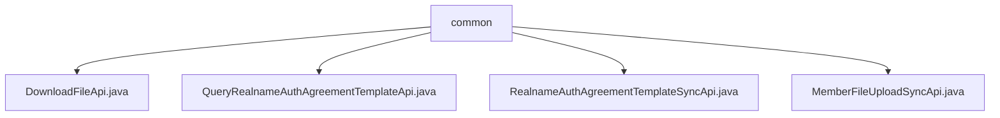

# Basic Information

|      |      |
|------|------|
| Name | common |
| Language | .java |
| Code Path | WeFe/union/union-service/src/main/java/com/welab/wefe/union/service/api/common |
| Package Name | docs.union.union-service.src.main.java.com.welab.wefe.union.service.api.common |
| Brief Description | DownloadFileApi handles file downloads with the path download/file. QueryRealnameAuthAgreementTemplateApi queries the real-name authentication agreement template with the path realname/auth/agreement/template/query. RealnameAuthAgreementTemplateSyncApi synchronizes the real-name authentication template using SM2 encryption. MemberFileUploadSyncApi processes member file uploads with the path member/file/upload/sync, requiring SM2 encryption. All inherit from AbstractApi and handle business logic through CommonService. |

# Description

## Overview  
The core responsibility of this module is to provide public service APIs for file downloads, real-name authentication agreement template queries, and member file synchronization uploads. All APIs inherit from the AbstractApi base class and adhere to a unified interface specification: paths are defined via @Api annotations, support signature/SM2 encryption verification, and inputs/outputs are encapsulated using specific DTOs. Key data structures include the Input inner class, UploadFileApiOutput, and RealnameAuthAgreementTemplateOutput. External dependencies primarily involve CommonService, such as handling file downloads and template queries.  

## Key Business Scenarios  
The module supports three typical scenarios: file downloads (e.g., retrieving file byte streams via fileId), real-name authentication agreement management (e.g., querying templates or synchronizing updates), and member file synchronization (e.g., encrypted uploads of member files). The interaction pattern resembles RESTful style, where input validation is followed by delegating business logic to CommonService. For example, DownloadFileApi returns ResponseEntity<byte[]>, while MemberFileUploadSyncApi requires memberId verification before invoking the upload service. All APIs return standardized encapsulated results to ensure consistent handling by callers.

### Package Internal Structure View

This flowchart illustrates the API file structure under the common directory in the union-service module of the WeFe project. The root node is the common folder, which contains four Java interface files: DownloadFileApi, QueryRealnameAuthAgreementTemplateApi, RealnameAuthAgreementTemplateSyncApi, and MemberFileUploadSyncApi. These files belong to the public service interface layer and are used for handling general functionalities such as file downloads and real-name authentication agreement template queries.

# File List

| Name   | Type  | Description |
|-------|------|-------------|
| [DownloadFileApi.java](DownloadFileApi.md) | file | The DownloadFileApi is a signature-supported file download interface that accepts the fileId parameter and returns a file byte stream. |
| [QueryRealnameAuthAgreementTemplateApi.java](QueryRealnameAuthAgreementTemplateApi.md) | file | This is an API class for querying real-name authentication agreement templates, with the path "realname/auth/agreement/template/query". It allows signed access, retrieves agreement template data through CommonService, and returns the results. |
| [RealnameAuthAgreementTemplateSyncApi.java](RealnameAuthAgreementTemplateSyncApi.md) | file | This is a real-name authentication agreement template synchronization API class with the path "realname/auth/agreement/template/sync". It uses SM2 verification, inherits from AbstractApi, processes file upload inputs and returns file outputs, and invokes commonService to query the real-name authentication agreement template upload file. |
| [MemberFileUploadSyncApi.java](MemberFileUploadSyncApi.md) | file | Member file synchronization upload API, requires SM2 verification, processes member ID and file upload, and invokes common services to complete the operation. |

