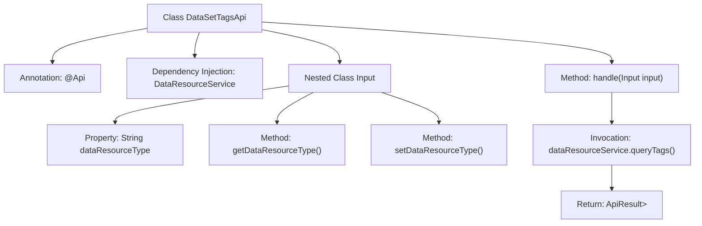

# Basic Information

|      |      |
|------|------|
| Name | DataSetTagsApi |
| Language | .java |
| Code Path | WeFe/union/union-service/src/main/java/com/welab/wefe/union/service/api/dataresource/DataSetTagsApi.java |
| Package Name | com.welab.wefe.union.service.api.dataresource |
| Dependencies | ['com.welab.wefe.common.exception.StatusCodeWithException', 'com.welab.wefe.common.web.api.base.AbstractApi', 'com.welab.wefe.common.web.api.base.Api', 'com.welab.wefe.common.web.dto.ApiResult', 'com.welab.wefe.union.service.dto.base.BaseInput', 'com.welab.wefe.union.service.dto.dataresource.TagsDTO', 'com.welab.wefe.union.service.service.DataResourceService', 'org.springframework.beans.factory.annotation.Autowired', 'java.io.IOException', 'java.util.List'] |
| Brief Description | This is an API class for querying data resource tags, with the path "data_resource/tags/query", requiring signature-based access. It accepts data type parameters, invokes the DataResourceService to query and returns a list of tags. |

# Description

This is a Java class named DataSetTagsApi, used for querying data resource tags. It extends AbstractApi, with generic parameters specifying the input type as the inner class Input and the return type as a list of TagsDTO. The class annotation defines the API path as "data_resource/tags/query" and allows signature-based access. It processes requests by invoking the queryTags method through the auto-injected DataResourceService. The inner class Input extends BaseInput and contains a read-write field dataResourceType for the data resource type. The handle method calls the service layer and returns the result.

# Class Summary

| Name   | Type  | Description |
|-------|------|-------------|
| DataSetTagsApi | class | Dataset label query API, with the path `data_resource/tags/query`, requires signed access. The input parameter is `dataResourceType`, and it returns a list of labels. The request is processed by invoking the `queryTags` method of `DataResourceService`. |


## Class DataSetTagsApi

|      |      |
|------|------|
| Access Modifier | @Api(path = "data_resource/tags/query", name = "data_resource_tags_query", allowAccessWithSign = true);public |
| Type | class |
| Name | DataSetTagsApi |
| Description | Dataset label query API, with the path `data_resource/tags/query`, requires signed access. The input parameter is `dataResourceType`, and it returns a list of labels. The request is processed by invoking the `queryTags` method of `DataResourceService`. |


### UML Class Diagram

```mermaid
classDiagram
    class DataSetTagsApi {
        -DataResourceService dataResourceService
        +handle(Input input) ApiResult~List~TagsDTO~~
    }
    
    class DataResourceService {
        <<Interface>>
        +queryTags(Input input) List~TagsDTO~
    }
    DataSetTagsApi --> DataResourceService : Dependency
    
    class Input {
        -String dataResourceType
        +String getDataResourceType()
        +void setDataResourceType(String dataResourceType)
    }
    DataSetTagsApi *-- Input : Composition
    
    class AbstractApi~T, R~ {
        <<Abstract>>
        +handle(T input) ApiResult~R~
    }
    DataSetTagsApi --|> AbstractApi~Input, List~TagsDTO~~ : Inheritance
    
    class TagsDTO {
        // Data Transfer Object
    }
    DataResourceService ..> TagsDTO : Usage
```

This code demonstrates the class structure of an API for querying data resource tags. The DataSetTagsApi inherits from the generic abstract class AbstractApi, uses the Input inner class as a parameter through composition, and relies on the DataResourceService interface to implement business logic. The API accepts an input object containing dataResourceType and returns a TagsDTO list result, reflecting clear hierarchical structure and separation of responsibilities.


### Internal Method Call Graph



This code illustrates a Spring framework-based API class DataSetTagsApi, which extends AbstractApi and implements data processing logic. The flowchart depicts class structure relationships: it includes the @Api annotation marker, DataResourceService injected via @Autowired, the handle method for processing requests, and the nested Input parameter class. The core flow involves the handle method calling dataResourceService.queryTags() and returning encapsulated results, while the Input class provides readable/writable data type properties.

### Field List

| Name  | Type  | Description |
|-------|-------|------|
| dataResourceService | DataResourceService | Automatically inject the DataResourceService instance. |

### Method List

| Name  | Type  | Description |
|-------|-------|------|
| handle | ApiResult<List<TagsDTO>> | This method overrides the parent class logic, invokes the dataResourceService to query tag data, and returns the encapsulated ApiResult. It handles potential exceptions. |


