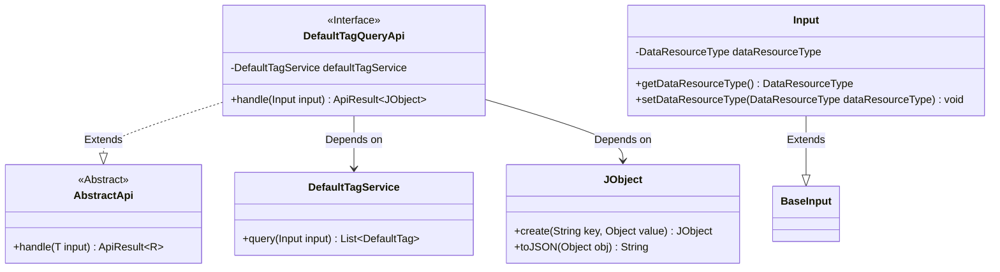
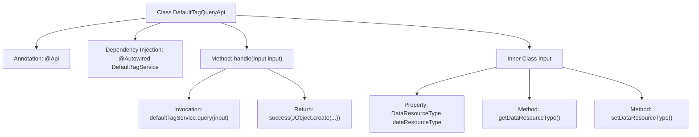

# Basic Information

|      |      |
|------|------|
| Name | DefaultTagQueryApi |
| Language | .java |
| Code Path | WeFe/union/union-service/src/main/java/com/welab/wefe/union/service/api/dataresource/DefaultTagQueryApi.java |
| Package Name | com.welab.wefe.union.service.api.dataresource |
| Dependencies | ['com.welab.wefe.common.exception.StatusCodeWithException', 'com.welab.wefe.common.fieldvalidate.annotation.Check', 'com.welab.wefe.common.util.JObject', 'com.welab.wefe.common.web.api.base.AbstractApi', 'com.welab.wefe.common.web.api.base.Api', 'com.welab.wefe.common.web.dto.ApiResult', 'com.welab.wefe.common.wefe.enums.DataResourceType', 'com.welab.wefe.union.service.dto.base.BaseInput', 'com.welab.wefe.union.service.service.DefaultTagService', 'org.springframework.beans.factory.annotation.Autowired', 'java.io.IOException'] |
| Brief Description | DefaultTagQueryApi interface, path data_resource/default_tag/query, requires signature authentication, invokes DefaultTagService to query data. The input must include the dataResourceType parameter and returns a JSON-formatted list. |

# Description

The code defines an API class named DefaultTagQueryApi, which is used to query default tag data. The API path is "data_resource/default_tag/query" and allows signed access. The class inherits from AbstractApi, with the input type being the inner class Input and the output type being JObject. The DefaultTagService is injected via Autowired to handle business logic. The handle method calls defaultTagService.query and returns the result in JSON format. The Input class inherits from BaseInput and includes the mandatory dataResourceType field along with its getter/setter methods, where the field type is DataResourceType. Overall, it implements a simple tag query interface.

# Class Summary

| Name   | Type  | Description |
|-------|------|-------------|
| DefaultTagQueryApi | class | This is an API class for querying default tags, with the path `data_resource/default_tag/query`, allowing signed access. It uses `DefaultTagService` to process query requests, takes `DataResourceType` as the input parameter, and returns a JSON-formatted list of tags as the result. |

## Class DefaultTagQueryApi

|      |      |
|------|------|
| Access Modifier | @Api(path = "data_resource/default_tag/query", name = "data_resource_default_tag_query", allowAccessWithSign = true);public |
| Type | class |
| Name | DefaultTagQueryApi |
| Description | This is an API class for querying default tags, with the path `data_resource/default_tag/query`, allowing signed access. It uses `DefaultTagService` to process query requests, takes `DataResourceType` as the input parameter, and returns a JSON-formatted list of tags as the result. |

### UML Class Diagram

This code demonstrates an API handler class `DefaultTagQueryApi`, which inherits from the generic abstract class `AbstractApi`, processes a specific input type `Input`, and returns results in JSON format. The `Input` class extends `BaseInput` and contains a mandatory `DataResourceType` enum field. The API queries data through `DefaultTagService` and uses the `JObject` utility class to construct responses. The overall design reflects a clear hierarchical structure and dependency relationships, where `DefaultTagQueryApi` serves as a concrete implementation class, relying on the service layer and utility classes to fulfill business logic.

### Internal Method Call Graph

This flowchart illustrates the structure of the DefaultTagQueryApi class and its internal relationships. The class defines API paths via the @Api annotation, injects the DefaultTagService, and processes input parameters through its core method handle(), which invokes the service layer to query data and ultimately returns a JObject containing the query results. The inner class Input includes the validated dataResourceType property with its getter/setter methods. The flow clearly presents the complete chain from request processing to result return.

### Field List

| Name  | Type  | Description |
|-------|-------|------|
| defaultTagService | DefaultTagService | Using @Autowired to automatically inject an instance of DefaultTagService. |

### Method List

| Name  | Type  | Description |
|-------|-------|------|
| handle | ApiResult<JObject> | Java method override, processes input and returns default tag query results in JSON format. |

