# Basic Information

|      |      |
|------|------|
| Name | DeleteApi |
| Language | .java |
| Code Path | WeFe/union/union-service/src/main/java/com/welab/wefe/union/service/api/dataresource/DeleteApi.java |
| Package Name | com.welab.wefe.union.service.api.dataresource |
| Dependencies | ['com.welab.wefe.common.exception.StatusCodeWithException', 'com.welab.wefe.common.fieldvalidate.annotation.Check', 'com.welab.wefe.common.web.api.base.AbstractApi', 'com.welab.wefe.common.web.api.base.Api', 'com.welab.wefe.common.web.dto.AbstractApiOutput', 'com.welab.wefe.common.web.dto.ApiResult', 'com.welab.wefe.union.service.dto.base.BaseInput', 'com.welab.wefe.union.service.service.DataResourceService', 'org.springframework.beans.factory.annotation.Autowired', 'java.io.IOException'] |
| Brief Description | The API interface for deleting a data resource requires passing the `dataResourceId` parameter and invoking the `delete` method of `DataResourceService` for processing. |

# Description

The code defines an API class named `DeleteApi`, designed for deleting data resources. The API path is `data_resource/delete` and allows signed access. The class inherits from `AbstractApi`, with the input type being `DeleteApi.Input` and the output type being `AbstractApiOutput`. The `DataResourceService` is injected via `@Autowired`, and its `delete` method is called within the `handle` method to perform the deletion. The input class `Input` extends `BaseInput` and includes the mandatory `dataResourceId` field along with its getter and setter methods. Upon successful processing, it returns a `success` result.

# Class Summary

| Name   | Type  | Description |
|-------|------|-------------|
| DeleteApi | class | API class for deleting data resources, with the path `data_resource/delete`, requires signature authentication, accepts the `dataResourceId` parameter, and invokes the service to delete the corresponding resource. |


## Class DeleteApi

|      |      |
|------|------|
| Access Modifier | @Api(path = "data_resource/delete", name = "data_resource_delete", allowAccessWithSign = true);public |
| Type | class |
| Name | DeleteApi |
| Description | API class for deleting data resources, with the path `data_resource/delete`, requires signature authentication, accepts the `dataResourceId` parameter, and invokes the service to delete the corresponding resource. |


### UML Class Diagram

```mermaid
classDiagram
    class AbstractApi~T, R~ {
        <<Abstract>>
        +handle(T input) ApiResult~R~
    }
    class DeleteApi {
        -DataResourceService dataResourceService
        +handle(Input input) ApiResult~AbstractApiOutput~
    }
    class DataResourceService {
        +delete(DeleteApi$Input input)
    }
    class BaseInput {
        <<Abstract>>
    }
    class DeleteApi$Input {
        -String dataResourceId
        +String getDataResourceId()
        +void setDataResourceId(String dataResourceId)
    }
    class AbstractApiOutput {
    }
    class ApiResult~T~ {
    }

    DeleteApi --|> AbstractApi~DeleteApi$Input, AbstractApiOutput~ : Inheritance
    DeleteApi --> DataResourceService : Dependency
    DeleteApi$Input --|> BaseInput : Inheritance
    AbstractApi ..> ApiResult : Usage
    DeleteApi ..> AbstractApiOutput : Usage
```

Class Diagram Description:
The diagram illustrates the structural relationships of DeleteApi and its associated classes. DeleteApi inherits from the generic class AbstractApi<Input, AbstractApiOutput> and depends on DataResourceService for data resource deletion operations. Input, as an inner class of DeleteApi, extends BaseInput and contains the dataResourceId field along with its accessor methods. AbstractApi defines the core abstract method handle, while ApiResult is used to encapsulate return values. The overall structure exemplifies typical patterns of layered design and dependency injection.


### Internal Method Call Graph

```mermaid
graph TD
    A["Class DeleteApi"]
    B["Annotation: @Api"]
    C["Inheritance: AbstractApi<Input, AbstractApiOutput>"]
    D["Dependency Injection: @Autowired DataResourceService"]
    E["Overridden Method: handle(Input input)"]
    F["Inner Class: Input extends BaseInput"]
    G["Field: @Check String dataResourceId"]
    H["Method: getDataResourceId()"]
    I["Method: setDataResourceId()"]
    J["Invocation: dataResourceService.delete(input)"]
    K["Return: success()"]

    A --> B
    A --> C
    A --> D
    A --> E
    E --> J
    E --> K
    A --> F
    F --> G
    F --> H
    F --> I
```



This code defines a DeleteApi class annotated with @Api, which inherits from AbstractApi and overrides the handle method. The flowchart illustrates the class structure, annotations, dependency injection, inner class definition, and core processing logic. The primary functionality is to delete specified data resources via dataResourceService, with the inner Input class validating the required parameter dataResourceId. The overall design follows a typical layered pattern for API interfaces, incorporating input validation and business logic processing.

### Field List

| Name  | Type  | Description |
|-------|-------|------|
| dataResourceService | DataResourceService | Automatically inject the DataResourceService instance. |

### Method List

| Name  | Type  | Description |
|-------|-------|------|
| handle | ApiResult<AbstractApiOutput> | Java Method: Processes input and invokes the deletion service, returning the result upon success. |


