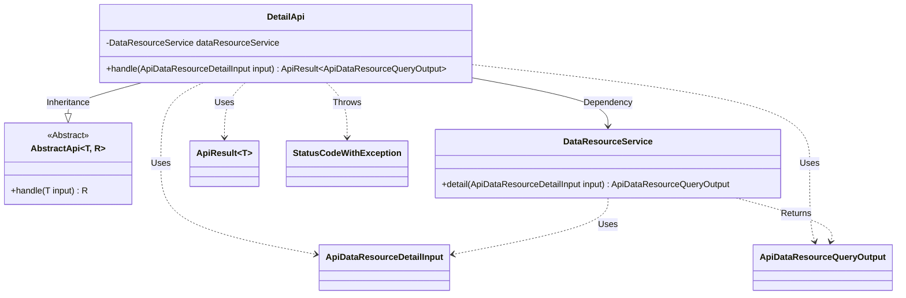
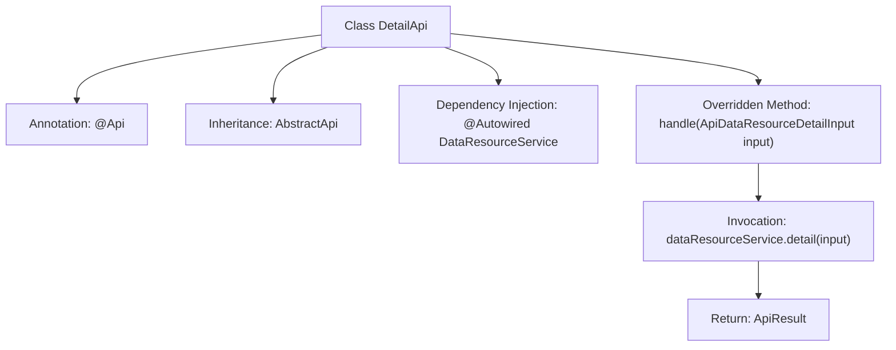

# Basic Information

|      |      |
|------|------|
| Name | DetailApi |
| Language | .java |
| Code Path | WeFe/union/union-service/src/main/java/com/welab/wefe/union/service/api/dataresource/DetailApi.java |
| Package Name | com.welab.wefe.union.service.api.dataresource |
| Dependencies | ['com.welab.wefe.common.exception.StatusCodeWithException', 'com.welab.wefe.common.web.api.base.AbstractApi', 'com.welab.wefe.common.web.api.base.Api', 'com.welab.wefe.common.web.dto.ApiResult', 'com.welab.wefe.union.service.dto.dataresource.ApiDataResourceDetailInput', 'com.welab.wefe.union.service.dto.dataresource.ApiDataResourceQueryOutput', 'com.welab.wefe.union.service.service.DataResourceService', 'org.springframework.beans.factory.annotation.Autowired'] |
| Brief Description | The DetailApi class is a data resource details interface that allows signed access, invoking the DataResourceService to process input and return detailed data. |

# Description

This is a Java class named DetailApi, which extends the base class AbstractApi and is used to handle API requests for querying data resource details. The class is annotated with the Api annotation, specifying the path as "data_resource/detail" and allowing signed access. It invokes the detail method of the injected DataResourceService to process the input parameter ApiDataResourceDetailInput and returns a result of type ApiDataResourceQueryOutput. The core business logic is implemented in the handle method, which returns a properly encapsulated ApiResult object upon success.

# Class Summary

| Name   | Type  | Description |
|-------|------|-------------|
| DetailApi | class | The Java class DetailApi defines an API interface with the path "data_resource/detail," allowing signed access. It invokes the detail method of DataResourceService to process the input and return the result. |

## Class DetailApi

|      |      |
|------|------|
| Access Modifier | @Api(path = "data_resource/detail", name = "data_resource_detail", allowAccessWithSign = true);public |
| Type | class |
| Name | DetailApi |
| Description | The Java class DetailApi defines an API interface with the path "data_resource/detail," allowing signed access. It invokes the detail method of DataResourceService to process the input and return the result. |

### UML Class Diagram

This code demonstrates a DetailApi class that inherits from the generic abstract class AbstractApi, implementing data resource detail query functionality. DetailApi utilizes the DataResourceService through dependency injection, processes the input parameter ApiDataResourceDetailInput, and returns the ApiDataResourceQueryOutput result encapsulated in ApiResult. The class diagram clearly illustrates inheritance relationships, dependencies, and interactions between types, reflecting the typical controller-service layer interaction pattern in the Spring framework.

### Internal Method Call Graph

This code demonstrates an annotation-based API class DetailApi, which inherits from AbstractApi and implements data processing logic. The flow starts with class definition, configures interface metadata through @Api annotation, injects DataResourceService using @Autowired, overrides the handle method to invoke the service layer's detail functionality, and finally returns the encapsulated ApiResult. The entire process exemplifies a typical API layer implementation pattern in the Spring framework, encompassing key steps such as dependency injection, service invocation, and result encapsulation.

### Field List

| Name  | Type  | Description |
|-------|-------|------|
| dataResourceService | DataResourceService | Automatically inject the DataResourceService service instance. |

### Method List

| Name  | Type  | Description |
|-------|-------|------|
| handle | ApiResult<ApiDataResourceQueryOutput> | Java method override, calling dataResourceService.detail to process the input and return the ApiResult encapsulated result. |

