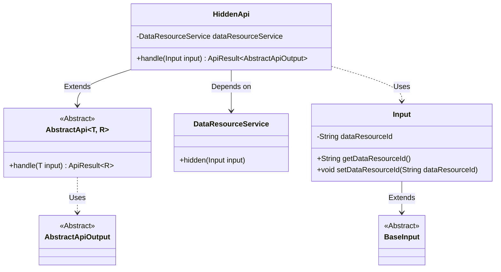
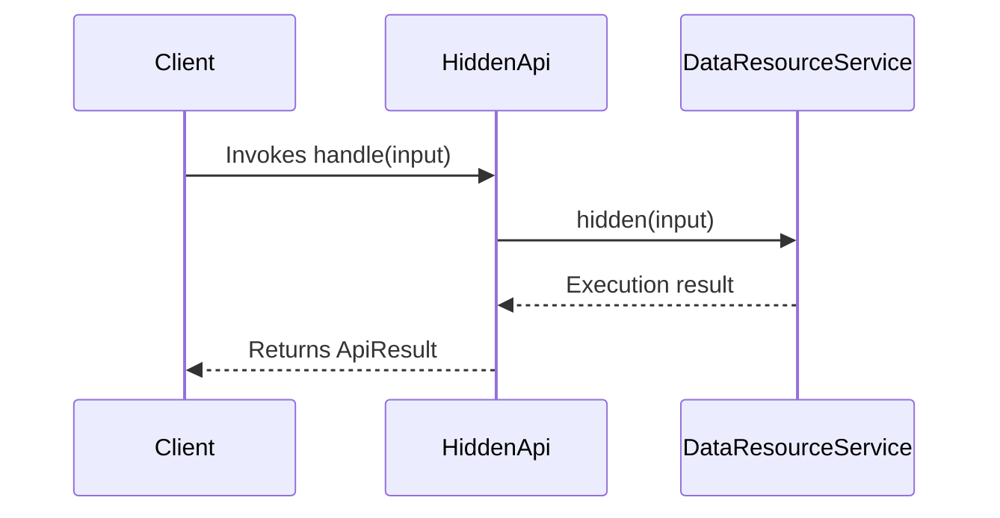

# Basic Information

|      |      |
|------|------|
| Name | HiddenApi |
| Language | .java |
| Code Path | WeFe/union/union-service/src/main/java/com/welab/wefe/union/service/api/dataresource/HiddenApi.java |
| Package Name | com.welab.wefe.union.service.api.dataresource |
| Dependencies | ['com.welab.wefe.common.exception.StatusCodeWithException', 'com.welab.wefe.common.fieldvalidate.annotation.Check', 'com.welab.wefe.common.web.api.base.AbstractApi', 'com.welab.wefe.common.web.api.base.Api', 'com.welab.wefe.common.web.dto.AbstractApiOutput', 'com.welab.wefe.common.web.dto.ApiResult', 'com.welab.wefe.union.service.dto.base.BaseInput', 'com.welab.wefe.union.service.service.DataResourceService', 'org.springframework.beans.factory.annotation.Autowired', 'java.io.IOException'] |
| Brief Description | The HiddenApi class is a data resource hiding interface with the path data_resource/hidden, requiring signed access. It processes the input parameter dataResourceId and invokes the dataResourceService.hidden method to implement the hiding functionality. |

# Description

HiddenApi is an API class designed for handling data resource hiding operations, with the path "data_resource/hidden" and allowing signed access. It inherits from AbstractApi, using generics to specify the input type as HiddenApi.Input and the output type as AbstractApiOutput. The class injects DataResourceService for business processing, with its core method `handle` invoking `dataResourceService.hidden` to execute the hiding operation. The input class Input extends BaseInput, containing the mandatory `dataResourceId` field along with its getter/setter methods. The entire API design is concise, focusing on the single responsibility of data resource hiding functionality.

# Class Summary

| Name   | Type  | Description |
|-------|------|-------------|
| HiddenApi | class | The HiddenApi class is a signed data resource hiding interface that processes the input parameter dataResourceId through the dataResourceService and returns a successful result after performing the hiding operation. |

## Class HiddenApi

|      |      |
|------|------|
| Access Modifier | @Api(path = "data_resource/hidden", name = "data_resource_hidden", allowAccessWithSign = true);public |
| Type | class |
| Name | HiddenApi |
| Description | The HiddenApi class is a signed data resource hiding interface that processes the input parameter dataResourceId through the dataResourceService and returns a successful result after performing the hiding operation. |

### UML Class Diagram

This code demonstrates the class structure of a hidden data resource API implementation. HiddenApi inherits from the generic abstract class AbstractApi, processes Input, and returns AbstractApiOutput. The actual hiding operation is performed via DataResourceService. The Input class extends BaseInput and contains the mandatory data resource ID field. The class diagram clearly illustrates inheritance relationships, dependency relationships, and usage relationships, reflecting a typical API service layer design pattern in the Spring framework.

### Internal Method Call Graph

```mermaid
graph TD
    A["Class HiddenApi"]
    B["Annotation: @Api"]
    C["Inheritance: AbstractApi<Input, AbstractApiOutput>"]
    D["Dependency Injection: @Autowired DataResourceService"]
    E["Overridden Method: handle(Input input)"]
    F["Inner Class: Input"]
    G["Field: String dataResourceId"]
    H["Validation Annotation: @Check(require=true)"]
    I["Getter/Setter Methods"]

    A --> B
    A --> C
    A --> D
    A --> E
    E --> D["Calls dataResourceService.hidden()"]
    A --> F
    F --> G
    F --> H
    F --> I
```

This code defines a HiddenApi class annotated with @Api, which inherits from AbstractApi and implements data processing logic. The flowchart illustrates class structure relationships including annotations, inheritance, dependency services, and inner input class. The sequence diagram depicts the complete workflow when a client invokes the handle method, where the hidden operation is executed via DataResourceService and results are returned. The core functionality involves performing hidden operations on specified data resources through the service layer, with input parameters validated and encapsulated via the nested Input class.

### Field List

| Name  | Type  | Description |
|-------|-------|------|
| dataResourceService | DataResourceService | Automatically inject the DataResourceService service instance. |

### Method List

| Name  | Type  | Description |
|-------|-------|------|
| handle | ApiResult<AbstractApiOutput> | Rewrite the handle method to invoke the dataResourceService for hiding input data, returning an empty result upon success. May throw status code exceptions or IO exceptions. |

