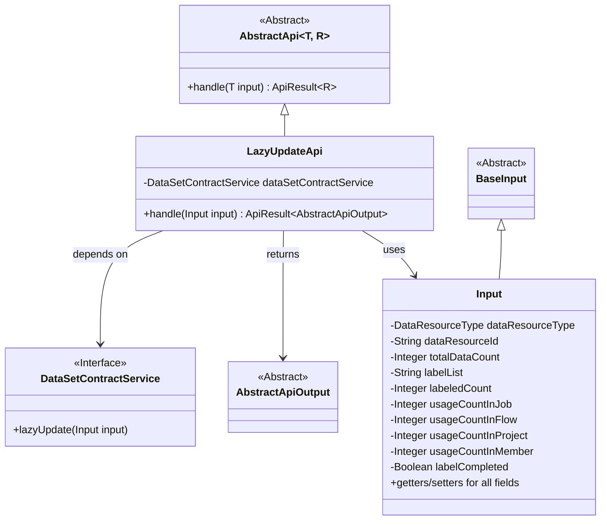

# Basic Information

|      |      |
|------|------|
| Name | LazyUpdateApi |
| Language | .java |
| Code Path | WeFe/union/union-service/src/main/java/com/welab/wefe/union/service/api/dataresource/LazyUpdateApi.java |
| Package Name | com.welab.wefe.union.service.api.dataresource |
| Dependencies | ['com.welab.wefe.common.exception.StatusCodeWithException', 'com.welab.wefe.common.fieldvalidate.annotation.Check', 'com.welab.wefe.common.web.api.base.AbstractApi', 'com.welab.wefe.common.web.api.base.Api', 'com.welab.wefe.common.web.dto.AbstractApiOutput', 'com.welab.wefe.common.web.dto.ApiResult', 'com.welab.wefe.common.wefe.enums.DataResourceType', 'com.welab.wefe.union.service.dto.base.BaseInput', 'com.welab.wefe.union.service.service.contract.DataSetContractService', 'org.springframework.beans.factory.annotation.Autowired'] |
| Brief Description | The LazyUpdateApi class is designed for lazy updating of data resource tag statistics. It accepts mandatory parameters such as resource type, ID, and total count, invokes the dataSetContractService for processing, and returns a successful result. |

# Description

The LazyUpdateApi is an API designed for lazy updating of data resource label statistics, with the endpoint at data_resource/lazy_update, allowing signed access. It inherits from AbstractApi, accepts Input parameters, and returns AbstractApiOutput. The Input class includes mandatory fields dataResourceType, dataResourceId, totalDataCount, as well as optional fields labelList, labeledCount, usageCountInJob, usageCountInFlow, usageCountInProject, usageCountInMember, and labelCompleted. The processing logic is implemented via the dataSetContractService.lazyUpdate method.

# Class Summary

| Name   | Type  | Description |
|-------|------|-------------|
| LazyUpdateApi | class | The LazyUpdateApi is used for lazy updating of dataset label statistics. It requires parameters such as resource type, ID, and total count, and invokes the dataSetContractService for processing. |

## Class LazyUpdateApi

|      |      |
|------|------|
| Access Modifier | @Api(path = "data_resource/lazy_update", name = "image_data_set_update_labeled_count", allowAccessWithSign = true);public |
| Type | class |
| Name | LazyUpdateApi |
| Description | The LazyUpdateApi is used for lazy updating of dataset label statistics. It requires parameters such as resource type, ID, and total count, and invokes the dataSetContractService for processing. |

### UML Class Diagram

This class diagram illustrates that LazyUpdateApi inherits from AbstractApi and depends on the DataSetContractService interface to process input data. The Input class inherits from BaseInput and contains multiple fields with their getter/setter methods. LazyUpdateApi processes Input parameters through the handle method and returns AbstractApiOutput results, implementing the lazy update functionality for data resources.

### Internal Method Call Graph

```mermaid
graph TD
    A["Class LazyUpdateApi"]
    B["Annotation: @Api"]
    C["Inheritance: AbstractApi<Input, AbstractApiOutput>"]
    D["Dependency Injection: DataSetContractService"]
    E["Overridden Method: handle(Input input)"]
    F["Inner Class: Input"]
    G["Input Property: DataResourceType dataResourceType"]
    H["Input Property: String dataResourceId"]
    I["Input Property: Integer totalDataCount"]
    J["Input Property: String labelList"]
    K["Input Property: Integer labeledCount"]
    L["Input Property: Integer usageCountInJob"]
    M["Input Property: Integer usageCountInFlow"]
    N["Input Property: Integer usageCountInProject"]
    O["Input Property: Integer usageCountInMember"]
    P["Input Property: Boolean labelCompleted"]
    Q["Input Methods: Getters/Setters for properties"]

    A --> B
    A --> C
    A --> D
    A --> E
    A --> F
    F --> G
    F --> H
    F --> I
    F --> J
    F --> K
    F --> L
    F --> M
    F --> N
    F --> O
    F --> P
    F --> Q
    E --> D
    E --> F
```

This code demonstrates an API class named LazyUpdateApi, which inherits from AbstractApi and handles lazy updates for data resources. The class defines API paths and permissions through the @Api annotation, utilizing DataSetContractService for business logic processing. The inner class Input contains multiple data resource properties along with their getter/setter methods. The handle method invokes the service layer for data updates and returns results. The flowchart clearly illustrates the class structure, dependency relationships, and main method invocation chain.

### Field List

| Name  | Type  | Description |
|-------|-------|------|
| dataSetContractService | DataSetContractService | The code snippet uses the @Autowired annotation to automatically inject an instance of DataSetContractService. |

### Method List

| Name  | Type  | Description |
|-------|-------|------|
| handle | ApiResult<AbstractApiOutput> | This method overrides the parent class logic, invokes the service layer to update the dataset, and returns an empty result upon success. It throws a status code encapsulated exception in case of errors. |

