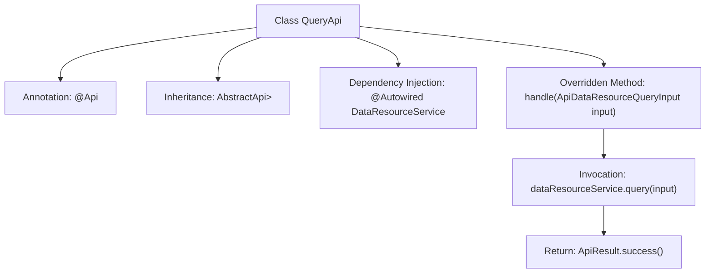

# Basic Information

|      |      |
|------|------|
| Name | QueryApi |
| Language | .java |
| Code Path | WeFe/union/union-service/src/main/java/com/welab/wefe/union/service/api/dataresource/QueryApi.java |
| Package Name | com.welab.wefe.union.service.api.dataresource |
| Dependencies | ['com.welab.wefe.common.data.mongodb.dto.PageOutput', 'com.welab.wefe.common.web.api.base.AbstractApi', 'com.welab.wefe.common.web.api.base.Api', 'com.welab.wefe.common.web.dto.ApiResult', 'com.welab.wefe.union.service.dto.dataresource.ApiDataResourceQueryInput', 'com.welab.wefe.union.service.dto.dataresource.ApiDataResourceQueryOutput', 'com.welab.wefe.union.service.service.DataResourceService', 'org.springframework.beans.factory.annotation.Autowired'] |
| Brief Description | The Java class QueryApi defines the data resource query interface, with the path "data_resource/query," requiring signed access. It invokes the query method of DataResourceService to process the input and return paginated results. |

# Description

The code defines an API class named `QueryApi` for querying data resources. The class annotation specifies the API path as `"data_resource/query"`, the name as `"data_resource_query"`, and allows signed access. This class inherits from `AbstractApi`, with generic parameters specifying the input type as `ApiDataResourceQueryInput` and the output type as paginated `ApiDataResourceQueryOutput`. It uses the auto-injected `DataResourceService` to call the `query` method for processing input parameters and returns a successfully encapsulated `ApiResult`. The entire class implements the handling and response to data resource query requests.

# Class Summary

| Name   | Type  | Description |
|-------|------|-------------|
| QueryApi | class | This is a data resource query API class with the path "data_resource/query", allowing signed access. It inherits from AbstractApi, processes ApiDataResourceQueryInput, and returns paginated ApiDataResourceQueryOutput results. The query operation is executed through the injected DataResourceService. |


## Class QueryApi

|      |      |
|------|------|
| Access Modifier | @Api(path = "data_resource/query", name = "data_resource_query", allowAccessWithSign = true);public |
| Type | class |
| Name | QueryApi |
| Description | This is a data resource query API class with the path "data_resource/query", allowing signed access. It inherits from AbstractApi, processes ApiDataResourceQueryInput, and returns paginated ApiDataResourceQueryOutput results. The query operation is executed through the injected DataResourceService. |


### UML Class Diagram

```mermaid
classDiagram
    class AbstractApi~T, R~ {
        <<Abstract>>
        #ApiResult~R~ handle(T input)
    }

    class QueryApi {
        -DataResourceService dataResourceService
        +ApiResult~PageOutput~ApiDataResourceQueryOutput~~ handle(ApiDataResourceQueryInput input)
    }

    class DataResourceService {
        +PageOutput~ApiDataResourceQueryOutput~ query(ApiDataResourceQueryInput input)
    }

    class ApiDataResourceQueryInput {
        // Query input parameter class
    }

    class ApiDataResourceQueryOutput {
        // Query output result class
    }

    class PageOutput~T~ {
        // Paginated output wrapper class
    }

    class ApiResult~T~ {
        // API result wrapper class
    }

    QueryApi --|> AbstractApi~ApiDataResourceQueryInput, PageOutput~ApiDataResourceQueryOutput~~ : Inheritance
    QueryApi --> DataResourceService : Dependency
    DataResourceService ..> ApiDataResourceQueryInput : Uses
    DataResourceService ..> ApiDataResourceQueryOutput : Uses
    DataResourceService ..> PageOutput~ApiDataResourceQueryOutput~ : Uses
    AbstractApi ..> ApiResult~R~ : Uses
```

This code demonstrates the implementation structure of a query API, where QueryApi inherits from the generic abstract class AbstractApi and utilizes DataResourceService through dependency injection for data querying. AbstractApi defines the template method for core processing logic, while QueryApi implements specific business processing to return paginated query results. The design embodies the Template Method pattern, achieving flexibility in input/output types through generics, while relying on the service layer to complete core business logic. The class diagram clearly illustrates inheritance, dependency, and usage relationships, as well as parameter passing between generic classes.


### Internal Method Call Graph



This flowchart illustrates the structure and main execution flow of the QueryApi class. It is a Spring framework-based API class that defines the interface path through the @Api annotation, inherits from the AbstractApi abstract class, and injects the DataResourceService. The core processing logic resides in the handle method, which invokes dataResourceService.query for data querying before returning a successfully encapsulated ApiResult. The entire flow demonstrates a complete processing chain from request input to service invocation and result encapsulation.

### Field List

| Name  | Type  | Description |
|-------|-------|------|
| dataResourceService | DataResourceService | Automatically inject the DataResourceService service instance. |

### Method List

| Name  | Type  | Description |
|-------|-------|------|
| handle | ApiResult<PageOutput<ApiDataResourceQueryOutput>> | Rewriting the parent class method in code, calling a service to query data and returning paginated results. |


