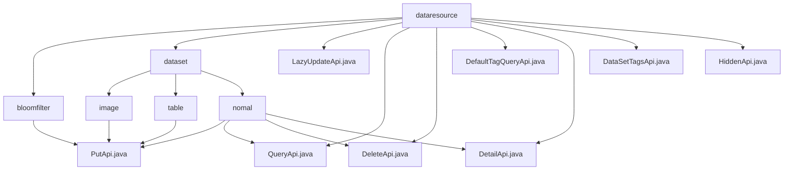

# Basic Information

|      |      |
|------|------|
| Name | dataresource |
| Language | .java |
| Code Path | WeFe/union/union-service/src/main/java/com/welab/wefe/union/service/api/dataresource |
| Package Name | docs.union.union-service.src.main.java.com.welab.wefe.union.service.api.dataresource |
| Brief Description | The PutApi is used to add data to the Bloom filter. The LazyUpdateApi lazily updates tag statistics. The QueryApi retrieves data resources. The DeleteApi removes data resources. The DefaultTagQueryApi queries default tags. The DetailApi fetches data details. The DataSetTagsApi queries tags. The HiddenApi hides data resources. |

# Description

## Overview  
This module serves as a unified data resource management service, with its core responsibilities including providing CRUD operations for data resources, tag management, and status control. The interface specification adopts a unified design inherited from AbstractApi, supporting signature-based access and standardized Input/Output patterns (e.g., PutApi requires mandatory fields, while QueryApi supports paginated output). Key data structures include the basic input class DataResourcePutInput, ImageInput with statistical fields, TableInput with feature descriptions, and the paginated query structure ApiDataResourceQueryOutput. External dependencies include BloomFilterService, DataResourceService, and DefaultTagService, which are injected via Autowired. For example, the Bloom filter defines its hashing strategy through the hashFunction property.

## Core Business Scenarios  
The module supports multi-type data resource management: basic CRUD (e.g., DeleteApi), tag statistics (e.g., LazyUpdateApi), metadata queries (e.g., DetailApi), and status control (e.g., HiddenApi). Interactions follow a RESTful style, with paths such as "data_resource/delete" and "data_resource/tags/query". Typical applications include querying feature datasets for joint modeling (calling QueryApi) and updating statistical information in annotation platforms (using LazyUpdateApi). Extension features resemble configuration centers, such as DefaultTagQueryApi providing predefined tag queries. Write operations are implemented through the service layer; for example, HiddenApi persists the resource's hidden status.

### Package Internal Structure View

This flowchart illustrates the API structure of the data resource service. The top-level is the dataresource directory, which contains two subdirectories (bloomfilter and dataset) along with multiple direct API files. The dataset directory is further divided into three subtypes: image, table, and nomal, each containing their respective API implementation files. The nomal type encompasses the most comprehensive API collection, covering operations such as create, read, update, and delete.

# File List

| Name   | Type  | Description |
|-------|------|-------------|
| [bloomfilter](bloomfilter/_module.md) | package | Bloom filter add API, allowing signature-based access, which receives input parameters and invokes the service to add data. |
| [LazyUpdateApi.java](LazyUpdateApi.md) | file | The LazyUpdateApi class is used for lazy updating of data resource tag statistics. It takes mandatory parameters such as resource type, ID, and total count, invokes the dataSetContractService for processing, and returns a successful result. |
| [QueryApi.java](QueryApi.md) | file | The Java class QueryApi defines the data resource query interface with the path "data_resource/query," requiring signed access. It invokes the query method of DataResourceService to process input and return paginated results. |
| [DeleteApi.java](DeleteApi.md) | file | API interface for deleting data resources requires passing the `dataResourceId` parameter and invoking the `delete` method of `DataResourceService` for processing. |
| [DefaultTagQueryApi.java](DefaultTagQueryApi.md) | file | DefaultTagQueryApi interface, path data_resource/default_tag/query, requires signature authentication, invokes DefaultTagService to query data. The input must include the dataResourceType parameter and returns a JSON-formatted list. |
| [DetailApi.java](DetailApi.md) | file | The DetailApi class is a data resource details interface that allows signed access, invoking the DataResourceService to process input and return detailed data. |
| [DataSetTagsApi.java](DataSetTagsApi.md) | file | This is an API class for querying data resource tags, with the path "data_resource/tags/query", requiring signed access. It accepts data type parameters, invokes the DataResourceService to query, and returns a list of tags. |
| [HiddenApi.java](HiddenApi.md) | file | The HiddenApi class is a data resource hiding interface with the path data_resource/hidden, requiring signed access. It processes the input parameter dataResourceId and invokes the dataResourceService.hidden method to implement the hiding functionality. |
| [dataset](dataset/_module.md) | package | The PutApi class handles the addition of image and tabular datasets, inheriting from AbstractApi, and uses the Input class containing required fields to call the add method of the Service. The module provides CRUD operations for datasets, follows a unified design, depends on DataSetService, and supports RESTful-style APIs. |

