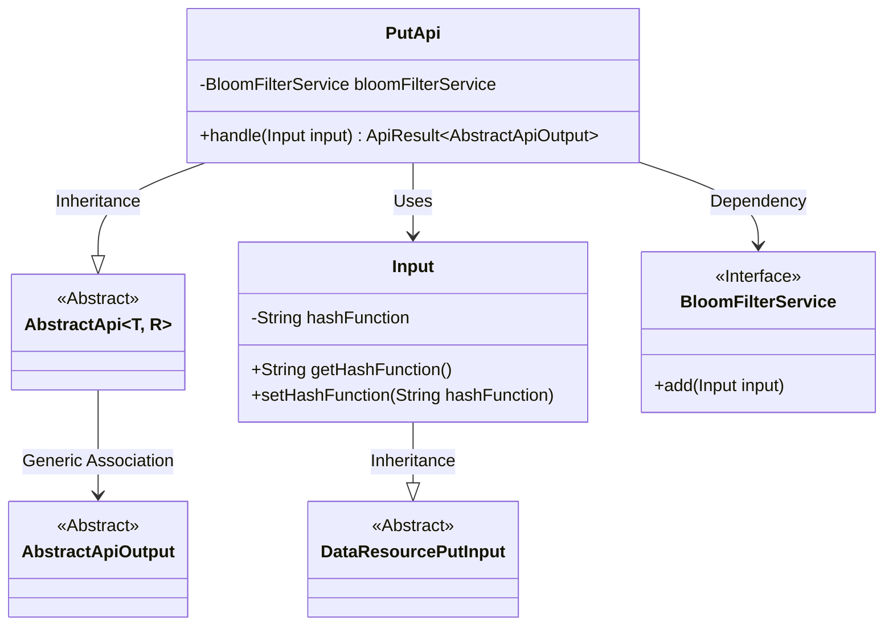

# Basic Information

|      |      |
|------|------|
| Name | PutApi |
| Language | .java |
| Code Path | WeFe/union/union-service/src/main/java/com/welab/wefe/union/service/api/dataresource/bloomfilter/PutApi.java |
| Package Name | com.welab.wefe.union.service.api.dataresource.bloomfilter |
| Dependencies | ['com.welab.wefe.common.exception.StatusCodeWithException', 'com.welab.wefe.common.web.api.base.AbstractApi', 'com.welab.wefe.common.web.api.base.Api', 'com.welab.wefe.common.web.dto.AbstractApiOutput', 'com.welab.wefe.common.web.dto.ApiResult', 'com.welab.wefe.union.service.dto.dataresource.DataResourcePutInput', 'com.welab.wefe.union.service.service.BloomFilterService', 'org.springframework.beans.factory.annotation.Autowired'] |
| Brief Description | Bloom filter add API, allowing signed access, which receives input parameters and invokes the service to add data. |

# Description

The code defines an API class named PutApi, which is used to add data to the Bloom filter. The API path is "bloom_filter/put" and allows signed access. The class inherits from AbstractApi, using generics to specify the input type as the inner class Input and the output type as AbstractApiOutput. The BloomFilterService is injected via @Autowired, and the add method is called in the handle method to process the input. The Input class inherits from DataResourcePutInput and includes a hashFunction string property along with its getter/setter methods. Upon successful processing, it returns success().

# Class Summary

| Name   | Type  | Description |
|-------|------|-------------|
| PutApi | class | Bloom filter add API, allowing signed access, receives input containing hash function parameters, and returns a successful result after invoking the service to add data. |

## Class PutApi

|      |      |
|------|------|
| Access Modifier | @Api(path = "bloom_filter/put", name = "bloom_filter_put", allowAccessWithSign = true);public |
| Type | class |
| Name | PutApi |
| Description | Bloom filter add API, allowing signed access, receives input containing hash function parameters, and returns a successful result after invoking the service to add data. |

### UML Class Diagram

Class Diagram Description: This diagram illustrates that the PutApi class inherits from the generic AbstractApi class and relies on the BloomFilterService interface to implement Bloom filter functionality. The Input class, as an inner class, extends DataResourcePutInput and contains the hashFunction property with accessor methods. PutApi processes input parameters through its handle method, invoking the service layer to complete data addition operations. The overall structure demonstrates clear hierarchical relationships and division of responsibilities.

### Internal Method Call Graph

```mermaid
graph TD
    A["Class PutApi"]
    B["Annotation: @Api"]
    C["Inheritance: AbstractApi<Input, AbstractApiOutput>"]
    D["Dependency Injection: @Autowired BloomFilterService"]
    E["Overridden Method: handle(Input input)"]
    F["Inner Class: Input"]
    G["Field: String hashFunction"]
    H["Method: getHashFunction()"]
    I["Method: setHashFunction()"]
    J["Invocation: bloomFilterService.add(input)"]
    K["Return: success()"]

    A --> B
    A --> C
    A --> D
    A --> E
    E --> J
    E --> K
    A --> F
    F --> G
    F --> H
    F --> I
```

This code describes a Spring framework-based API class PutApi, primarily used for adding data to a Bloom filter. The class defines a REST endpoint via the @Api annotation, inherits from AbstractApi with specified input/output types. The core logic resides in the handle method, which invokes BloomFilterService's add operation and returns a success result. Input, as a nested class extending DataResourcePutInput, contains a configurable hashFunction property with its getter/setter. The flowchart clearly illustrates the class structure, method invocation relationships, and inner class hierarchy.

### Field List

| Name  | Type  | Description |
|-------|-------|------|
| bloomFilterService | BloomFilterService | Automatically inject the Bloom filter service instance. |

### Method List

| Name  | Type  | Description |
|-------|-------|------|
| handle | ApiResult<AbstractApiOutput> | The method processes the input data by first adding it to the Bloom filter and then returning a successful result. |

