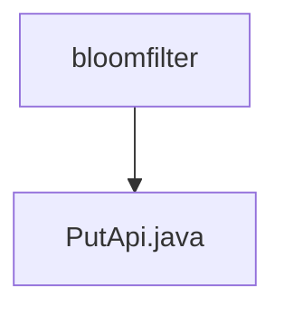

# Basic Information

|      |      |
|------|------|
| Name | bloomfilter |
| Language | .java |
| Code Path | WeFe/union/union-service/src/main/java/com/welab/wefe/union/service/api/dataresource/bloomfilter |
| Package Name | docs.union.union-service.src.main.java.com.welab.wefe.union.service.api.dataresource.bloomfilter |
| Brief Description | Bloom filter add API, allowing signature-based access, which receives input parameters and invokes the service to add data. |

# Description

The code defines an API class named PutApi, which is used to add data to a Bloom filter. The API path is "bloom_filter/put" and allows signed access. The class inherits from AbstractApi, using generics to specify the input type as the inner class Input and the output type as AbstractApiOutput. The BloomFilterService is injected via @Autowired, and the handle method calls the add method to process the input. The Input class inherits from DataResourcePutInput and includes a hashFunction string property along with its getter/setter methods. Upon successful processing, it returns success().

### Package Internal Structure View

This flowchart illustrates the hierarchical relationship between the bloomfilter package and the PutApi.java file in a Java project. The bloomfilter serves as the parent directory, containing a child file PutApi.java, which is a typical Java project structure where API implementation classes are stored under their corresponding functional packages. This structure clearly demonstrates the code organization, making it easier for developers to quickly locate relevant functional modules.

# File List

| Name   | Type  | Description |
|-------|------|-------------|
| [PutApi.java](PutApi.md) | file | Bloom Filter Add API, allowing signed access, which receives input parameters and invokes the service to add data. |

