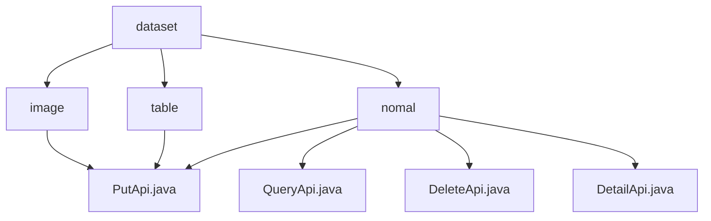

# Basic Information

|      |      |
|------|------|
| Name | dataset |
| Language | .java |
| Code Path | WeFe/union/union-service/src/main/java/com/welab/wefe/union/service/api/dataresource/dataset |
| Package Name | docs.union.union-service.src.main.java.com.welab.wefe.union.service.api.dataresource.dataset |
| Brief Description | The PutApi class handles the addition of image and tabular datasets, inheriting from AbstractApi, and uses the Input class containing required fields to call the add method of the Service. The module provides CRUD operations for datasets, follows a unified design, depends on DataSetService, and supports RESTful-style APIs. |

# Description

## Overview  
This module serves as a unified dataset management service, with its core responsibility being to provide standardized CRUD operations for image and tabular datasets. The interface specification adopts a unified design inherited from AbstractApi, utilizing signature-based access and Input/Output patterns (e.g., ImageDataSet's PutApi requires the mandatory field `labelCompleted`, while TableDataSet's PutApi requires `containsY`). Key data structures include `DataResourcePutInput` (base input), `ImageInput` with statistical fields, and `TableInput` with feature descriptions. External dependencies are `ImageDataSetService` and `TableDataSetService`, injected via Autowired. For instance, tabular datasets define their structure through `columnNameList`.  

## Key Business Scenarios  
The module supports differentiated processing for heterogeneous datasets: image datasets focus on annotation management (e.g., `labeledCount` statistics), while tabular datasets emphasize feature descriptions (e.g., `featureNameList`). Interactions follow a RESTful style, with paths such as `image_data_set/put` and `table_data_set/put`. Typical applications include:  
- Publishing feature engineering datasets during joint modeling (using tabular APIs).  
- Annotation platforms submitting annotation results (calling image APIs).  
All write operations are implemented via PutApi. For example, operational statistical fields like `usageCountInJob` are persisted during image dataset creation.

### Package Internal Structure View

This flowchart illustrates the hierarchical structure under the dataset directory, which includes three subdirectories: image, table, and nomal. Each subdirectory contains corresponding API files. Specifically, the image and table directories each have a PutApi.java file, while the nomal directory contains four API files: PutApi.java, QueryApi.java, DeleteApi.java, and DetailApi.java. The entire structure clearly reflects the organization of APIs for different dataset types in data resource services.

# File List

| Name   | Type  | Description |
|-------|------|-------------|
| [table](table/_module.md) | package | This is an API class for adding tabular datasets, including input parameters such as the number of columns, the number of features, and the list of names, which stores the data into the database through the service layer. |
| [nomal](nomal/_module.md) | package | The PutApi handles dataset addition, inheriting from AbstractApi, utilizing Input and DataSetOutput. The QueryApi manages queries, returning paginated results with various query conditions. The DeleteApi processes deletions, with input containing an id and outputting DataSetOutput. The DetailApi retrieves details, requiring an id as input and returning DataSetDetailOutput. All are processed via DataSetService. |
| [image](image/_module.md) | package | The PutApi class handles the addition of image datasets, with inputs including fields such as task type, labels, file size, etc., and invokes the ImageDataSetService to complete the operation. |

