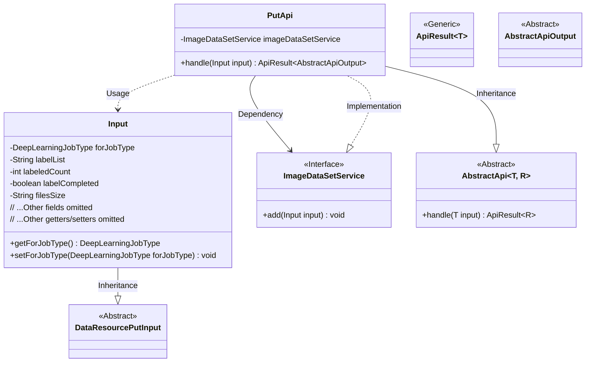
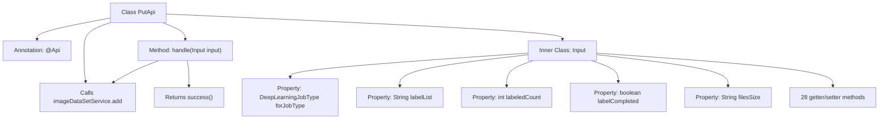

# Basic Information

|      |      |
|------|------|
| Name | PutApi |
| Language | .java |
| Code Path | WeFe/union/union-service/src/main/java/com/welab/wefe/union/service/api/dataresource/dataset/image/PutApi.java |
| Package Name | com.welab.wefe.union.service.api.dataresource.dataset.image |
| Dependencies | ['com.welab.wefe.common.exception.StatusCodeWithException', 'com.welab.wefe.common.fieldvalidate.annotation.Check', 'com.welab.wefe.common.web.api.base.AbstractApi', 'com.welab.wefe.common.web.api.base.Api', 'com.welab.wefe.common.web.dto.AbstractApiOutput', 'com.welab.wefe.common.web.dto.ApiResult', 'com.welab.wefe.common.wefe.enums.DeepLearningJobType', 'com.welab.wefe.union.service.dto.dataresource.DataResourcePutInput', 'com.welab.wefe.union.service.service.ImageDataSetService', 'org.springframework.beans.factory.annotation.Autowired'] |
| Brief Description | The PutApi class handles the addition of image datasets, with inputs including fields such as task type, labels, file size, etc., and calls the ImageDataSetService to complete the operation. |

# Description

This is a Java class named PutApi, designed for handling the addition operations of image datasets. The class extends AbstractApi, uses the Api annotation to define its path and name, and allows signature-based access. It injects the ImageDataSetService and processes input data by invoking the add method through the handle method.  

The input class Input extends DataResourcePutInput and includes multiple fields such as forJobType, labelList, labeledCount, etc., which describe the attributes of the image dataset. Each field has corresponding getter and setter methods, with the labelCompleted field marked as mandatory. Additionally, the Input class contains some fields related to dataset usage statistics, such as usageCountInJob.

# Class Summary

| Name   | Type  | Description |
|-------|------|-------------|
| PutApi | class | This is an API class for uploading image datasets, with the path `image_data_set/put`, allowing signed access. It processes input parameters including task type, label list, file size, etc., and returns a success result after invoking the service layer to add data. |

## Class PutApi

|      |      |
|------|------|
| Access Modifier | @Api(path = "image_data_set/put", name = "image_data_set_put", allowAccessWithSign = true);public |
| Type | class |
| Name | PutApi |
| Description | This is an API class for uploading image datasets, with the path `image_data_set/put`, allowing signed access. It processes input parameters including task type, label list, file size, etc., and returns a success result after invoking the service layer to add data. |

### UML Class Diagram

This class diagram illustrates the architecture of an image dataset upload API. The PutApi inherits from the generic abstract class AbstractApi, processing Input-type parameters and returning AbstractApiOutput results. Its core dependency is the ImageDataSetService interface, which implements data addition functionality. The Input class inherits from DataResourcePutInput and includes extended fields such as deep learning job type and label list. The entire design adopts a layered architecture, achieving extensibility through abstract classes and interfaces, conforming to object-oriented design principles.

### Internal Method Call Graph

This flowchart illustrates the complete structure of the PutApi class, including API annotations, service injection, and core processing methods. The inner class Input contains multiple properties and corresponding getter/setter methods, with the labelCompleted property featuring an @Check validation annotation. The handle method processes input data by calling imageDataSetService.add and returns a success result, demonstrating a typical API request handling flow. The class structure clearly presents the complete chain of data validation, business processing, and service invocation.

### Field List

| Name  | Type  | Description |
|-------|-------|------|
| imageDataSetService | ImageDataSetService | The code snippet uses Spring's @Autowired annotation to automatically inject an instance of ImageDataSetService. |

### Method List

| Name  | Type  | Description |
|-------|-------|------|
| handle | ApiResult<AbstractApiOutput> | The method processes the input data, invokes the service to add an image dataset, and returns the result upon success. |

